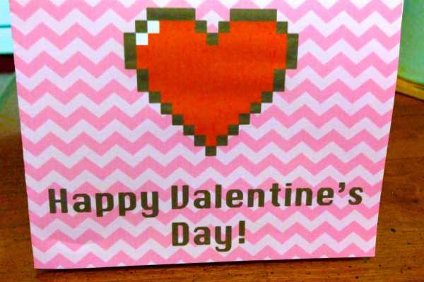

Happy (almost) Valentine’s Day! Though it isn’t Freebie Friday yet, I’m posting this one a bit early. Just in case you didn’t get to the store in time to pick up a card for your Valentine, here’s a quickie card from me to you! Just print at home, fold and use!

          
        

          
        

You can download the
<strong><a href="/wp-content/uploads/2014/02/Valentines-Card.pdf">free printable card right here</a></strong>
, and follow instructions below to fold it properly. Enjoy!

