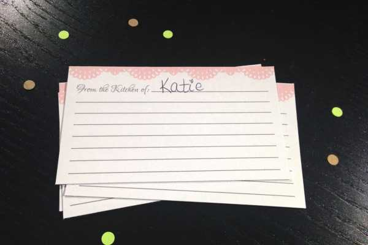
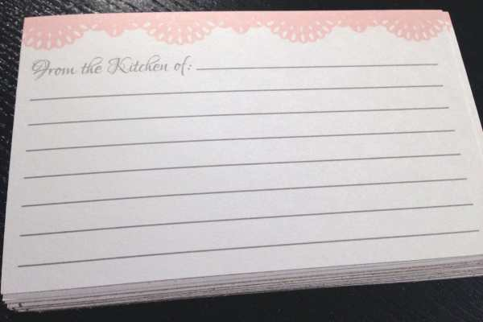
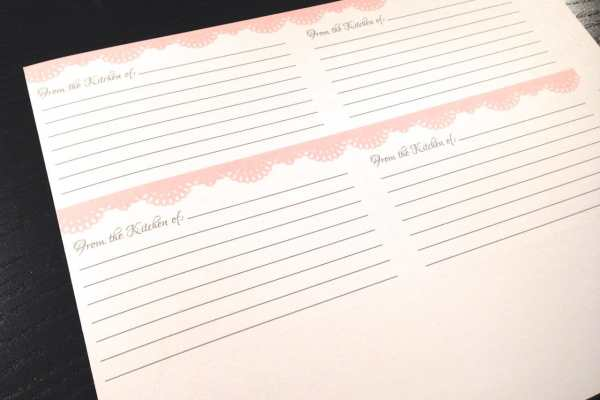
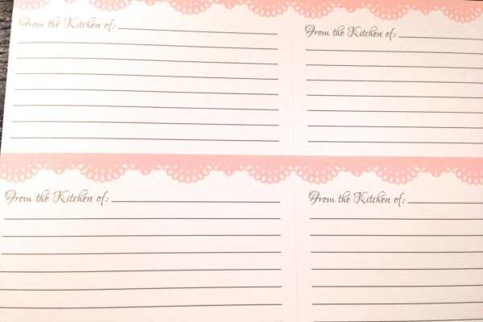

Oh my gosh!
<strong>
TWO GIVEAWAYS IN ONE WEEK!
</strong>
What luck! Yesterday I showed you the cute little
<a title="Stress Relief Basket" href="/stress-relief-basket/"><strong>
stress relief basket
</strong></a>
that I made for the bridal shower last weekend. I also told you I’d be including more of the things I made for the shower over the next week. Today, I’m featuring the recipe cards that I made, with a chance for you and your BFF to win a set each!

There were a lot of cute recipe cards and binders for them that I found while searching, but none that went with the theme of the shower. I really wanted everything to match, so I decided to just make it all myself. We bought a wooden recipe box, I made dividers with my doily hole puncher and cardstock, and had Husband help me create little doily designs in Illustrator for some DIY recipe cards in the pale pink color I needed. Then we printed them out four to a sheet, and I used my paper cutter to finish them off. That part took quite a while, but they came out great! So great, that I decided I’d make another batch for a giveaway to my readers.

          
        

          
        

          
        

          
        

The winner of this Katie Crafts giveaway will receive two sets of recipe cards (a dozen cards in each) to share with their bestie! Fill them with your favorite recipes before you hand them over so she has 12 new meals to try, or hand them over blank for her to fill with whatever she likes. It’s up to you! Enjoy! One winner, two sets of cards! Contest open internationally, ends March 27th 11:59 PM EST. Please read the terms and conditions for contest rules.
 <a id="rc-64ecfa3" class="rafl" href="http://www.rafflecopter.com/rafl/display/64ecfa3/" rel="nofollow noopener noreferrer" target="_blank">a Rafflecopter giveaway</a> 
Have a great Friday, and don’t forget to enter my other current raffle with
<a title="Featured Etsy Shop: The Wandering Deer" href="/featured-etsy-shop-the-wandering-deer/">The Wandering Deer</a>
for a free mini crocheted penguin!

