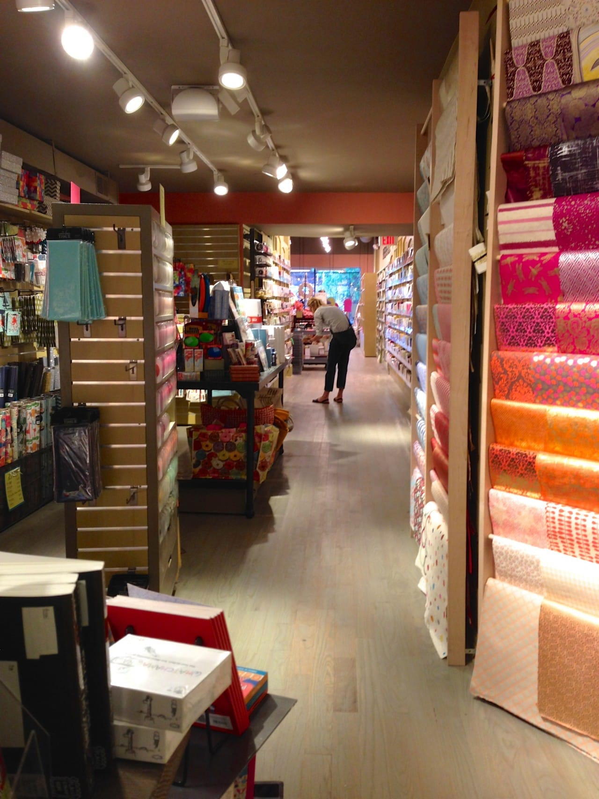
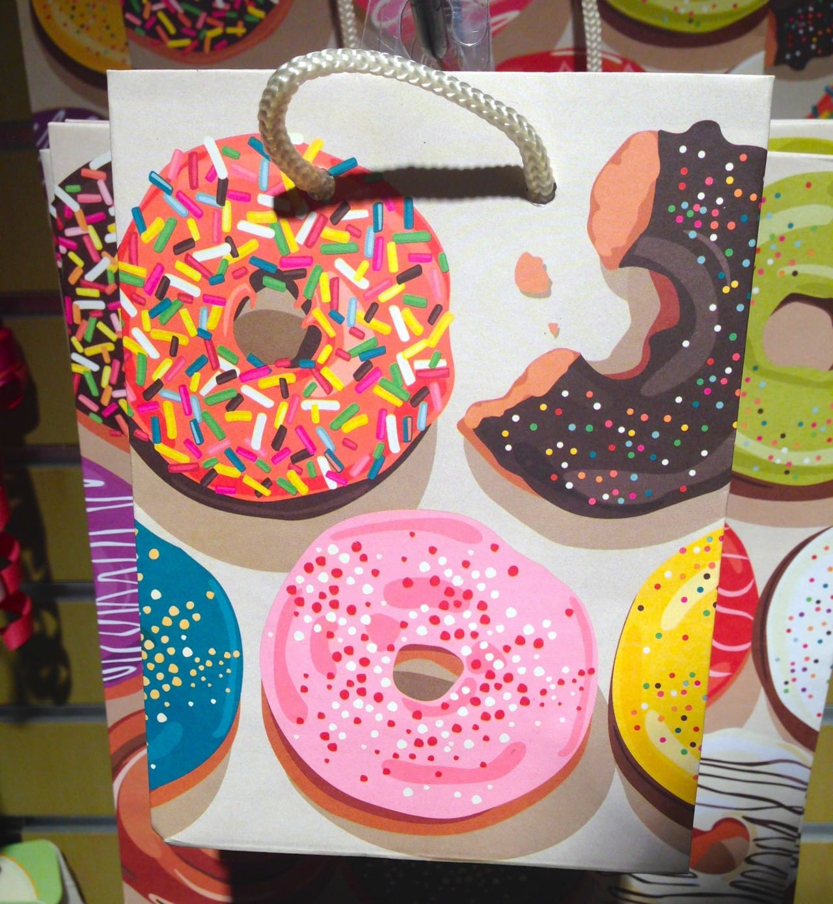
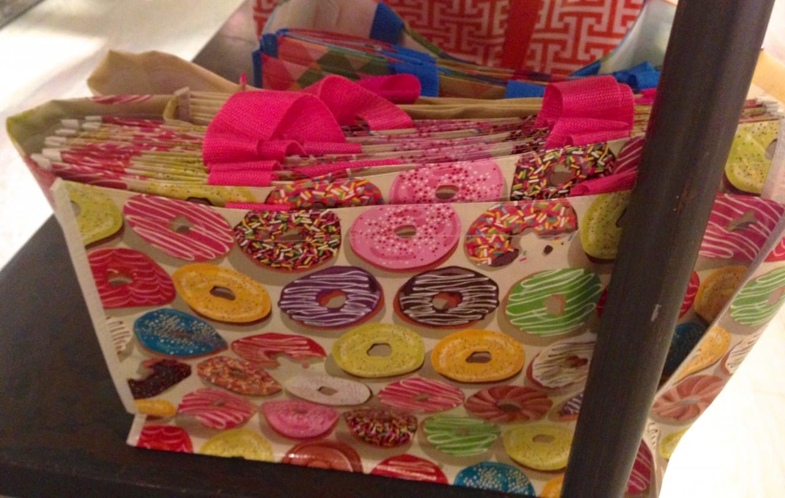
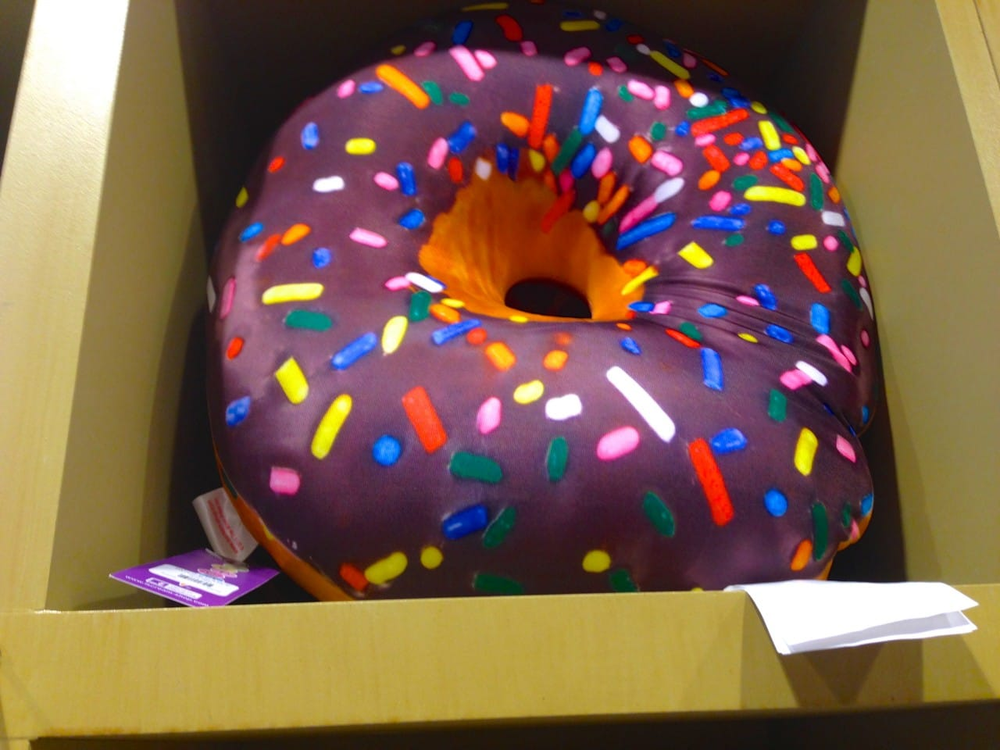
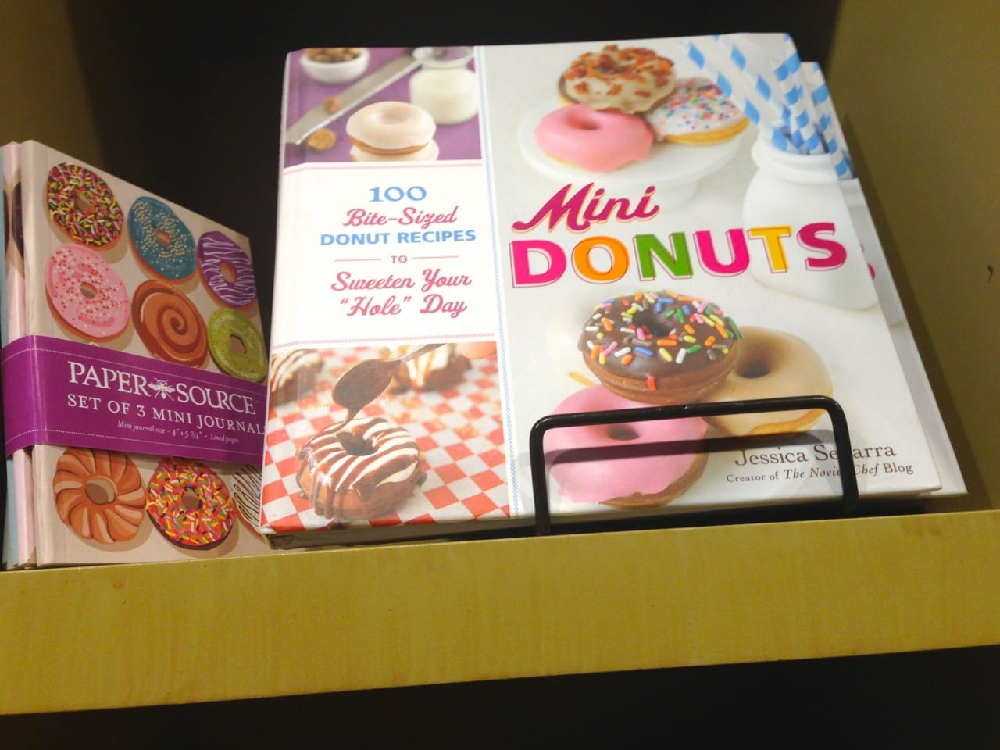
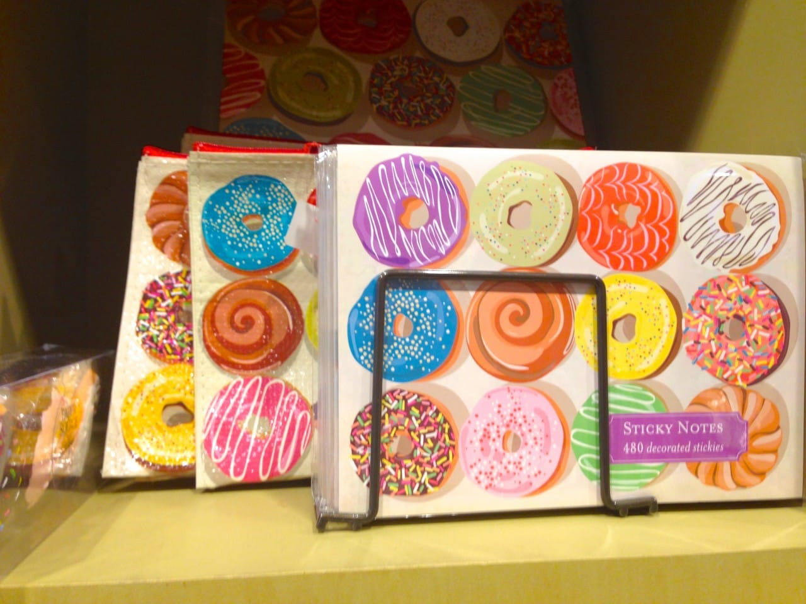

Fact: The first Friday in June is
<em>
National Donut Day.
</em>
How delicious! That means depending on where you live, you can go out and grab a free donut (or doughnut, if you prefer) today to enjoy with your afternoon coffee. If you aren’t in to eating the sugary treats but still enjoy the idea of them, you can check out how
<a title="Paper Source" href="http://www.paper-source.com/" target="_blank" rel="noopener noreferrer">Paper Source</a>
is celebrating with their array of donut themed crafty items!

There used to be a Krispy Kreme right by our apartment, which gave out a free donut with no strings attached to commemorate the holiday. Now that it’s gone, perhaps we’ll head over to Dunkin Donuts for a freebie- though theirs are only free with purchase of a beverage. That’s fine- Husband (being the coffee fiend that he is) will buy a cup, I’m sure. Either way, let’s move on to cute drawn donuts that aren’t as edible!

Paper Source (all photos taken in their Philadelphia Walnut Street store) has the cutest line of donut-y items! I scoured the shop for all of them, though I probably missed one or two. They aren’t exactly here just for Donut Day- they’ve been here all year- but I thought a post about them today would be completely appropriate. Here are some of the things I found!

First of all, isn’t the store adorable?
<figure id="attachment_2889" aria-describedby="caption-attachment-2889" class="post__figure"><figcaption id="caption-attachment-2889">
Seriously, I spend a lot of money here. I love everything!
</figcaption></figure><figure id="attachment_2888" aria-describedby="caption-attachment-2888" class="post__figure"><figcaption id="caption-attachment-2888">
In addition to the donut wrapping paper at the top of this post, there are also various sizes of donut gift bags!
</figcaption></figure><figure id="attachment_2890" aria-describedby="caption-attachment-2890" class="post__figure"><figcaption id="caption-attachment-2890">
Also giant donut tote bags.
</figcaption></figure><figure id="attachment_2886" aria-describedby="caption-attachment-2886" class="post__figure"><figcaption id="caption-attachment-2886">
This donut pillow looked so comfy!
</figcaption></figure><figure id="attachment_2885" aria-describedby="caption-attachment-2885" class="post__figure"><figcaption id="caption-attachment-2885">
A cookbook on making mini donuts? Yes please! Also, those mini donut journals are so sweet! (see what I did there?)
</figcaption></figure><figure id="attachment_2884" aria-describedby="caption-attachment-2884" class="post__figure"><figcaption id="caption-attachment-2884">
Love these too!
</figcaption></figure><figure id="attachment_2883" aria-describedby="caption-attachment-2883" class="post__figure"><figcaption id="caption-attachment-2883">
OBSESSED with this iPhone case! And the magnets and garland are cute too!
</figcaption></figure><figure id="attachment_2887" aria-describedby="caption-attachment-2887" class="post__figure"><figcaption id="caption-attachment-2887">
If you need 480 donut sticky notes, I know where to get them! Also a cute little zipper pouch to put them in!
</figcaption></figure>
Well, that’s everything! My favorite is definitely the iPhone case, but I’m holding out. They have so many cute designs in their shop and I’m hoping one of the other ones makes it on to a case soon! You can purchase some of the above items (plus a mega adorb apron!)
<a title="Paper Source Donuts" href="https://search.paper-source.com/index/_/N-/Ntt-donut" target="_blank" rel="noopener noreferrer">right here, on Paper-Source.com</a>
! Hope you enjoy your Donut Day!

