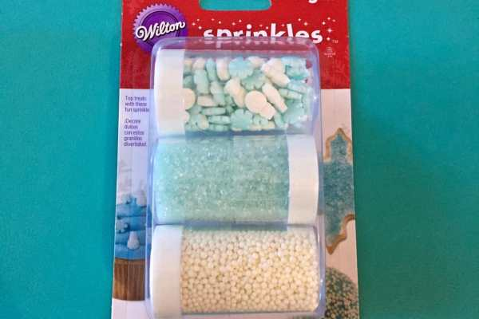
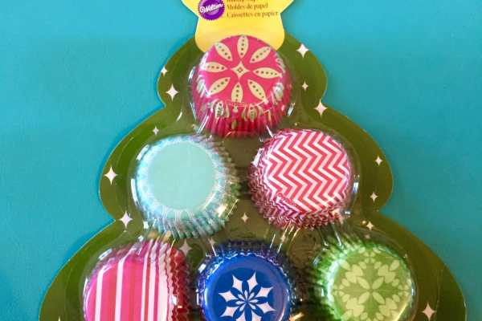

<em>?On the fifth day of Christmas, Katie Crafts gave to me…?</em>

A Holiday Baking Giveaway + PB Cookie Recipe! I thought we’d end the week of giveaways with a sweet follow up to yesterday’s cupcake brooch. Today you have a chance to win some Wilton items that are perfect for your holiday baking and check out my Grandmother’s Peanut Butter Cookie recipe!

First, let’s bake! I haven’t made these cookies for the season yet, so I don’t have any photos, but you already know what they look like! Think back to your favorite cookies from childhood. Peanut buttery, crumbly, soft. Score marked and topped with a Hershey’s Kiss. This is that recipe, straight from Grandma! Hope you enjoy it as much as I do!
<h2>Peanut Butter Cookie Recipe</h2><h2>Ingredients:</h2><ul><li>
1 3/4 cup flour
</li><li>
1 tsp baking soda
</li><li>
pinch of salt
</li><li>
1/2 cup butter, softened
</li><li>
1/2 cup of peanut butter, creamy
</li><li>
1/2 cup of granulated sugar
</li><li>
extra granulated sugar to roll the cookies in
</li><li>
1/2 cup brown sugar
</li><li>
1 large egg
</li><li>
1 tsp vanilla extract
</li><li>
Hershey Kisses (optional)
</li></ul><h2>Directions:</h2><ul><li>
Preheat your oven to 375 degrees F.
</li><li>
Sift flour, baking soda and salt together in a large bowl and set aside.
</li><li>
Cream the butter and all sugar (minus the extra sugar!) together with your electric mixer.
</li><li>
Beat in the egg and vanilla.
</li><li>
Add your dry and wet ingredients together and gently mix.
</li><li>
Grease a cookie sheet. Set aside.
</li><li>
Sprinkle the extra sugar on your workspace/mat.
</li><li>
Using one Tablespoon of peanut butter dough for each cookie, roll dough into small balls making sure that each ball is coated in a thin layer of sugar. Place on cookie sheet 2″ apart.
</li><li>
Use a fork to gently press the top of the cookie twice (crossing each other) to get those little baked in marks. Push a Hersey Kiss right in the center if you want to make your cookies Peanut Butter with Chocolate ones! If you just want regular PB cookies, skip this step!
</li><li>
Cook for 6 – 8 minutes until the bottoms become golden.
</li><li>
Enjoy!
</li></ul>
One of the best parts of this recipe is that it’s SO quick! You can whip up a giant batch of these, cool and pack them up in a cute cookie tin in just about an hour. What a great tasty gift to bring someone this season!
<ul><li><strong><em>
Pro Tip:
</em></strong>
Sometimes I will roll the peanut butter dough into small logs instead of balls. Once they’ve baked and cooled completely, I will melt down Andes Candies in a double boiler and dip half of them in, leaving them on wax paper to dry. Mint Chocolate Peanut Butter Cookies?! Best. Ever.
</li></ul>

          
        

          
        

          
        

Now that I have you super excited for cookies, let’s move on to the giveaway!! One lucky winner will receive the following Wilton items:
<ul><li>
A Wilton cookie cutter set, with one mitten and one snowman cookie cutter
</li><li>
A Wilton sprinkles set, with three bottles of wintery sprinkles: snowflakes, white nonpareils and ice blue sugar crystals
</li><li>
A Wilton mini baking cups set, with 150 mini cupcake wrappers in 6 different holiday worthy designs
</li></ul>
Use your cookie cutters during your sugar cookie baking session with your kids. Use the mini baking cups for tiny adorable mini cupcakes or to hold your fancy handmade truffles. Decorate the cookies, cupcakes and truffles with wintery sprinkles. Have fun!

Enter the giveaway below to win this Wilton Holiday Baking Giveaway!

Raffle open to US residents only. Must be 18 or older to enter. No bots or fake accounts. All entries are verified. Please read Rafflecopter terms and conditions.

Giveaway ends at 11:59 PM ET on 12/12/15! Don’t forget to check out the other giveaways this week! They are:
<strong><a href="/elf-haul-giveaway/">e.l.f. haul giveaway</a>
,
<a href="/pearl-earrings-giveaway-with-natalia-khon/">pearl earrings giveaway</a>
,
<a href="/crocheted-baby-hat-giveaway/">crocheted baby hat</a></strong>
and
<strong><a href="/cupcake-brooch-giveaway-with-me-mama-creations/">cupcake brooch</a></strong>
! This is the last giveaway for the blog for the 12 Days of Christmas, but follow me on
<strong><a href="https://www.instagram.com/imkatiecrafts/" target="_blank" rel="noopener noreferrer">Instagram</a></strong>
for a random raffle next week!

<a id="rcwidget_01gy0f49" class="rcptr" href="http://www.rafflecopter.com/rafl/display/64ecfabc32/" rel="nofollow noopener noreferrer" target="_blank">a Rafflecopter giveaway</a>
<blockquote>
<em>Christmas border</em>
<em><a href="http://www.freepik.com/free-vector/hand-drawn-christmas-borders_825050.htm" target="_blank" rel="noopener noreferrer">Designed by Freepik</a></em></blockquote>
