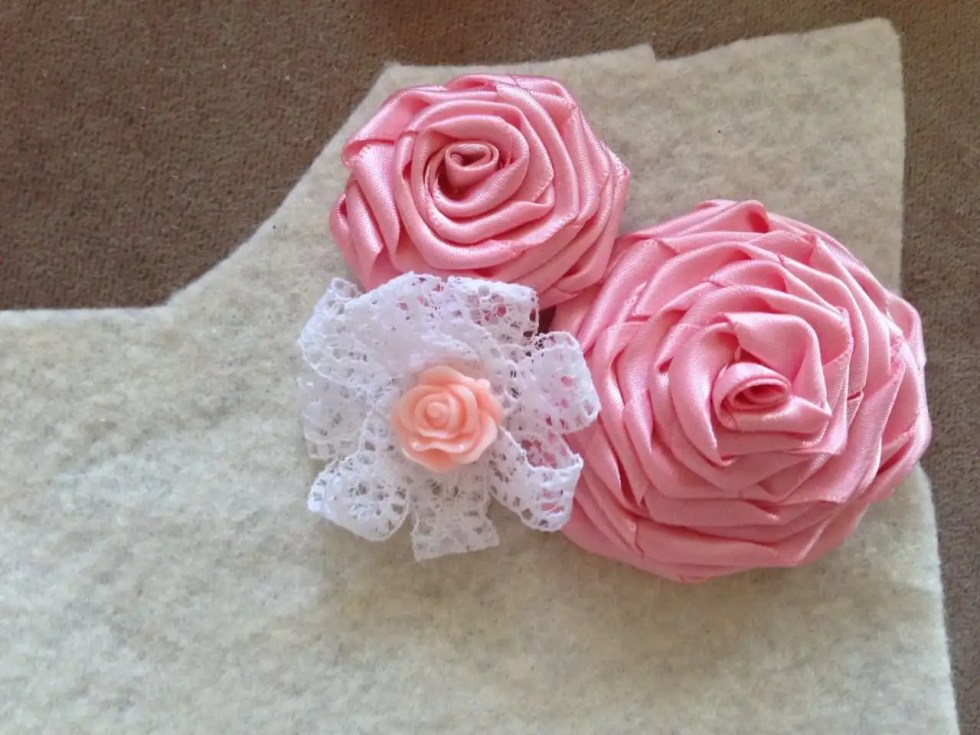
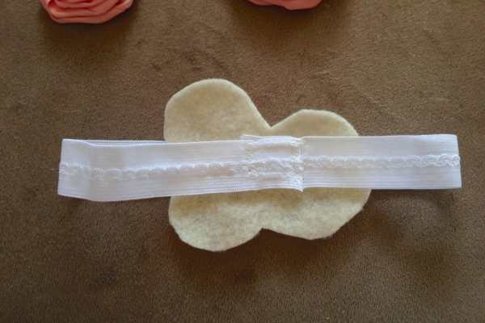
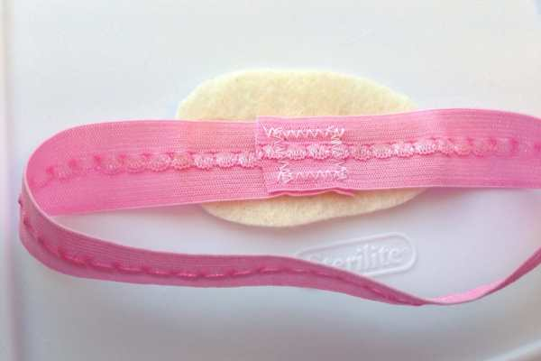
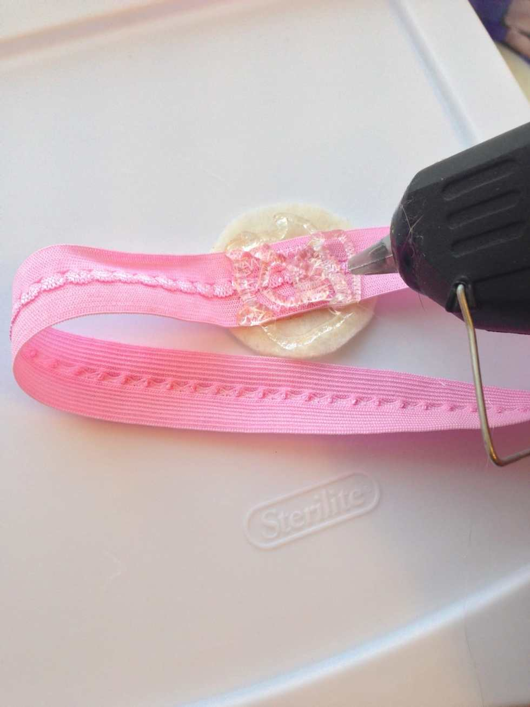
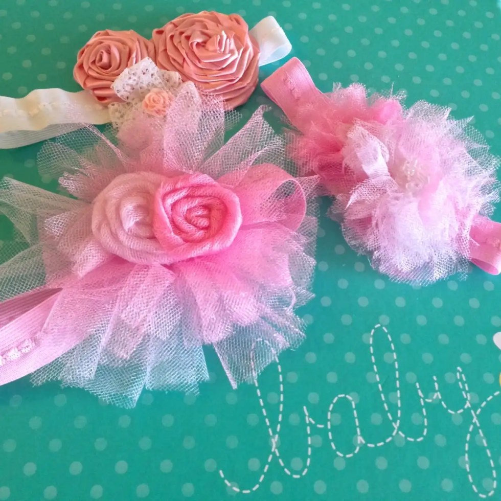
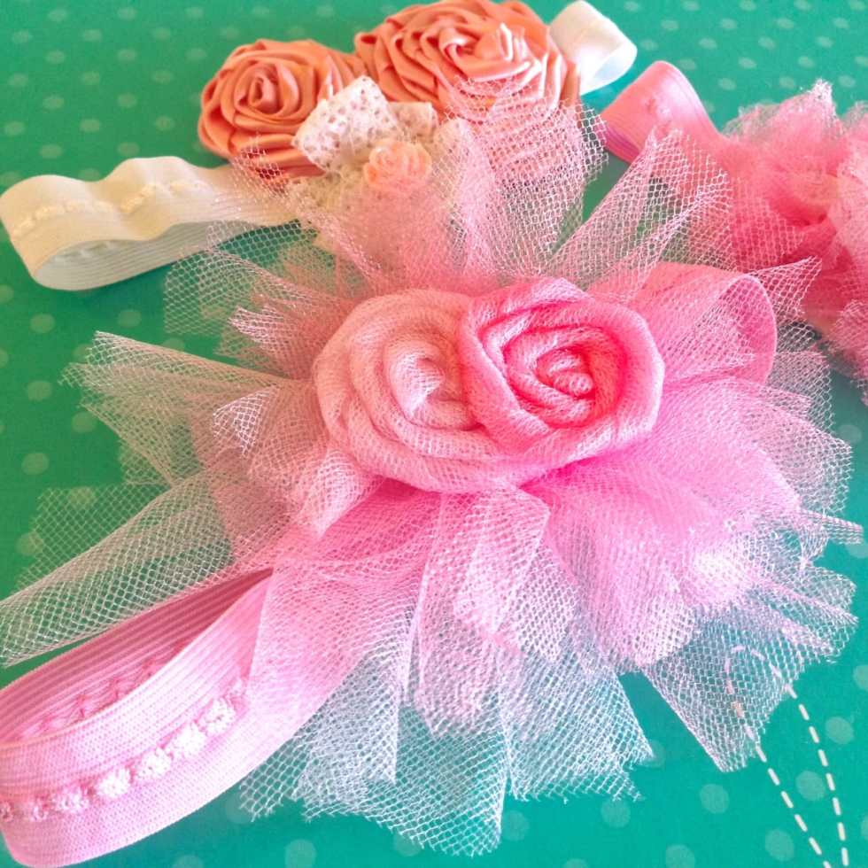
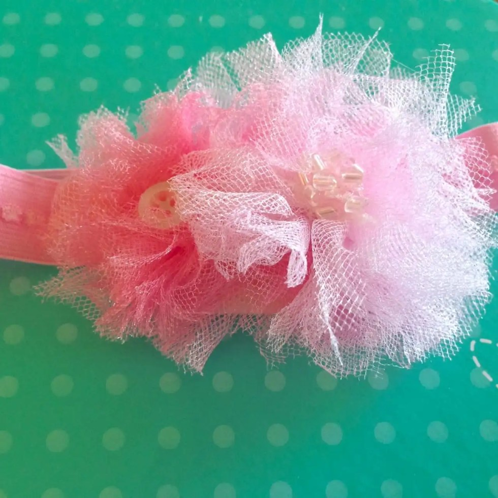
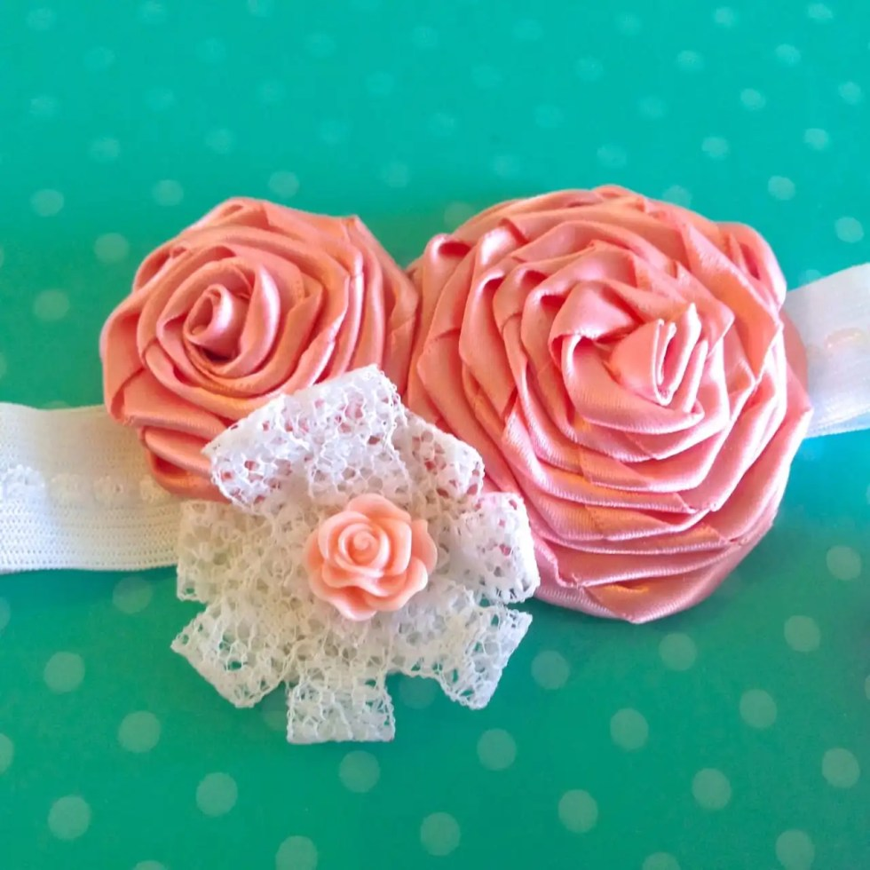

Project: How To Make Baby Headbands

Last week, you learned how to make those adorable
<em><strong><a title="5 Minute Tulle Pom Pom Flowers" href="/5-minute-tulle-pom-pom-flowers/">5 minute tulle pom pom flowers</a></strong></em>
… and now you know why! It is so that you can make your very own super sweet baby headbands! (But let’s be honest, you can make one for yourself, too, if you really want!) My bestie from home is due to have her second child, this time a little girl, in about three weeks. Obviously, she needed some newborn headbands to rock in the nursery. I felt I had to step in and help!

I started out with the idea of making two different headbands in different sizes, and ended up making three just so I could use more of the cute flowers I had made. Newborn head sizes range from 11 inches to 14 inches, so I made three different sizes- 11″, 12″ and 13″. I figure, one of them is bound to fit, plus it’s soft elastic that will stretch! That means that even the 13″ one I made should fit on the baby girl for awhile.
<h3>Materials:</h3><ul><li>
Assorted flowers, buttons, beads
</li><li>
Fold over elastic
</li><li>
Scissors
</li><li>
Hot glue gun &#x26; glue (not pictured)
</li><li>
Felt
</li><li>
Measuring tape
</li><li>
Sewing machine OR needle &#x26; thread
</li></ul><h3>Instructions:</h3><ul><li>
First, you must make your flowers! Make
<a title="5 Minute Tulle Pom Pom Flowers" href="/5-minute-tulle-pom-pom-flowers/"><strong>
tulle pom pom flowers
</strong></a>
,
<strong><a title="DIY Shabby Chic Rosettes" href="/diy-shabby-chic-rosettes/">ribbon rosettes</a></strong>
, and/or little lace bows and adorn them with buttons, beads and whatever else you can dream up! Use your glue gun to make certain said buttons and beads are well secured.
</li></ul><ul><li>
Once all your flowers are made, set them aside and determine the size you want your headbands.
</li><li>
Make sure to cut the elastic one inch longer than you need it to be, so that it can overlap for sewing. For example, if you want to end up with an 11″ round headband, cut a 12″ strip of elastic.
</li></ul>

          
        

          
        

<ul><li>
Use a zig zag stitch to sew your elastic together in a “box” like pictured above. Don’t worry about it looking less than beautiful, as that part will be completely covered up with flowers and felt.
</li></ul>

<ul><li>
Next, you’ll want to practice-arrange your flowers atop your headband and see what works for you. It took me a very long time to do this as I just couldn’t make up my mind! ALL the flowers looked cute together but it took a long while to pick which ones should live with which. Phew!
</li></ul>

<ul><li>
Once you’ve picked your arrangements, lay them exactly the same way atop the felt, and cut around. This piece will be against the baby’s head but may be visible through the flowers so make sure to trim/shape it nicely.
</li></ul>

          
        

          
        

          
        

<ul><li>
Add a little glue to the middle of the felt shape and firmly press the sewn “box” of elastic to it. Make sure you are gluing the INSIDE of the elastic and not the pretty outside, as that will be where the flowers go in the next step. See photo above. Do this for all headbands.
</li></ul>

<ul><li>
Now that the felt piece and elastic are bonded, use your hot glue gun once more and cover the whole piece of felt.
</li></ul>

          
        

          
        

<ul><li>
Carefully place the flowers one at a time on the felt just as you did in your practice-arrangement. Add extra glue where needed and press down. Let dry.
</li></ul><figure id="attachment_5002" aria-describedby="caption-attachment-5002" class="post__figure"><figcaption id="caption-attachment-5002">
The back will look like this!
</figcaption></figure><ul><li>
If you’ve done everything correctly, the stitched “box” of elastic will be totally covered by felt (which touches the baby’s head) and flowers, and you will have a beautiful new headband for the newborn in your life!
</li></ul>

<ul><li>
Don’t forget you can make these for any little girl simply by measuring their head! If you don’t have fold over elastic on hand, you can use a plain headband they may already have! I just find the flatness of the fold over elastic to be ideal for gluing.
</li></ul>
Here are some closeups of the headbands I made!
<figure id="attachment_5008" aria-describedby="caption-attachment-5008" class="post__figure"><figcaption id="caption-attachment-5008">
This one is the smallest headband but with the biggest flowers. Perfect for a newborn photo!
</figcaption></figure><figure id="attachment_5009" aria-describedby="caption-attachment-5009" class="post__figure"><figcaption id="caption-attachment-5009">
I love the little shiny beads and button I adorned to the middles of these pom pom flowers!
</figcaption></figure><figure id="attachment_5010" aria-describedby="caption-attachment-5010" class="post__figure"><figcaption id="caption-attachment-5010">
Satin and lace may be the winners!
</figcaption></figure>
Enjoy your new baby headbands, and stay tuned for later this week/early next week when I share what other DIY I made to go with the gift of headbands! If you try out this tutorial, be sure to share photos with me on
<a title="Katie Crafts Blog on Facebook" href="https://www.facebook.com/imkatiecrafts" target="_blank" rel="noopener noreferrer"><strong>
Facebook
</strong></a>
! I’d love to see them and repost them to my friends!

Which headband is your favorite?

