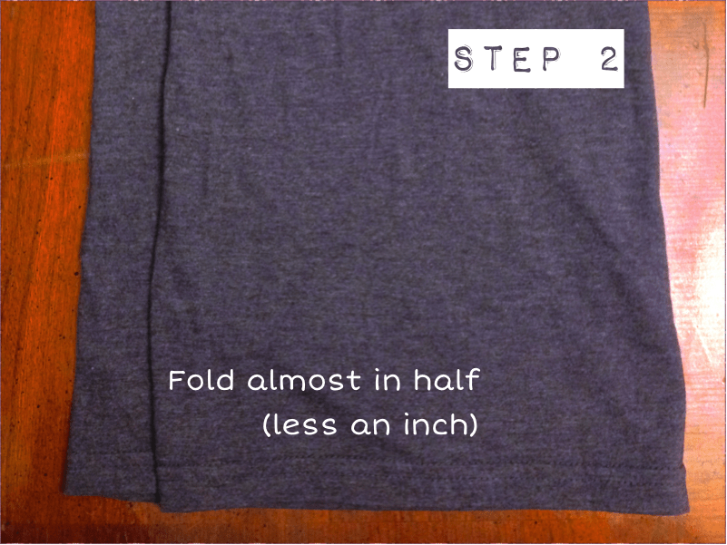
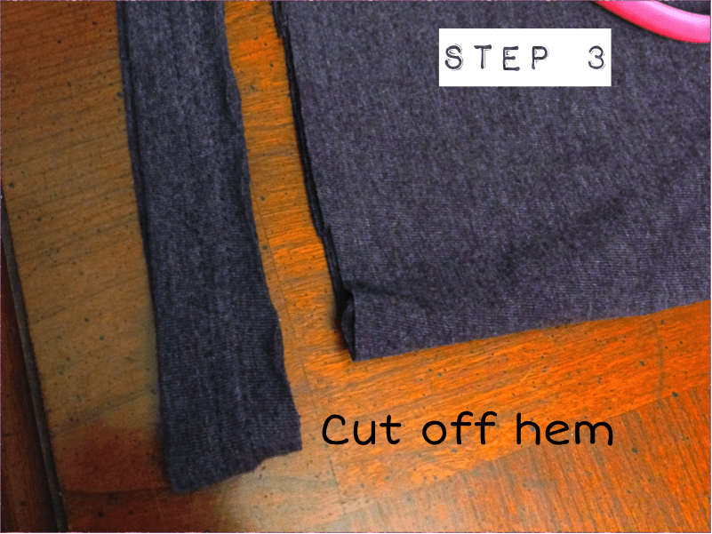
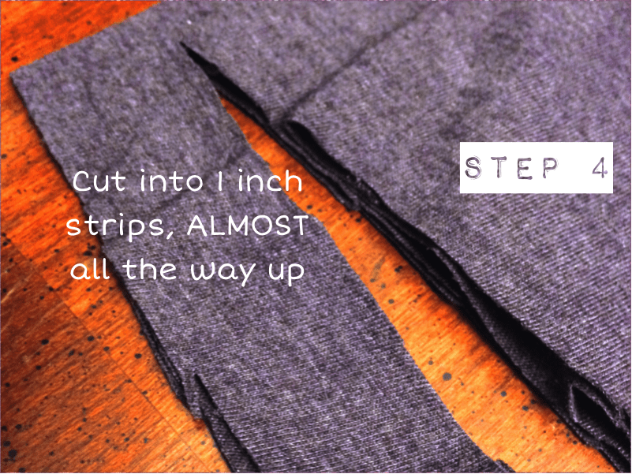
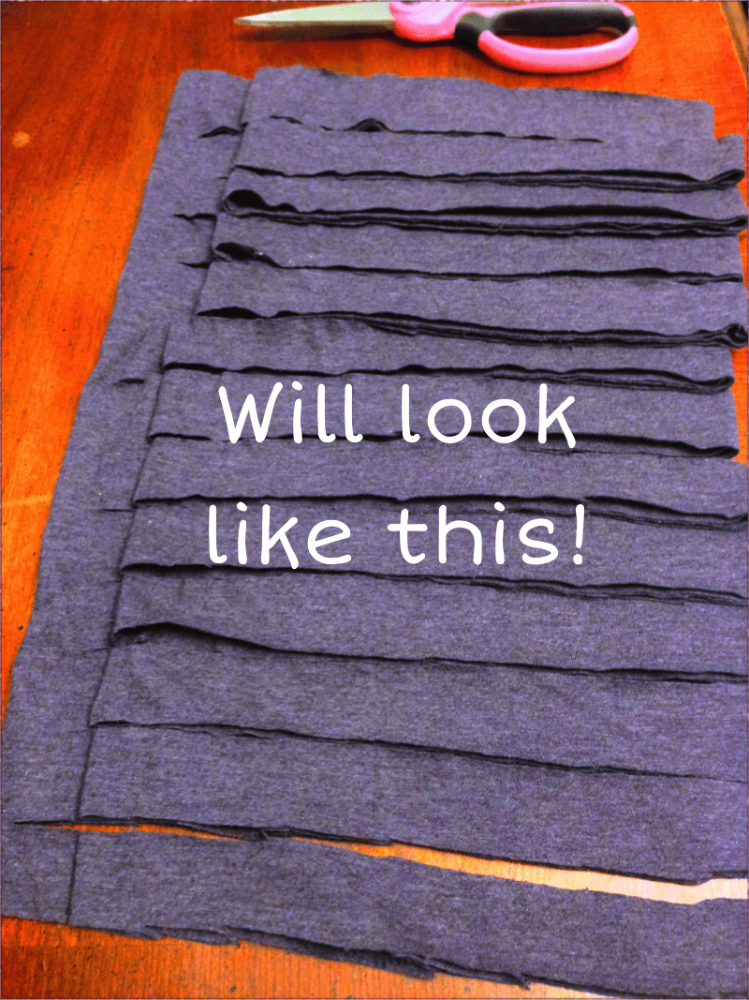
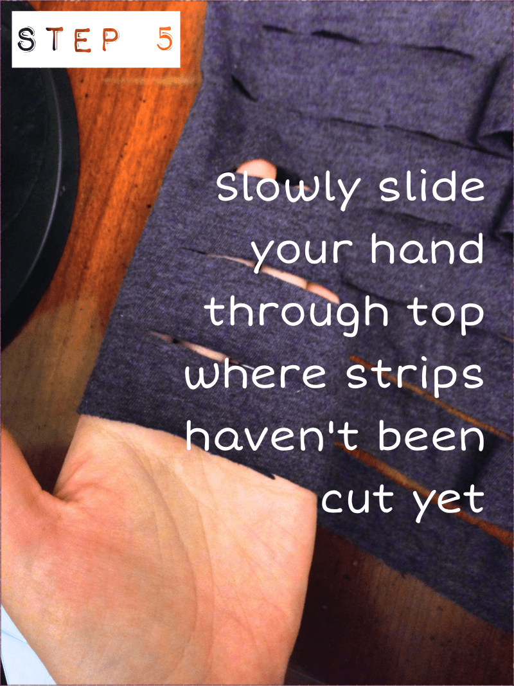
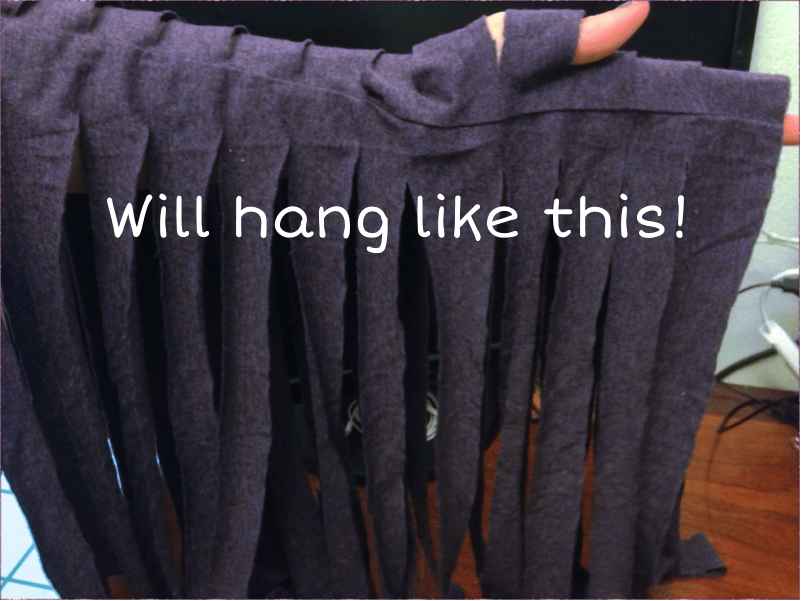
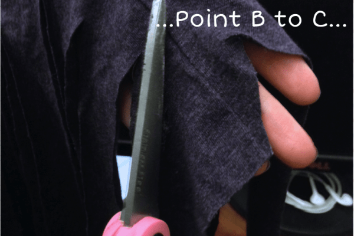
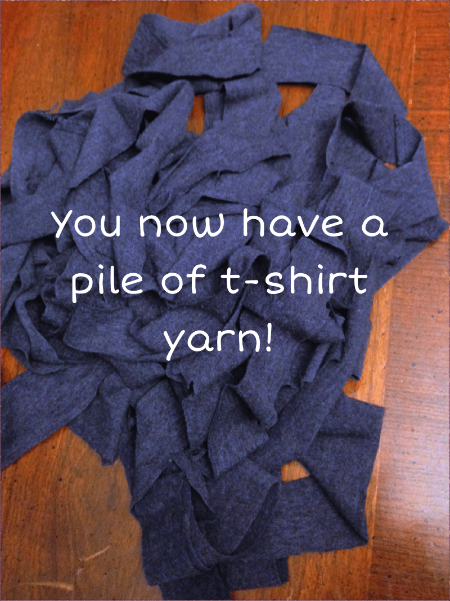
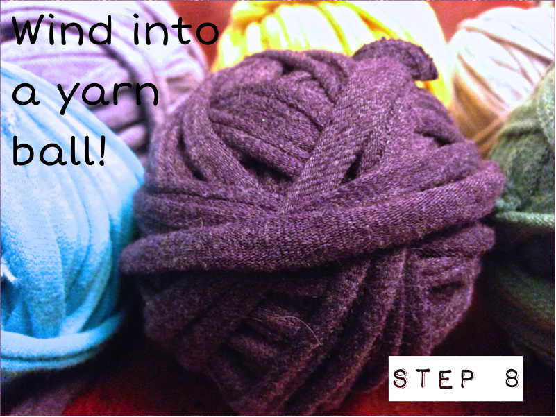
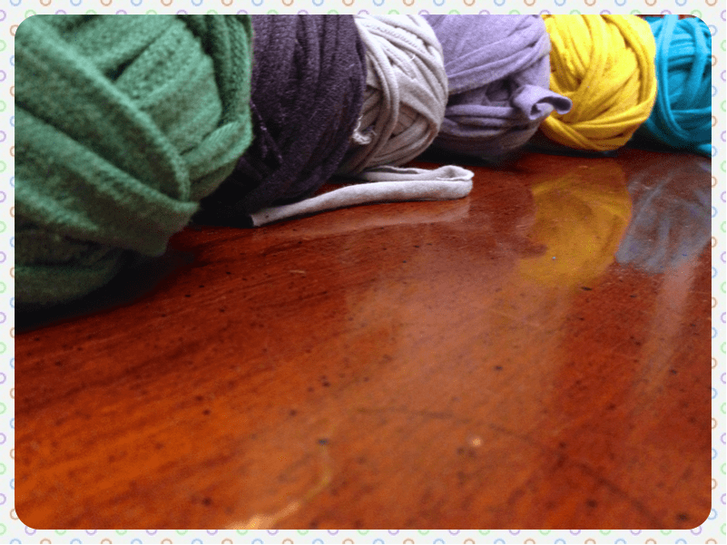

Project: How To Make T-Shirt Yarn

A few days ago, I posted a super easy DIY tutorial on how to make
<strong><a title="No Sew Braided Headband" href="/no-sew-braided-headband/">No Sew Braided Headbands</a></strong>
. In case you were waiting for the weekend to arrive to try the project out, and have found yourself ready to begin but without the needed t-shirt yarn: fear not! I will show you in
<strong>
FIVE
</strong>
minutes with only
<strong>
TWO
</strong>
materials what to do to make your own!

T-Shirt yarn is such a great supply to have for crafting! You can use it for accessory projects, like the above mentioned headbands, jewelry or more, or even for crocheting a rug {
<strong>
spoiler alert
</strong>
: I’ll tackle this project over the next month!} Besides, you know how much I love using recycled materials for projects. Let’s get started!
<h2>Materials:</h2><ul><li>
Scissors
</li><li>
Old t-shirt
</li></ul><h2>Instructions:</h2>

<ul><li>
With shirt laying nice and flat, cut from about an inch under one armpit straight across to the other side, through both layers of fabric.
</li></ul>

<ul><li>
Fold your dissected t-shirt
<strong>
almost
</strong>
in half from one side to the other, with about an inch longer on one side.
</li></ul>

<ul><li>
Cut off the hem. It is too bulky to use as yarn and will be a different thickness than the rest of the t-shirt yarn otherwise.
</li></ul>

<ul><li>
Cut the entire shirt into 1 inch strips, going over the shorter folded half, and ALMOST all the way up to the tippy top (about a half inch or so from the folded top is fine.)
</li></ul>

<ul><li>
Slip your hand slowly (it’s a little tricky!) through the top non-cut edge of t-shirt. If you did it correctly, it should hang like below.
</li></ul>

<ul><li>
Snip across on an angle from one strip to the next, to create a never-ending string of fabric.
</li></ul>

          
        

          
        

          
        

<ul><li>
Technically you are finished, since you now have a big old pile of yarn! But there are just two more things you should do to complete this how-to.
</li></ul>

<ul><li>
By pulling the yarn taut between your hands you will lengthen the yarn, thin it out and make it take shape. If you don’t do this, you’ll still have one very large 1″ chunky strip. Not so great for crocheting!
</li><li>
Wind it in to a yarn ball… or have your husband do it, like I did!
</li></ul>

That’s it! Try not to do it to ALL your t-shirts, or you won’t have anything left to wear. This is the perfect project to tackle when you’ve just cleaned out your dressers and haven’t made it to the Salvation Army yet. I can’t wait to try out fun projects using this yarn during this month.*

*It’s officially
<strong>
March
</strong>
, which happens to be
<strong>
National Crochet Month
</strong>
! There are lots of fun things in store to celebrate so check back daily for patterns, tutorials, giveaways and more!

What other projects should I use this yarn for? I’d love to hear your suggestions!

