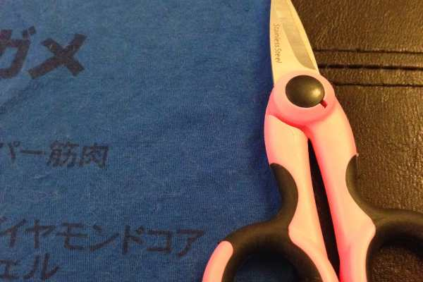
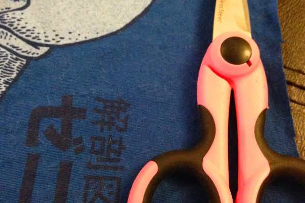
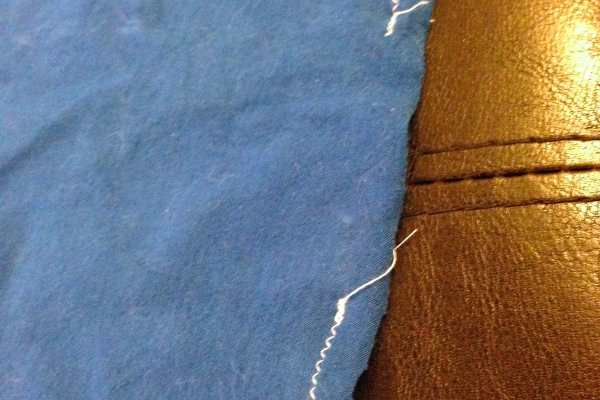
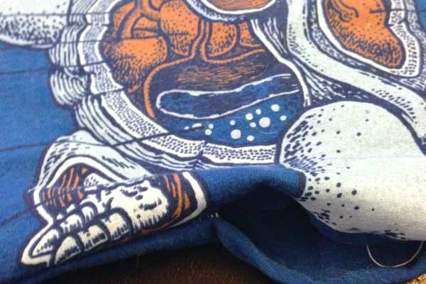
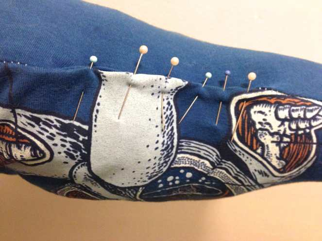
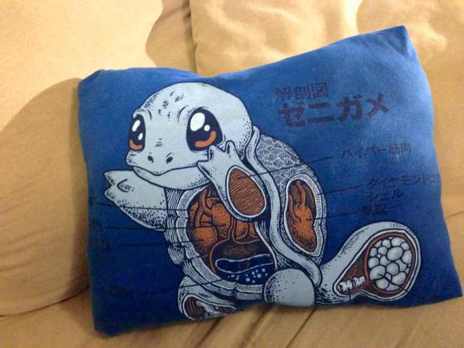

Project: How To Turn Your T-Shirt In To A Pillow

The other day, I caught the Husband trying to throw out an old t-shirt of his. It got a small bleach stain on it which is pretty much the end of an article of clothing. Still, I rescued it from garbage can heaven and gave it two new reasons to live! Half the shirt I used to
<a title="How To Make T-Shirt Yarn" href="/how-to-make-t-shirt-yarn/"><em>
make t-shirt yarn
</em></a><em>
,
</em>
while the other half was used to make a pillow! My sister also loves the same silly anime things that Husband does (sorry, I just don’t see the appeal!), so I knew she’d love this pillow for her bed. It was very easy and I’m thinking of making a few pillows for my bed now too, using shrunken Woot tees and old band shirts!
<blockquote>
<em>In hindsight, I should have used the lint brush on the t-shirt before starting this project, since it was covered in cat hair. Just pretend it isn’t there, please!</em>
</blockquote><h2>Materials:</h2><ul><li>
Old t-shirt
</li><li>
Scissors
</li><li>
Pins
</li><li>
Needle and matching thread
</li><li>
Sewing machine
</li><li><a title="Poly-Fil" href="http://amzn.to/1sdaUiy" target="_blank" rel="noopener noreferrer">Poly-Fil</a>
/ stuffing
</li></ul><h2>Instructions:</h2><ul><li>
Cut the bottom, sleeves and neck off your t-shirt so you are left with two squares of fabric (the front image, and the back).
</li></ul>

          
        

          
        

          
        

          
        

<ul><li>
Place right sides facing each other and pin all the way around.
</li></ul><ul><li>
Jersey knit can be a mega pain to work with since it is stretchy. Using a ballpoint needle made for knits on your sewing machine, and using a small zig zag stitch will give you the best chance of securely making a pillow! Stitch all the way around leaving a gap of a few inches- large enough to fit your hand in later! Be sure to back stitch at the beginning and end to strengthen near the gap.
</li><li>
Make box edges so your pillow corners are squared off. Forget how? Refresh yourself by reading
<a title="Reversible Tote Bag Tutorial" href="/reversible-tote-bag-tutorial/"><em>
my tote tutorial
</em></a><em>
!
</em></li></ul>

          
        

          
        

<ul><li>
Flip inside out.
</li></ul>

          
        

          
        

<ul><li>
Stuff your pillow with Poly-Fil as much as you want. If you want a very firm pillow, add tons of stuffing. If you want it softer, use less. Since your hand fits in the gap, you can make sure to get the filling in all the corners. Just squish the filling in deeper so it isn’t by the open gap.
</li></ul>

<ul><li>
Pin the gap closed and stitch it up. Squish the stuffing around in the pillow to even it out. Done!
</li></ul>
Enjoy your new pillow for yourself or give it as a gift! Would be a great present for that teen going back to college in a few weeks! You can use their high school t-shirt (or even new college shirt) to make a pillow for their dorm bed!

Have other ways to re-use or recycle a t-shirt? Share in the comments!

