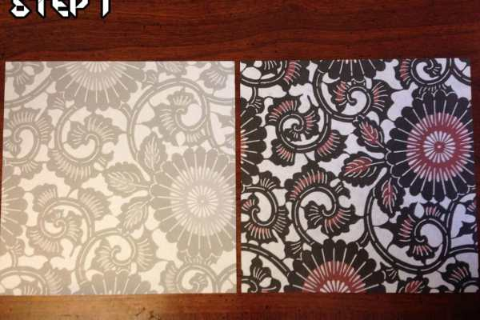
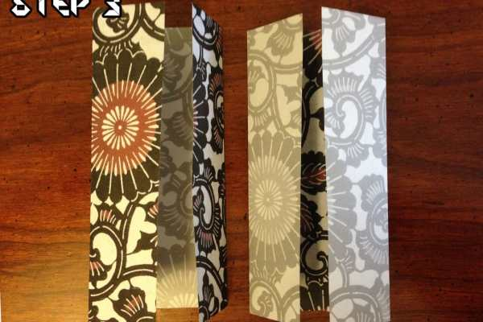
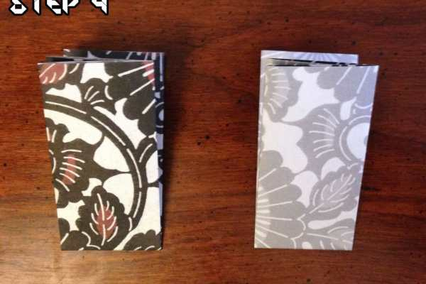
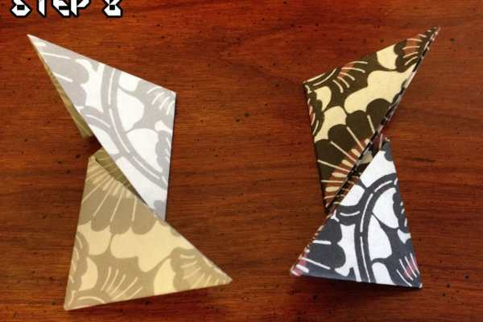
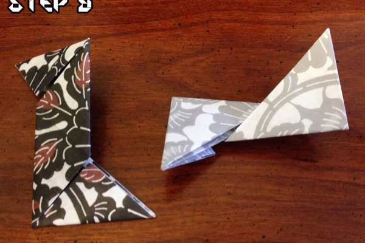
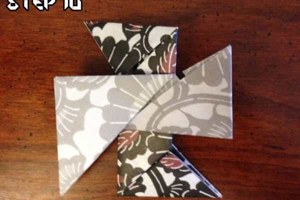
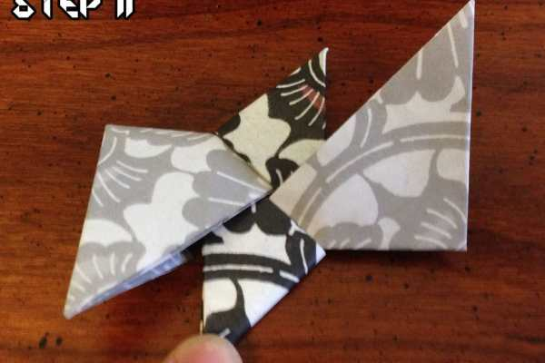

Project: Origami Ninja Star Tutorial

Hey there! It’s me again, The Husband™! I’m back again with something new to talk about. Only this time you can’t eat what I’m cooking up, you might just put your eye out!

When I was younger (and in grade school), I would spend my time doing anything that gave me a reason to ignore my homework; video games, books and drawing to name a few. Occasionally I’d want to get a little more hands on, so I decided to get a little more mischievous — I learned how to make Origami Ninja Stars! As a bonus, when I was finished making them, I could throw them at my friends! Here’s how you can make your own!
<h2>How to make an Origami Ninja Star</h2>

          
        

          
        

<h3>Step 1</h3>
Start with two pieces of square paper. Katie bought me some pretty snazzy paper made specifically for origami, but anything will do. I’ve even been known to use notebook paper on occasion. 😀
<h3>Step 2</h3>
Fold each piece of paper in half and make sure the seam is crisp. That part is really important, it’ll make the paper much easier to fold later on! This is known as a
<strong>
Book Fold
</strong>
.

          
        

          
        

<h3>Step 3</h3>
Take the two pieces and fold them once more, towards the inner fold — make sure to keep those seams crisp! This is called a
<strong>
Cupboard Fold
</strong>
.
<h3>Step 4</h3>
This part is a little tricky because the paper needs to be sitting a certain way before you fold it. With the cupboard fold, make sure you fold the edges in, and then fold the paper in on to itself again (as if you’re ‘closing’ the cupboard). Then, make sure both of the openings are facing left. Once you’ve done that, fold both pieces up, directly in half, and press the seam to help it stay down.

          
        

          
        

<h3>Step 5</h3>
Are you still paying attention? Good! Here’s where the instructions for each piece starts to diverge a bit. For the
<em>
left piece
</em>
, fold the top right corner down, in to a triangle fold. For the
<em>
right piece
</em>
, fold the top left corner down in to another triangle fold; they should mirror one another.
<h3>Step 6</h3>
This step is very similar to Step 5, but on the bottom corners. For the
<em>
left piece
</em>
, fold the bottom left corner up, in to a triangle fold. For the
<em>
right piece
</em>
, fold the bottom right corner up, in to a triangle fold; these parts should also mirror one another.

          
        

          
        

<h3>Step 7</h3>
Starting with the
<em>
left piece
</em>
, fold the triangle up once more, making the point face to the left. For the
<em>
right piece
</em>
, do the same thing but in the opposite direction. The triangle’s point should be facing right.
<h3>Step 8</h3>
This is the same as Step 7 but with the top corners. Make sure the
<em>
left triangle
</em>
is pointing left, and the
<em>
right triangle
</em>
is pointing right.

          
        

          
        

<h3>Step 9</h3>
Here comes another curveball! Notice the two pieces have switched places. This is so that the two will fit together in the right way. Once you’ve swapped them, turn the
<em>
left piece
</em>
upside down — it should look like the
<strong>
letter Z
</strong>
. Make sure the top left triangle is facing left. Turn the
<em>
right piece
</em>
90º counter-clockwise. Just make sure that it matches the picture above.
<h3>Step 10</h3>
We’re almost done! Take the right piece and place it on top of the left piece.

          
        

          
        

<h3>Step 11</h3>
Since the pieces are no longer next to each other, I’m going to refer to them as the
<em>
top piece
</em>
and the
<em>
bottom piece
</em>
. Take the
<em>
bottom piece
</em>
and fold the triangles inward, tucking the points inside of the
<em>
top piece
</em>
.
<h3>Step 12</h3>
Flip over the almost-ninja-star and repeat Step 11, sliding the last two triangles inward and tucking them inside. If you’ve followed the instructions right, you should end up with your very own ninja star! Hooray!

Now all you need to do is making a bunch more and then
<a href="http://www.wikihow.com/Make-a-Ninja-Mask-out-of-a-T-Shirt" title="How to Make a Ninja Mask out of a T Shirt" target="_blank" rel="noopener noreferrer">turn your shirt in to a Ninja Mask</a>
! You’ll be terrorizing the town in no time at all!

If you used a different method or made something completely different/awesome, show me in the comments!

