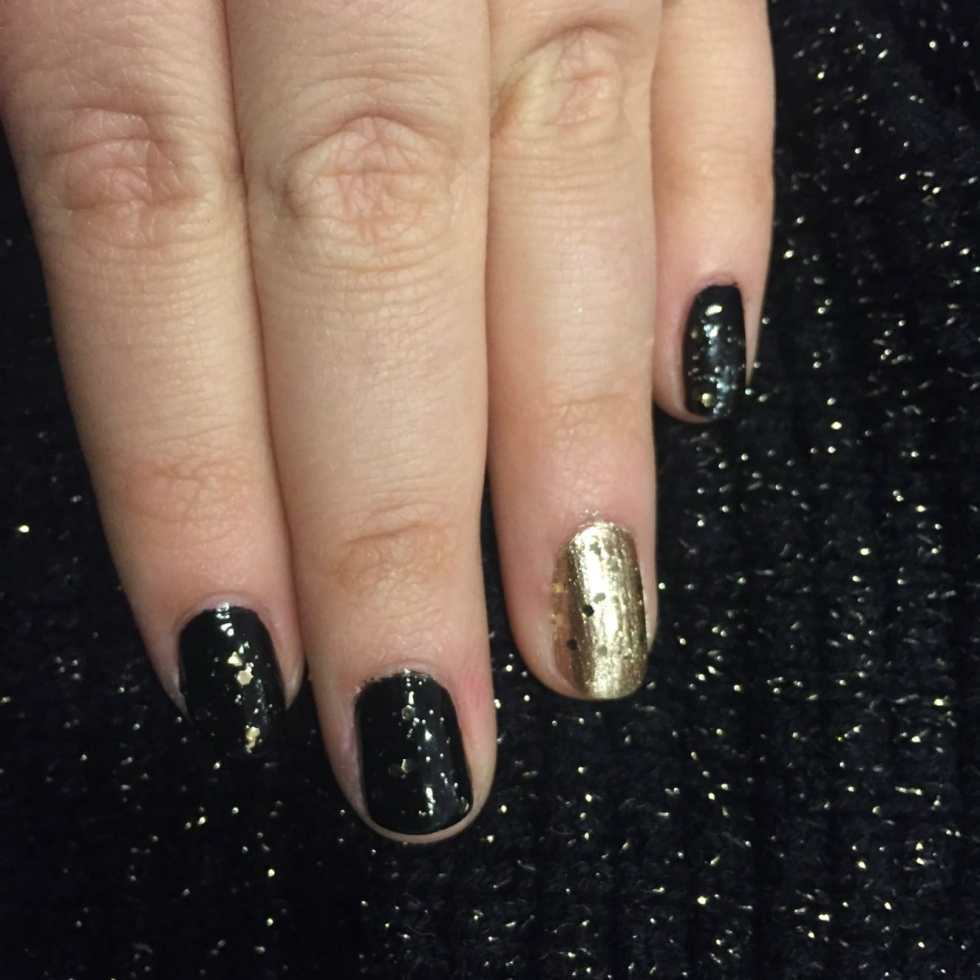
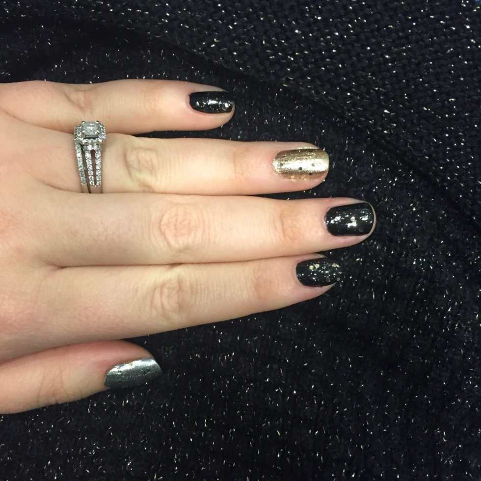

It’s New Year’s Eve! I cannot believe this year went by so quickly… and yet, I’m SO happy for 2016 to get here! You may have big plans of heading out on the town tonight, or maybe you’re staying in with a few good friends- no matter what your night entails, wouldn’t it be nice to have super cute NYE nails? Here’s a last minute New Year’s Eve nail art design that anyone can pull off, is quick to do and will go with any outfit!

First, let me tell you about this awesome
<strong><a href="http://www.amazon.com/gp/product/B019AE7A9U/ref=as_li_qf_sp_asin_il_tl?ie=UTF8&#x26;camp=1789&#x26;creative=9325&#x26;creativeASIN=B019AE7A9U&#x26;linkCode=as2&#x26;tag=katicraf-20&#x26;linkId=QMJHOBMNDW4H5SKM" target="_blank" rel="noopener noreferrer">e.l.f. glam color collection</a></strong>
I got for Christmas! It has 8 amazing nail polish shades in it, plus a bottle of matte top coat. I can’t wait to try them all out, but for this tutorial I paired just three of them (Gold Star, Pot of Gold and Liquid Metal) with my trusty black polish. I thought the gold and silver polishes may need a base coat of something else but they weren’t transparent at all! That’s why for one photo, you’ll see my thumb with gray polish on it. Don’t worry though- it was completely covered with just one coat of silver!

Now on to the lovely black, silver and gold look that I think is a perfect complement to any NYE outfit! You’re really going to love it- it’s the easiest design EVER (even if it looks kind of fancy!)
<h2>Materials:</h2><ul><li>
Black nail polish
</li><li>
Gold nail polish
</li><li>
Silver nail polish
</li><li>
Gold glitter nail polish
</li><li>
Clear top coat
</li></ul><h2>Instructions:</h2><ul><li>
Begin with clean, dry nails. Paint your pinkies, middle and index fingers with one coat of black. Let dry.
</li><li>
Paint your ring fingers with one coat of gold. Let dry.
</li><li>
Paint your thumbs with one coat of silver. Let dry.
</li><li>
When dry, do a second coat one each nail. Let dry completely.
</li></ul>
Ignore the gray!
<ul><li>
Put one coat of gold glitter nail polish on each and every nail. Let dry completely.
</li><li>
If you want the look to last long, throw a coat of clear top coat on to seal the deal. If you are running behind on time (and since tonight is already New Year’s Eve), just let the glitter polish act as your top coat and be done already!
</li></ul><figure id="attachment_7418" aria-describedby="caption-attachment-7418" class="post__figure"><figcaption id="caption-attachment-7418">
Look how seamlessly the polish matches my sweater! Haha!
</figcaption></figure><ul><li>
Enjoy the quickest nails ever and have the best time tonight!
</li></ul>

What are your big New Year’s Eve plans tonight? Anything exciting going on for New Year’s Day?

