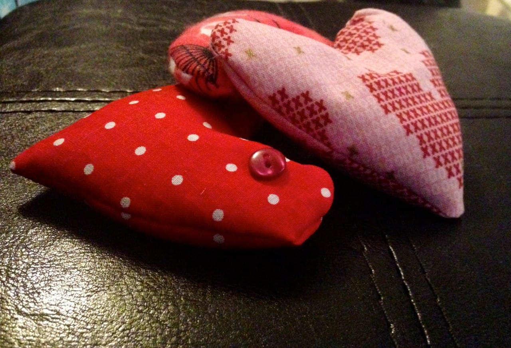

Project: Lavender Heart Sachets

It’s almost
<strong>
Valentine’s Day
</strong>
! A time of romance, love, candy and ridiculous cards. Yay! Today I’ll teach you how to make a very simple project that requires little skill and only a few materials. These cute lavender heart sachets will make the perfect gift for someone that you want to say “Love You!” to. They can be made any size you like and give off the most relaxing lavender scent!

Growing up, my family didn’t just celebrate Saint Valentine on February 14th, but also my parent’s anniversary. That made the ‘everything-heart-shaped day’ an extra special one in our household. Mom always got flowers, candies and some pretty silly cards from us. In return, she would make us special Valentine’s treats and a delicious home-cooked dinner for all of us to enjoy. She’d always wear red, pink or something with hearts on it and made sure we did too.

As we got older, the traditions didn’t stop (as you’ll see when we round each holiday!) If we couldn’t join her and Dad for dinner, there would surely be leftovers in the fridge waiting for us. Simple cards turned in to matching jewelry so that she and her daughters had something pretty to wear. And chocolate. Always chocolate.

No matter what we gave Mom, it was the most perfect gift she’d ever received, making every holiday spent with her very memorable and fun. She would have adored these little love-ender heart sachets!
<h2><strong>
Materials Needed For One Sachet:
 </strong></h2><ul><li>
Fabric (amount depends on size of heart)
</li><li>
Matching thread
</li><li>
Scissors
</li><li>
Sewing Machine and/or thread and needle for hand stitching
</li><li>
Pins
</li><li><a title="White Fancy Rice" href="http://amzn.to/N9XKV5" target="_blank" rel="noopener noreferrer">Rice</a>
(enough to fill half the heart)
</li><li><a title="Dried Lavender on Amazon" href="http://amzn.to/1aA0eq1" target="_blank" rel="noopener noreferrer">Dried lavender</a>
(enough to fill the other half)*
</li><li>
Paper and pencil
</li><li>
Buttons or other findings for decoration (optional)
</li><li>
Pinking shears (optional)
</li><li>
Iron for pressing (optional)
</li></ul><h2><strong>
Instructions:
</strong></h2><ul><li>
First, you’ll want to make your heart. Rather than provide you with a template for this, I’ll leave it to your pencil, paper, scissors and Kindergarten paper folding skills! Fold the paper in half. Draw your half a heart to desired size and cut. Unfold paper and you have a heart! Good for you! Be sure to make the paper heart slightly larger than you want your sachet to be. This will be important later!
</li></ul><ul><li>
Next, pick out your fabric. I did two cotton fabrics and a flannel. I did try out a fourth somewhat stretchy fabric but it did not get along with me. That one became a pincushion. 🙂 If you are making one sachet, make sure you have enough fabric to make TWO hearts (front and back of sachet). If you are making two sachets, be sure you have enough fabric for FOUR hearts, and so on.
</li></ul><ul><li>
Pin the paper heart down and trace it on the “wrong side” of your fabric using chalk or a pencil. Repeat for second half of heart. Before you cut the hearts out, make sure you like the pattern on the “right” side, since this will be the front/back of your sachet!
</li></ul><ul><li>
Now put those scissors back to use, and cut out both pieces of the heart. Easy peasy.
</li></ul><ul><li>
If your fabric is wrinkly, now is the time to iron it! The flatter the fabric is when you pin it in the next step, the more accurate your final product will be.
</li></ul><ul><li>
With the right sides facing together, pin all around the heart.
</li></ul><ul><li>
Now it’s time to sew! I used my machine, with a simple straight stitch and 1/4″ seam allowance, to go
<strong>
ALMOST
</strong>
all the way around the heart. Leave about two inches
<strong>
open
</strong>
to turn (you’ll see why below!). You may certainly hand stitch this entire project if you are confident in your skills!
</li></ul><ul><li>
Now look at heart, and think about what areas of fabric will gather together when you flip it inside out. To avoid bunching, you’ll need to clip the excess fabric with either pinking shears or scissors. Just don’t cut too close to the seam!
</li></ul><ul><li>
Using the end of a pencil or your fingers,
<strong>
gently
</strong>
turn the heart inside out through the two inch opening.
</li></ul><ul><li>
Flatten out heart and admire your work so far. Press it again if it’s wrinkly (this is your last chance!)
</li></ul><ul><li>
If you will be decorating the outside of your sachet with buttons or the like, now is a good time to do it. You can do it once it’s filled, but it becomes a little trickier.
</li></ul><ul><li>
Time to fill those little suckers up! I mixed half lavender and half rice in a bowl and using a sheet of paper, made a funnel to fill the hearts up. You can use all lavender* if you like. I find the scent of lavender to be relaxing in small doses. Too much of it is just too strong for me! I also like the bit of weight the rice gives it. It’s up to you how you fill them! Just be sure you do so with enough room left to fold in opening and stitch it shut.
</li></ul><ul><li>
Now that your sachet is all filled, simply fold in the remaining fabric at the opening, pin, and hand-stitch shut. You can use a blind stitch if you want it to be completely hidden. I’m still learning to perfect the blind stitch, myself!
</li></ul><ul><li>
All done! Go make yourself a cup of tea and relax with the aroma of lavender in the air.
</li></ul><h2><strong>
Tips:
</strong></h2><ul><li>
Different types of fabric require different amounts of tension on your machine. Always play around with a scrap piece of the fabric before you begin your projects to figure out what works best.
</li><li>
Don’t get frustrated if you mess up while sewing- that’s what your seam ripper is for!
</li><li>
I love my pinking shears, and will tell you to use them whenever possible. If you don’t have a pair, don’t sweat it! Just use a pair of scissors to create the little notches yourself. In a small project like this, it won’t add any time or labor.
</li><li>
Always begin and end a project with a few back-stitches. This will knot your thread in place and keep it from unraveling later.
</li></ul>

