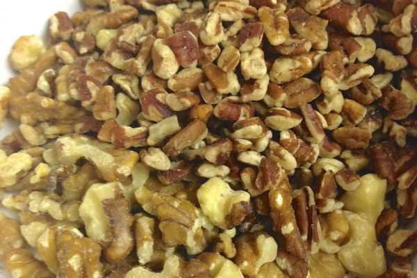
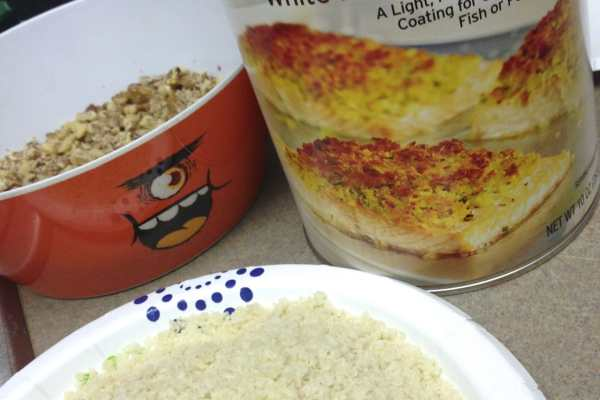
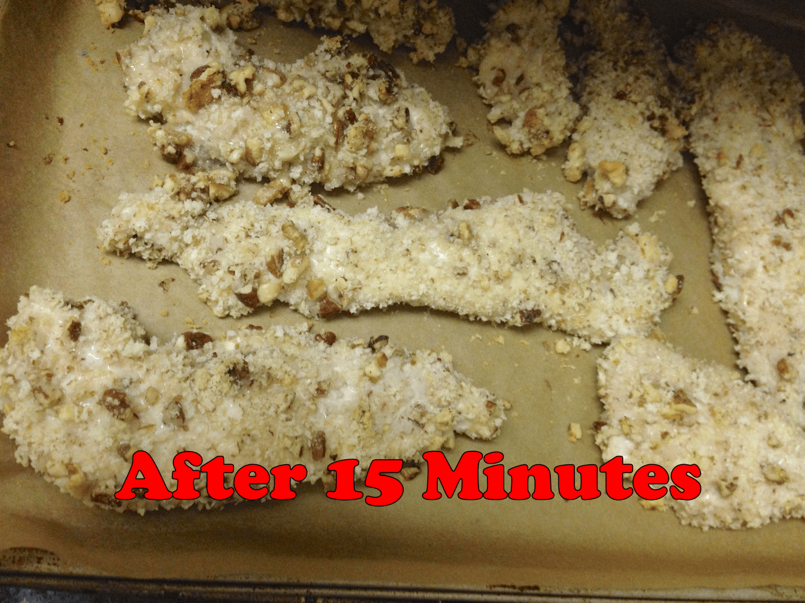

Recipe: Maple Walnut Pecan Chicken

I love a good baked chicken recipe- especially one that only takes 30 minutes to make! My friend (hey Hoffff!) made it for me a few years ago and I loved it. The following week I made it for my husband and he loved it. Then I made it for my Dad and Sister a few weeks after that and they loved it. Then my Dad made it for my Aunt and well- you can see where this is going. It’s obviously a winner in our family- and hopefully it will be in yours too!

First, let me give credit where credit is due. This recipe is totally taken from
<a title="Maple Pecan Chicken - Betty Crocker" href="http://www.bettycrocker.com/recipes/maple-pecan-chicken/23f051a3-6c27-4df1-832f-d2551a2b3f94" target="_blank" rel="noopener noreferrer">Betty Crocker</a>
, and then adjusted to my liking! I encourage you to visit their original recipe so you can spot the differences. In my tips at the bottom of the page, I’ll explain my choices for changing some of the recipe components. Don’t be deceived- just because this recipe is baked, doesn’t mean it’s healthy! It still combines maple syrup and mayo!

Prep Time: 10-15 minutes

Cook Time: 20 minutes
<h2>Ingredients per 1 pound of chicken*</h2>
*double each ingredient for each additional pound
<ul><li>
1 pound boneless skinless chicken breasts, fat trimmed, cut in to strips
</li><li>
1 Tablespoon pure maple or maple-flavored syrup, + extra for later
</li><li>
1 Tablespoon mayonnaise
</li><li>
1/2 cup panko bread crumbs
</li><li>
1/8 cup chopped pecans
</li><li>
1/8 cup chopped walnuts
</li><li>
seasonings: salt, pepper, onion powder, garlic powder
</li></ul><blockquote>
For this tutorial, I was making a LOT of chicken (we love leftovers!), so you’ll see my ingredients were all doubled up in the photos.
</blockquote><h2>Directions:</h2><ul><li>
Heat oven to 400°F. Line baking sheet with parchment paper.
</li></ul>
Ew. Raw chicken is ugly.
<ul><li>
Between pieces of plastic wrap, place chicken strips. I really don’t like including photos of raw chicken (it’s pretty gross!) so I made the above one black and white to try to bring down the yuck factor!
</li><li>
Gently pound chicken with meat mallet/tenderizer.
</li><li>
Remove plastic wrap and season chicken how you’d normally season cutlets. Set aside.
</li></ul>

          
        

          
        

<ul><li>
In BOWL (not plate or you’ll make a mess!), smash your nuts! I used a muddler because it’s easy (and fun) and I didn’t feel like chopping the already small pieces even smaller. You can take the easier route and throw them in a food processor, but I was lazy and didn’t want another thing to wash. Plus, as I said, it was fun to smash them!
</li></ul>

          
        

          
        

<ul><li>
Measure out your panko breadcrumbs and add them to the nut bowl. Mix together.
</li></ul>

          
        

          
        

<ul><li>
On plate or in a shallow dish, mix together maple syrup and mayonnaise. It will look gross, even after totally mixed. You may even be thinking as you’re mixing it “This is really disgusting- why am I making this recipe again!?” This is normal. Push through. I promise, it’s delicious! And the mayo coating on the chicken makes it mega super moist and plump!
</li></ul>

          
        

          
        

<ul><li>
Dip chicken into syrup mixture, then into panko mixture. Place on baking sheet, on parchment paper.
</li><li>
Bake at 400°F for 15 minutes.
</li></ul>

<ul><li>
When the 15 minutes are up, add a small drizzle (don’t drench them!) of syrup to the top of each chicken strip.**
</li></ul><blockquote>
**I do this when I’m frying up my regular chicken cutlets too, only I use honey instead of syrup! I learned it from my Dad- and they come out a-mazing!
</blockquote>

<ul><li>
Bake an additional 5 minutes or until golden brown/chicken is cooked. Be sure to cut one open and make sure it’s cooked all the way through- then marvel at how juicy it is!
</li></ul>

Pair with your fave starch (we went with mashed potatoes) and veggie (we went with corn) for a really great meal that everyone will love! Buon appetito!

<blockquote>
»
<strong>
Warning!
</strong>
Your Husband
<strong>
will
</strong>
try to eat
<strong>
all
</strong>
of the chicken in one sitting. You must stop him for his own good!«
</blockquote><h2>Tips:</h2><ul><li>
I’ve made this many different times in many different ways. I’ve used both pure maple syrup and maple flavored syrup- and you can really tell the difference. It’s still totally delish if you use maple flavored syrup (that’s all I had on hand this round, so it’s what I used in those pics!), but if you can get your hands on the good stuff- go for it!
</li><li>
The original recipe is all pecans, no walnuts. Husband loves walnuts, and while I typically don’t, I’m a sucker for walnut-encrusted chicken. It was an obvious choice to include them. Feel free to swap them out and go all pecans if you like!
</li><li>
Also in the original recipe, the amount of nuts and breadcrumbs is the same. This didn’t work for me- it always came out soggy. By increasing the amount of panko, it ensured the chicken came out crunchy.
<em>
BONUS: I don’t have to spray the tops of the chicken with cooking spray to get them to crunch up like the original recipe recommends, since they already get plenty crunchy from the added breadcrumbs! If you want them a more golden hue, you may still include this step.
</em></li></ul>
If you try this dish and make any new changes to it, let me know how it turns out! I’d love to hear what you think and what twists you put on it!

