
I recently had a giveaway for some nail art tape (more on that in a minute!), and once again asked readers to tell me what kind of designs they wanted to see. I can’t wait to tackle all the new types of designs that were suggested, and began with this week’s abstract floral look! Plus, I tried out a new trick using Elmer’s Glue that I think is pretty neat.

Before we get to the tutorial, let’s take a moment to congratulate our three winners, Melissa, Rebecca and Rachel! You each get a roll of nail art tape to play with and I can’t wait to see what you come up with as you design! Be sure to check your email for details and send over your addresses so I can ship these out! 🙂

Okay, tutorial time!
<h2>Materials:</h2><ul><li>
Clear base/top coat
</li><li>
Mint green nail polish
</li><li>
Hot pink sparkly nail polish
</li><li>
Hot pink nail polish
</li><li>
Yellow nail polish
</li><li>
Black nail polish
</li><li>
Nail art brush
</li><li><em>
Optional:
</em>
Elmer’s Glue (not pictured), small paint brush and tweezers*
</li></ul>
<em>*</em>

“WHY Elmer’s Glue!?!?,”
<em>
you ask? If you paint the safe-for-your-skin schoolhouse glue on your cuticles and the skin surrounding the nails, you can get messy with the painting/being abstract/using stamps/etc. and not worry about it getting all over your skin. You let it dry completely before you do your normal design and at the end, you use the tweezers to gently peel it off. Easy!
</em><h2>Instructions:</h2>
I love this design because it’s abstract and you pretty much can’t get it wrong! Just use my design as a guide or inspiration to come up with your own lovely abstract flower!
<ul><li>
Begin with clean, dry nails.
</li></ul>
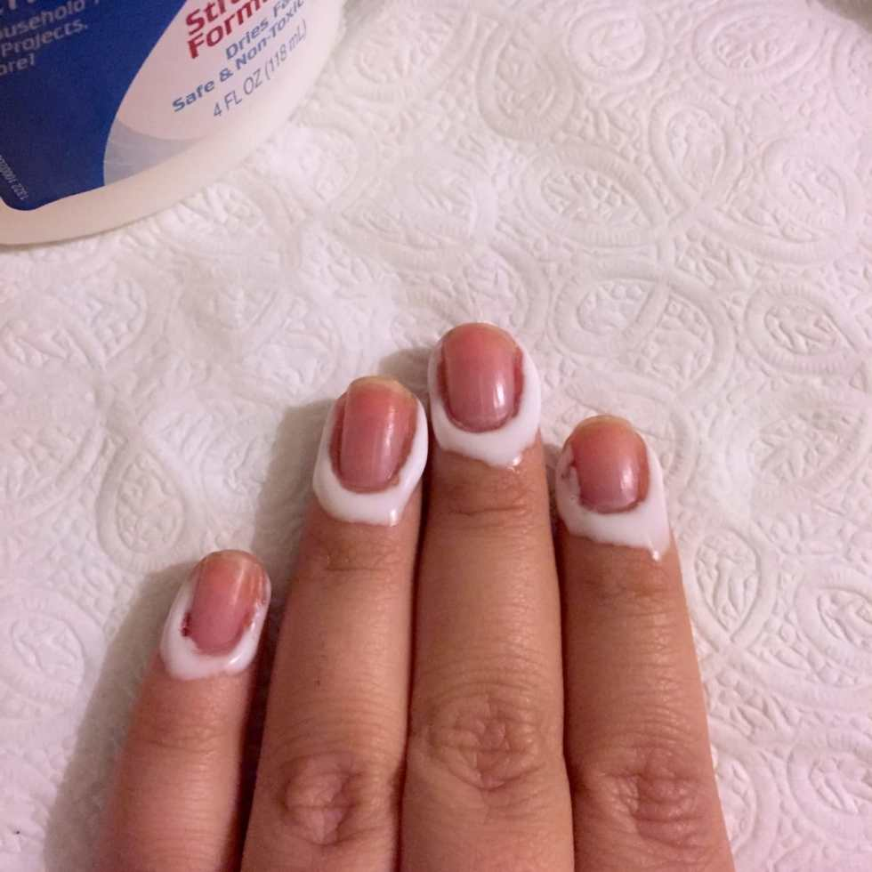
<ul><li><em>
If you are doing the optional step of Elmer’s Glue, now is the time to paint it on around your nails and let it completely dry before continuing. I put too much on as I didn’t use a paint brush and it took forever to dry. I will definitely be using a paint brush next time!
</em></li></ul>
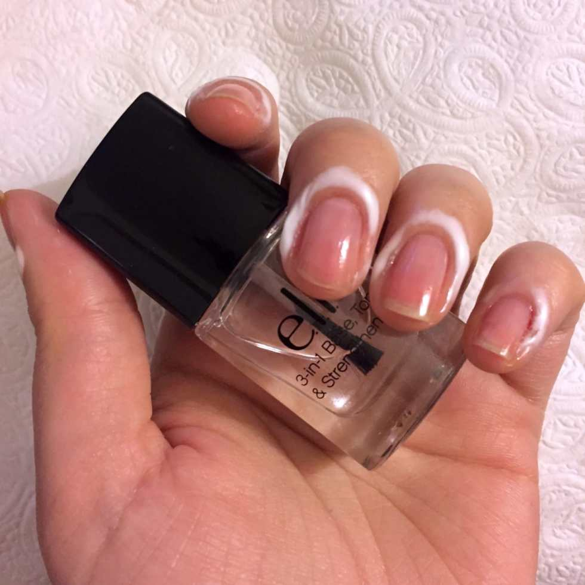
<ul><li>
Do one coat of clear base coat and let dry completely.
</li></ul><figure id="attachment_5941" aria-describedby="caption-attachment-5941" class="post__figure">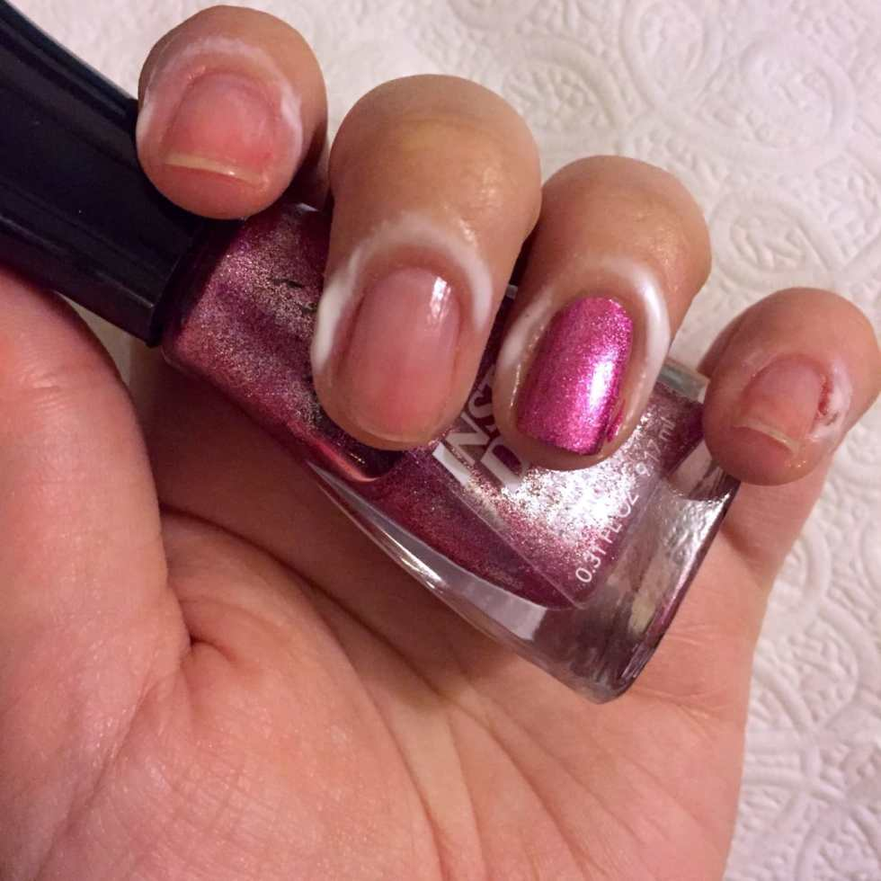<figcaption id="caption-attachment-5941">
after two coats
</figcaption></figure><ul><li>
Paint one coat of sparkly pink polish on your accent nail (I picked my ring finger for this one) and let dry.
</li></ul><figure id="attachment_5942" aria-describedby="caption-attachment-5942" class="post__figure">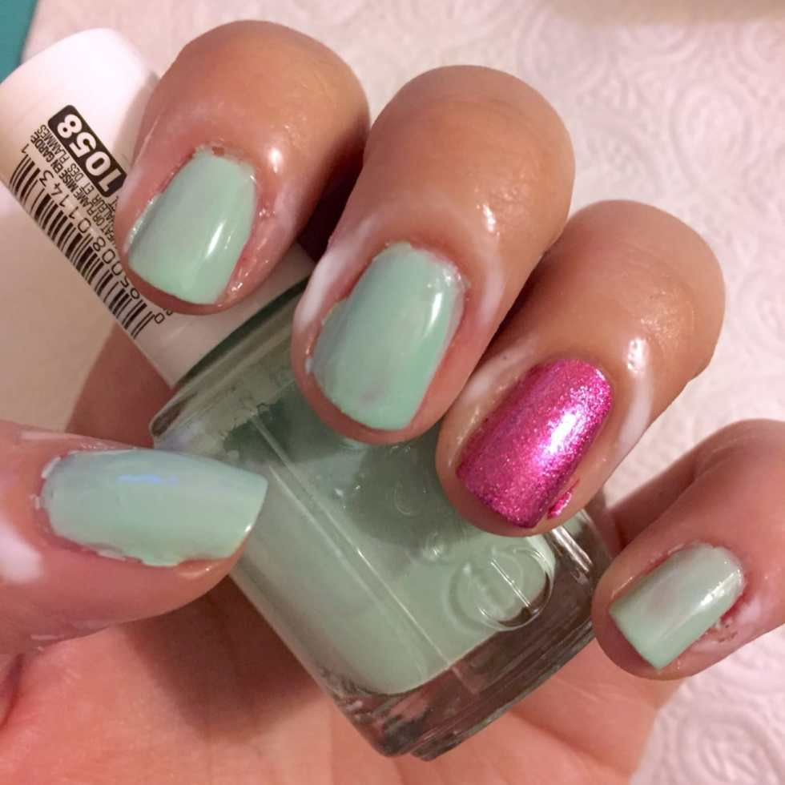<figcaption id="caption-attachment-5942">
after two coats
</figcaption></figure><ul><li>
Paint one coat of mint green polish on each of the remaining nails. Let dry.
</li><li>
Do a second coat of the pink and a second coat of the green on each of the nails.
</li></ul>

          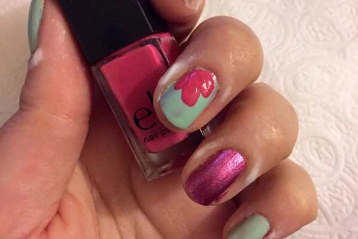
        

          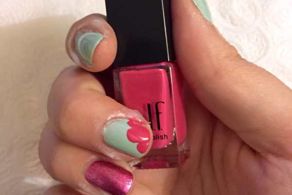
        

<ul><li>
Use your non-sparkly hot pink polish to make three quick petals. Remember, they do not need to be perfect! I did them on one hand coming out from the bottom of the nail, and on the other hand coming out from the top of the nail. Let completely dry.
</li></ul>
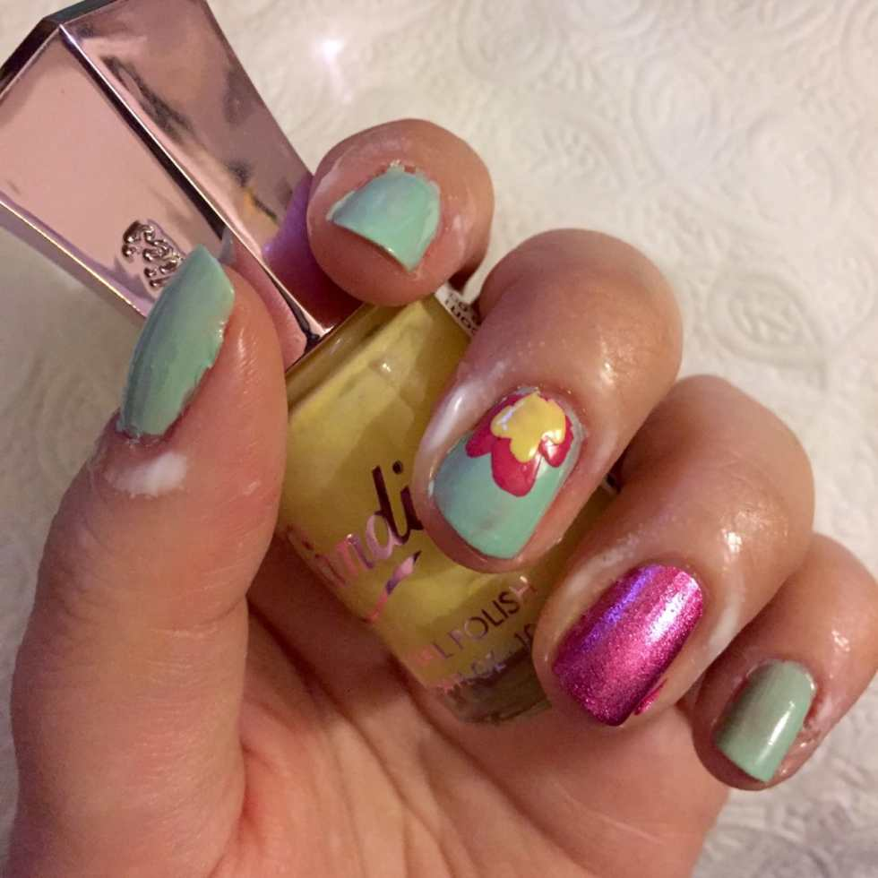
<ul><li>
Repeat the above step using the yellow nail polish, right on top of the pink to make smaller petals. Let dry.
</li></ul>
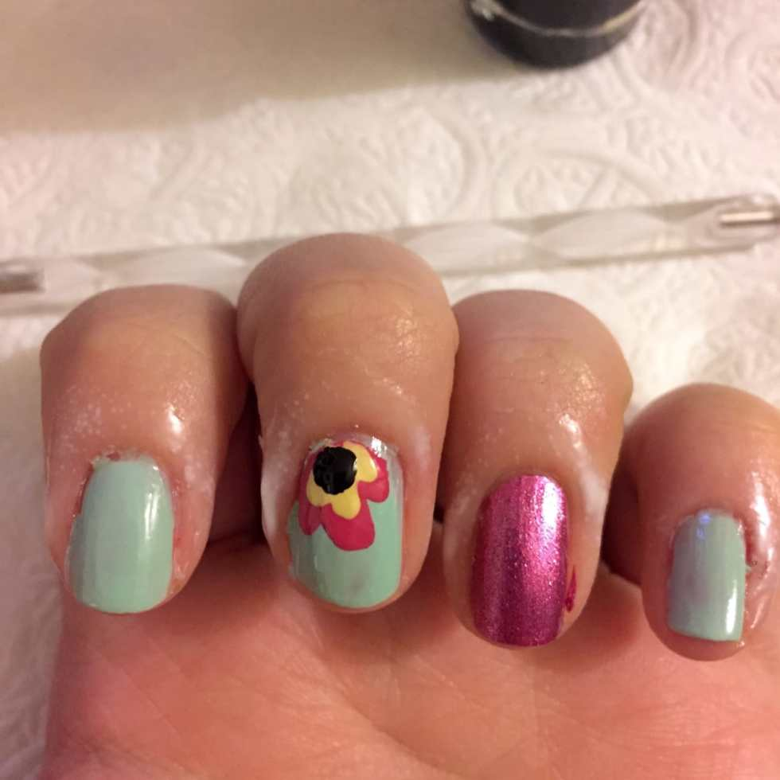
<ul><li>
Make a dot of black polish in the middle of each flower. I found my dot was too “perfectly round” for an abstract look, so I dragged the polish around a little to give it rougher edges! Let dry.
</li></ul>

          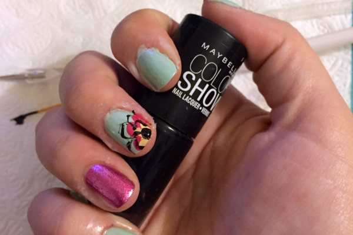
        

          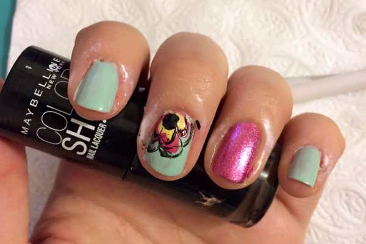
        

<ul><li>
Use your nail art brush dipped in black polish to create sketchy lines around the petals, accenting and somewhat outlining your flowers! Let dry.
</li><li><em>
Peel off the glue with tweezers, if you did this step!
</em></li><li>
Lock in look with clear nail polish and enjoy!
</li></ul>
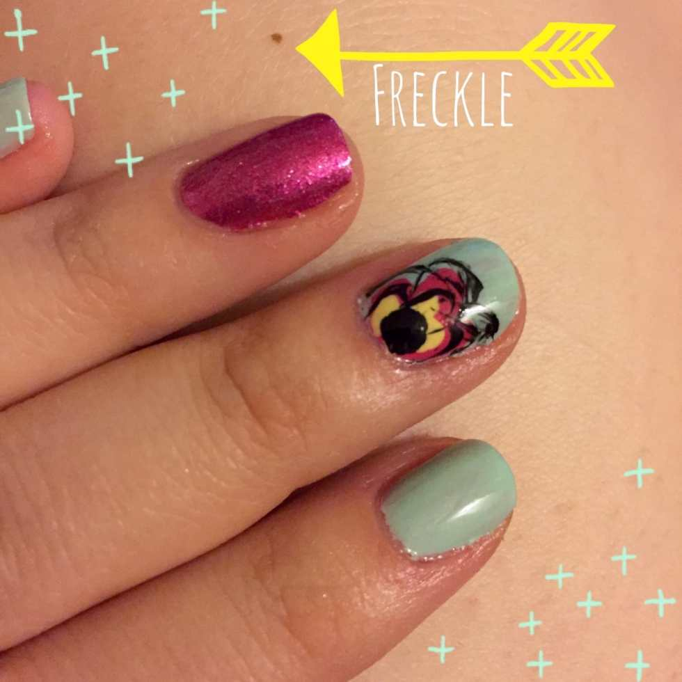

I’d love to see your abstract designs! Share them in the comments below! Happy Manicure Monday! 🙂

