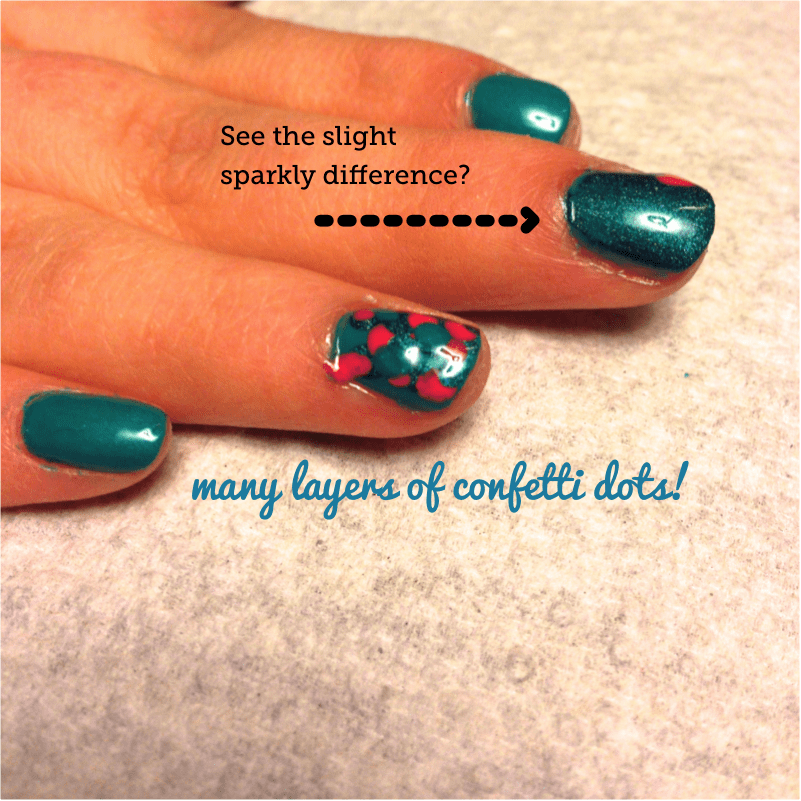
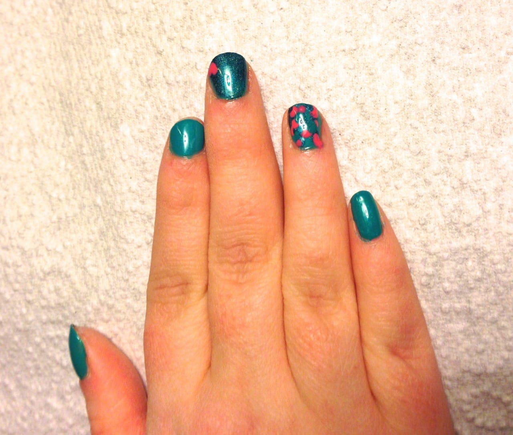
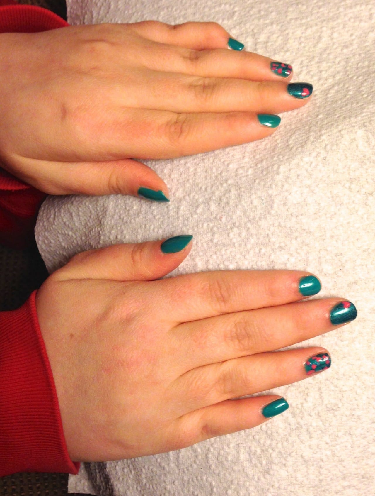

Project: 80s Dance Party Nail Art Design

It’s very rare that my sister, Jessica, lets me paint her nails. However, when I brought home some really fun nail polish colors and told her it was for my blog, she agreed (she still, of course, rolled her eyes so hard they almost fell out of her head.) We dubbed it 80s Dance Party!
<h2>Materials:</h2><ul><li>
Clear base coat/top coat
</li><li>
Teal nail polish
</li><li>
Similar teal sparkle nail polish
</li><li>
Hot pink nail polish
</li><li>
Toothpick/dotting tool/bobby pin
</li></ul><h2>Instructions:</h2><ul><li>
First, I filed Jessica’s nails to shape them. They really needed it!
</li><li>
Then I did a quick coat of my favorite
<a title="Sally Hansen Double Duty" href="http://amzn.to/1eYa3cS" target="_blank" rel="noopener noreferrer"><strong>
Sally Hansen Double Duty
</strong></a>
and let it dry.
</li></ul><ul><li>
Now on to the teal polish! I did two coats (letting it dry in between). The teal I used was
<a title="Sinful Colors " rise="" &#x26;#x26;#x26;#x26;#x26;#x26;="" shine&#x26;#x26;#x26;#x26;#x26;#x22;&#x26;#x26;#x26;#x26;#x26;#x22;="" href="http://amzn.to/1pXcXrk" target="_blank" rel="noopener noreferrer"><strong>
Sinful Colors “Rise &#x26; Shine.”
</strong></a>
It’s mega glossy, which I love.
</li></ul>

<ul><li>
After her nails were dry, it was time to paint the middle finger on each hand with one coat of the somewhat different teal sparkle color. I used
<strong>
China Glaze
</strong>
polish in
<strong>
Techno Teal
</strong>
for the slightly shimmery color, which I couldn’t find online. It’s a shade from 2011 and part of their ‘holo-effect’ series,
<strong>
China Glaze Tronica Collection.
</strong>
What I love about the polishes in this collection are how long they last! They also dry pretty quickly, which is always another plus. I’ve seen colors similar to this often, though, so I’m sure you won’t have any trouble finding a match!
</li><li>
While the one nail is drying, you can begin your dance party! Just use a dotting tool, toothpick or bobby pin to layer lots and lots of polka dots in all three shades (teal, teal sparkle and pink) over each other on the ring fingers. For pink, I used
<strong>
“Preppy Pink”
</strong>
by
<strong>
NYC Nail Polish.
</strong></li></ul>

<ul><li>
Don’t worry about the bits that get on your fingers- you’ll clean these later!
</li></ul>

<ul><li>
By the time you are finished with your 80s confetti dot dance party, your middle fingers should be dry. Paint a pink heart on the corner of each of them.
</li><li>
Lock in the look with some clear polish! Enjoy!
</li></ul>

Hope you enjoyed this simple 80s Dance Party nail art design! Thanks for being my guinea pig, Jess!

I’m going to give the butterfly nails I blogged about as my inspiration project on
<a title="Sunday Funday: Issue 3" href="/sunday-funday-issue-3/"><strong>
Sunday Funday: Issue 3
</strong></a>
a go this week! I really hope they turn out well!! I’ll be posting photos of them if they do. 🙂

