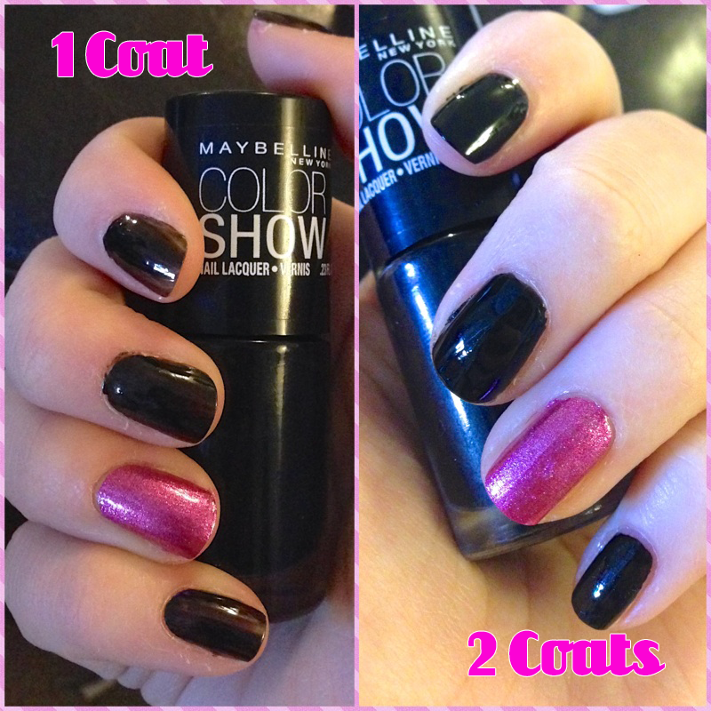
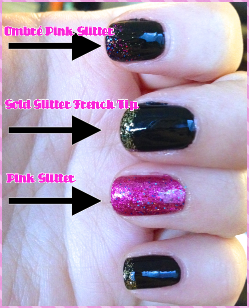

I mentioned
<a title="Sunday Funday: Issue 6" href="/sunday-funday-issue-6/">last weekend</a>
that I was in Atlantic City for my friend’s bachelorette party! I also said that I did a fun nail design that was pretty perfect for the occasion, and that I’d share it this week! Well, here we are! Hope you like it as much as I do.
<h2>Materials:</h2><ul><li>
Clear base and top coats (not pictured)
</li><li>
Black glossy nail polish
</li><li>
Pink clear-glitter nail polish
</li><li>
Pink solid-sparkly nail polish (You’ll see the difference below!)
</li><li>
Gold clear-glitter nail polish
</li></ul><h2>Instructions:</h2><ul><li>
After cleaning your nails, do a quick clear base coat on your nails.
</li></ul>

<ul><li>
When the clear is dry, paint your ring fingers with one coat of the pink solid-sparkly nail polish. I used
<a title="Sally Hansen Pink Fast" href="http://amzn.to/1mmJPGQ" target="_blank" rel="noopener noreferrer">Sally Hansen Insta-Dri in Pink Fast</a>
. When it’s dry, do a second coat.
</li><li>
Next up, do one coat of a nice glossy black polish. My favorite is
<a title="Maybelline Color Show in Onyx Rush" href="http://amzn.to/1dIzSUb" target="_blank" rel="noopener noreferrer">Maybelline Color Show in Onyx Rush</a>
. After the first coat is
<strong>
totally dry
</strong>
, do a second. Let that one dry too!
</li></ul>

<ul><li>
Let all coats
<strong>
totally 100% dry!
</strong>
Now it’s time for glitter! Do one coat of pink clear-glitter over the pink nail.
</li></ul>

<ul><li>
Pick two nails you want to also do some pink glitter on, and give it a little ombré look with ‘layers’ of glitter.
</li><li>
On the remaining nails, do french tips with the gold glitter polish. Repeat glitter coats for extra sparkle!
</li></ul>

<ul><li>
Finish off with a glossy clear top coat. Let dry and you’re ready to party!
</li></ul>
I especially loved the black glossy nails with the gold glitter. It looked like I dipped them in gold foil! I will certainly be using this style again. Enjoy your hot pink and black sassy glitter bachelorette party nails!

