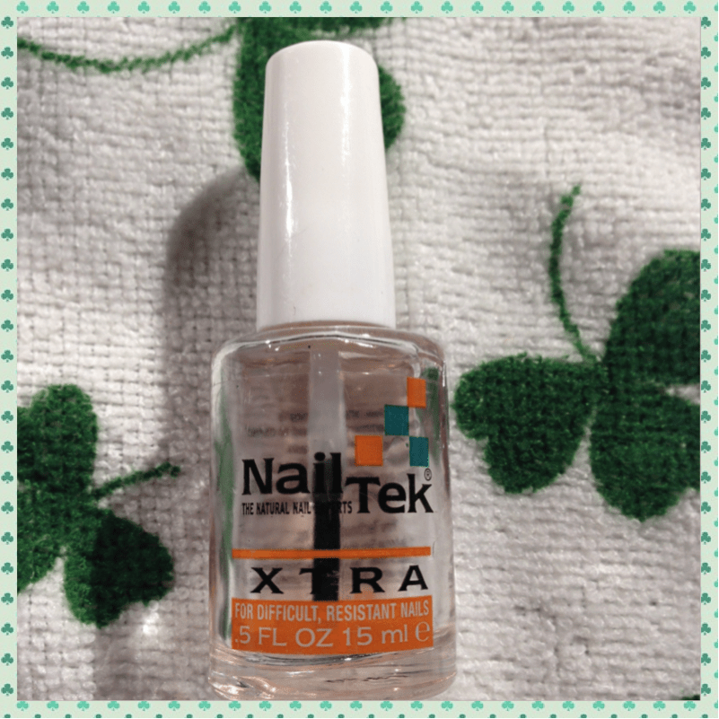
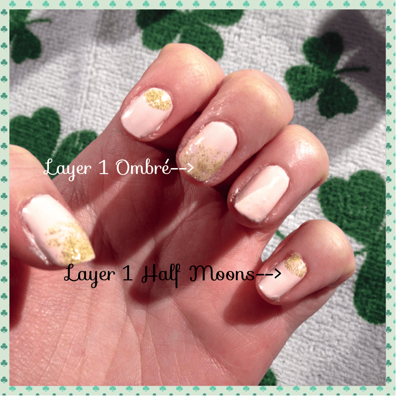
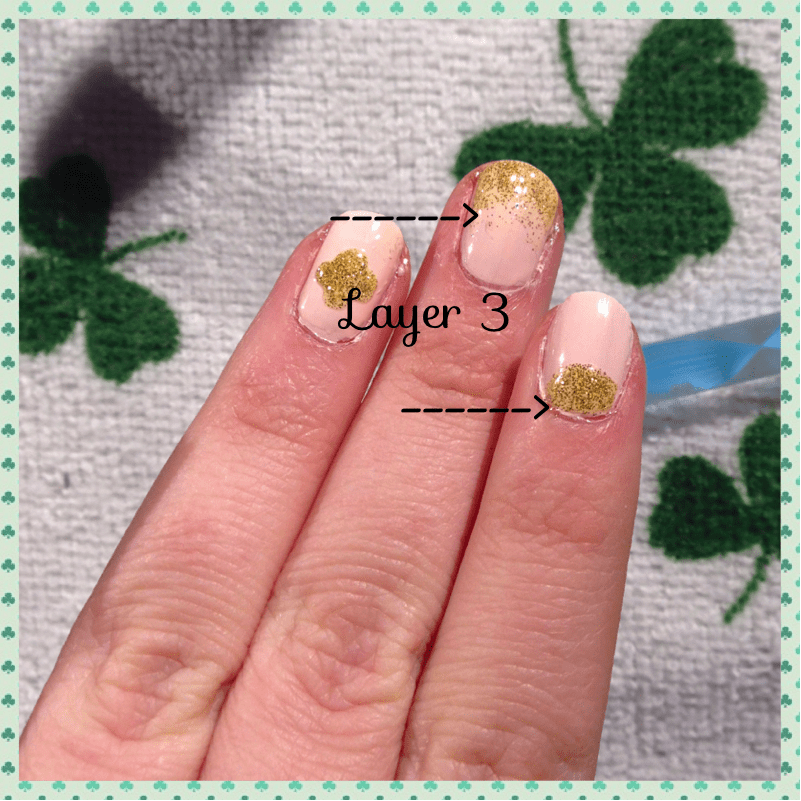
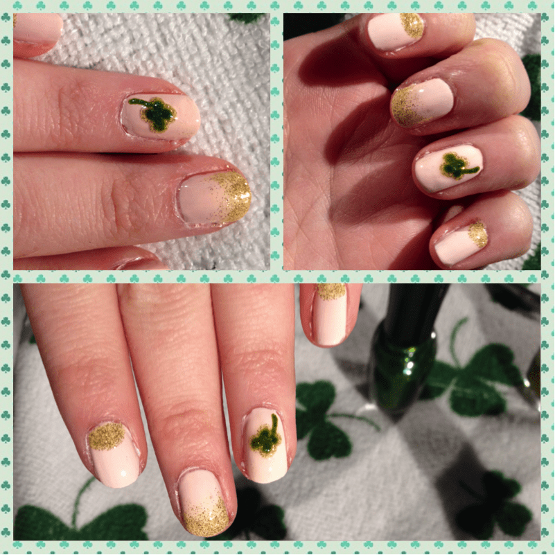

Project: Classy Clovers Nail Art Tutorial

Saint Patrick’s Day falls on a Monday this year. That means all your parades, bar hopping and ridiculous “KISS ME, I’M IRISH!” outfits must be reserved for the weekend. Still, if you’d like to show a smidge of Irish Pride at your workplace come Monday, I have a lovely, simple and classy nail art design to help you celebrate!
<h2>Materials:</h2><ul><li>
Base coat (not pictured)
</li><li>
Light pink nail polish
</li><li>
Gold glitter nail polish
</li><li>
Green glitter nail polish
</li><li>
Clear top coat
</li><li>
Dotting tool or toothpicks
</li></ul><h2>Instructions:</h2>
First, let me start this by saying this design took me awhile. The light pink polish I used (while a lovely shade) was thin and somewhat streaky. I had to do three coats to get it to where I wanted it. So it was time consuming waiting for every single layer to dry. If you have a light pink polish that is perfect in two coats (or even one!), this tutorial should be much easier for you!

<ul><li>
Start out with a clear base coat on your already cleaned up nails. I’m trying to strengthen mine right now, so I’m using Nail Tek- which isn’t a base coat- and therefore didn’t want to ALSO add ANOTHER layer to the mix. You should use a clear base coat before you begin, though!
</li></ul>

<ul><li>
Do one layer of light pink polish. I used Spoiled by Wet &#x26; Wild in color “My Button Fell Off.” (Seriously, once again, who gets the job of naming polishes?! I want in!!)
</li><li>
Once layer one is
<strong>
DRY
</strong>
, do a second layer. Let that one dry. Do a third if you have to. Let dry. You can see the difference in layers above.
</li></ul>

<ul><li>
When all your bazillion layers of pale pink polish are dry, it’s time for the gold! I used my favorite gold glitter polish by Sinful Colors called “Paris.” I have two other gold glitter polishes, but I like this one the best. It’s mega sparkly!
</li><li>
I did three different designs total: half moons, ombré, and clovers. The clovers went on my ring fingers, and I alternated half moons and ombré.
</li></ul>

I started with the
<strong>
first layer
</strong>
of the half moon, and the
<strong>
first layer
</strong>
of the ombré:
<ul><li><strong>
Half Moon
</strong>
: I figured out which nails I wanted to do my half moons on, and did those first. I used the nail polish applicator to put a small dot of polish at the middle base of my fingernail. Then I gently pulled it from one side to the other to create an easy half moon.
</li><li><strong>
Ombré
</strong>
: On to my designated ombré nails. Usually I’d use a makeup sponge and different color polishes for this look, but it’s far easier when glitter is involved. I just painted the nail about halfway down with one
<strong>
thin
</strong>
coat of glitter polish, staggering to make it look nice/not like a straight line.
</li></ul>

<ul><li>
Now for the
<strong>
Lucky 4 Leaf Clover!
</strong>
I used the large end of my dotting tool and the gold polish to make 4 fat dots next to each other. Then I made one dot in the middle of those, and gently dragged it to each of the other dots. This made a clover type shape. Repeat on other hand. Let dry while you do other half moon &#x26; ombré layers.
</li></ul>

<ul><li>
Layer 2: I went back over my half moons with some more glitter for extra sparkle. Then I painted halfway down the already glittered portion of the ombré nail (so that the new half is more sparkly, making it look like a gradual glitter).
</li><li>
Layer 3: When mostly dry, I did it once more, again only on half of the last application. This essentially makes three ‘stacked layers’ for an easy ombré style. Add more to half moons if you like.
</li></ul>

<ul><li><strong>
Makin’ it green
</strong>
: I grabbed my green polish (Confetti brand, color “My Favorite Martian”) and repeated the clover design steps directly on top of the {dried} gold clover, this time using the small end of the dotting tool. To complete it, I used the small end of the tool dipped in my green again to make a little stem.
</li></ul>

Various shots of the nails before the shiny top coat, and before cleaning them up!

<blockquote>
<em>Realizing now how grossly white my skin looks from the polish on there. Ew.</em>
</blockquote>

<ul><li>
Finish up with top coat and go make yourself and the Husband some grilled cheese sandwiches. Mess up one of your newly painted nails while cooking and curse under your breath. Try to fix with more polish but continue to be dissatisfied with a spot you think is obviously messed up while no one else will probably even notice it. Or try to skip this step entirely, because it was really a pain.
</li></ul>

Enjoy your sweet dainty nails with your touch of Irish on Saint Patrick’s Day! Have a great weekend, and come back on Monday for my
<strong>
Homemade Shamrock Shake recipe
</strong>
!

