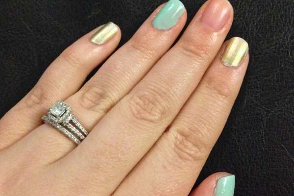
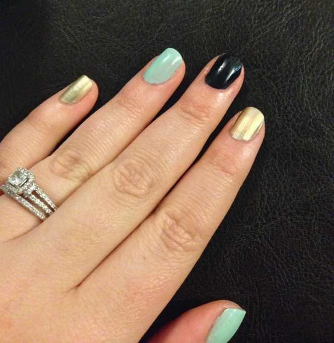
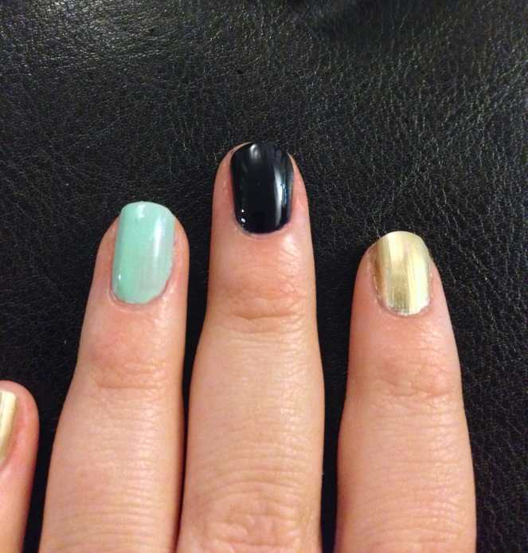
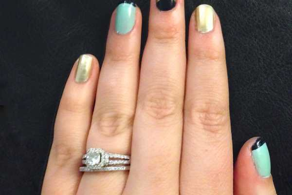
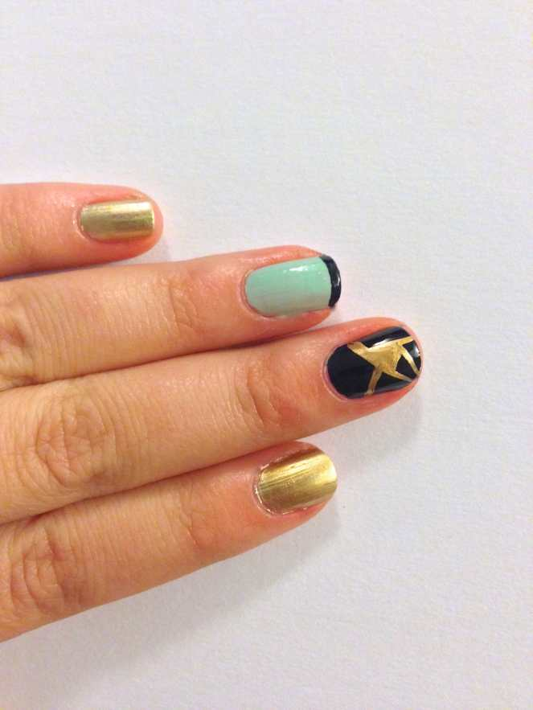

My three fave colors right now are navy, mint and gold. Why not combine them together in a cute, easy and somewhat abstract nail art design?! There is no reason why not, obviously. That’s why I did it! Check out how you can too below!
<h2>Materials:</h2><ul><li>
Gold nail polish (Sally Hansen ColorFoil is awesome!)
</li><li>
Mint green nail polish (I used
<a title="Essie " fashion="" playground&#x26;#x26;#x26;#x26;#x26;#x22;="" polish&#x26;#x26;#x26;#x26;#x26;#x22;="" href="http://amzn.to/1x3Ful2" target="_blank" rel="noopener noreferrer">Essie’s Fashion Playground</a>
)
</li><li>
Navy nail polish (I used
<a title="Essie After School Blazer" href="http://amzn.to/Z5ekLx" target="_blank" rel="noopener noreferrer">Essie’s After School Blazer</a>
)
</li><li>
Clear top coat (I used
<a title="Sally Hansen Double Duty" href="http://amzn.to/1upGJFZ" target="_blank" rel="noopener noreferrer">Sally Hansen Double Duty</a>
)
</li><li>
Nail art brush – thin
</li></ul><h2>Instructions:</h2><ul><li>
Shape your nails with a file if necessary, and make sure your nails are clean and dry.
</li><li>
Pick two nails on each hand to paint gold, and do one coat on said nails. I picked my pinky and pointer fingers. The ColorFoil is fab and only needs one coat, but if your polish needs two, just let the first dry while you continue on to the other nails and come back to them later.
</li></ul>
How Shiny!
<ul><li>
Pick which nails you want to paint mint green and paint them! I chose my ring finger and thumb on each hand. My mint needed two coats, so once the first coat was dry, I went back and did a second on each. (See the difference below?)
</li></ul>

          
        

          
        

<ul><li>
All that is left is your middle finger nail (or whichever you left for the end!) Paint remaining nails navy blue and let dry. Do two coats if you have to!
</li></ul>

<ul><li>
Here are the three colors together!
</li></ul><figure id="attachment_4185" aria-describedby="caption-attachment-4185" class="post__figure"><figcaption id="caption-attachment-4185">
Love these shades!
</figcaption></figure><ul><li>
Next, use the navy polish to make a french tip on the nails that you painted mint green.
</li></ul>

<ul><li>
Use your nail art brush and the gold polish to make a fun abstract design! Do whatever your heart desires and make it your own unique design.
</li></ul>

          
        

          
        

<ul><li>
Put a coat of clear on your nails to lock in your design and make it even glossier!
</li></ul>

Enjoy your navy, mint and gold nails!

What colors do you totally love together?

