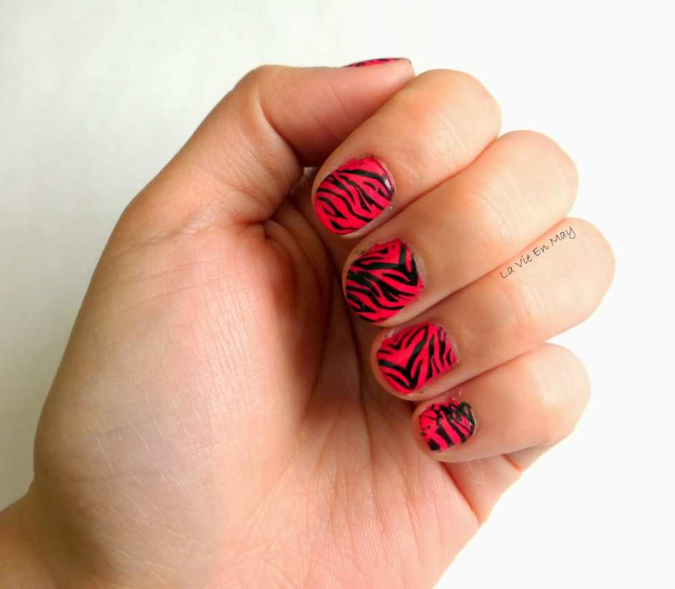

This last week was so busy! With Easter, my cat getting sick and having to go to the vet twice, a Phillies game and about a million other things, I knew I wasn’t going to have time to blog as much as I wanted to. Thankfully, May from
<a title="La Vie en May" href="http://www.lavieenmay.com/" target="_blank" rel="noopener noreferrer"><strong>
La Vie en May
</strong></a>
came to my rescue with today’s Manicure Monday post!

May is letting me share her fun post of a pink zebra nail art design that she was able to make using a super cool nail stamping set she has, which means you get a review of the product too! Check out May’s
<a title="Nail Stamp NOTD Pink Zebras on La Vie en May" href="http://www.lavieenmay.com/2014/02/nail-stamp-notd-pink-zebras.html" target="_blank" rel="noopener noreferrer"><em>
original post right here
</em></a>
, or read her re-post below!
<blockquote>
<em>All photos originally from La Vie en May.</em>
</blockquote>
My boyfriend surprised me with nail stamp supplies for Valentine’s Day! As crazy as it sounds, I was so giddy when I saw the stuff he got me. I always thought nail stamping was cool: it seemed really simple to do and you can beautiful designs in just seconds without having to go to the salon and empty your wallet. Check out what I got:

<em>Konad Double Side Nail Stamper and Metal Scraper; found</em>
<em><a href="http://www.amazon.com/gp/product/B002MZ8BK2/ref=as_li_tl?ie=UTF8&#x26;camp=1789&#x26;creative=390957&#x26;creativeASIN=B002MZ8BK2&#x26;linkCode=as2&#x26;tag=lavienma-20&#x26;linkId=2AIJ6DQ2NSV76SAI" rel="nofollow noopener noreferrer" target="_blank">here</a>
.
</em>
<em>MASH Design Plates, Set of 25; found</em>
<em><a href="http://www.amazon.com/gp/product/B00IUI8ZVU/ref=as_li_tl?ie=UTF8&#x26;camp=1789&#x26;creative=390957&#x26;creativeASIN=B00IUI8ZVU&#x26;linkCode=as2&#x26;tag=lavienma-20&#x26;linkId=QUMFJ5ZQFXEIWVM4" rel="nofollow noopener noreferrer" target="_blank">here</a>
.
</em>
I have to say, it’s not as easy as it looks. It took me 2-3 tries before I really got it down correctly. The key to success is swiftness. There are four simple steps: cover the image with nail polish, scrape off excess nail polish, grab the design using the stamper and roll the stamper over your finger. You want to be really quick between the scraping and grabbing the design using the stamper. If you’re too slow, the nail polish will dry and you have to clean the plate with acetone and start all over. I recommend watching a video before you start doing it yourself.

For my first design ever, I decided to choose a zebra print. I thought I’d spice it up by having a hot pink base instead of a white base. What do you guys think?

<em>Hot pink base is Essie’s ‘Bottle Service’ (similar</em>
<em><a href="http://www.amazon.com/gp/product/B00770KI4Y/ref=as_li_tl?ie=UTF8&#x26;camp=1789&#x26;creative=390957&#x26;creativeASIN=B00770KI4Y&#x26;linkCode=as2&#x26;tag=lavienma-20&#x26;linkId=YQ6DWUAGU5GJFRFF" rel="nofollow noopener noreferrer" target="_blank">here</a>
) and stripes are
</em> <em><a href="http://www.amazon.com/gp/product/B00GXW0VBC/ref=as_li_tl?ie=UTF8&#x26;camp=1789&#x26;creative=390957&#x26;creativeASIN=B00GXW0VBC&#x26;linkCode=as2&#x26;tag=lavienma-20&#x26;linkId=JKPJR4N3RYPMGIIY" rel="nofollow noopener noreferrer" target="_blank">Essie’s ‘Licorice’</a></em>

<em>Ignore the pinky..it’s a bit messy to say the least.</em>

Have any questions about nail stamping? Let May know in the comments!

