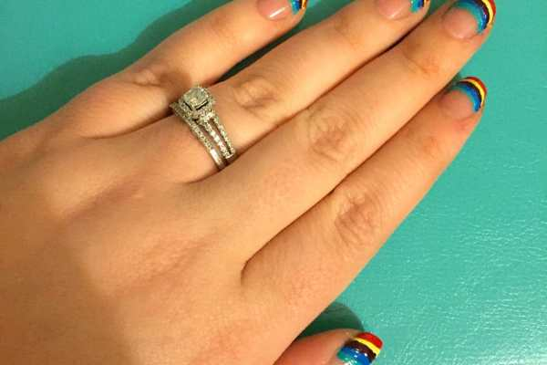
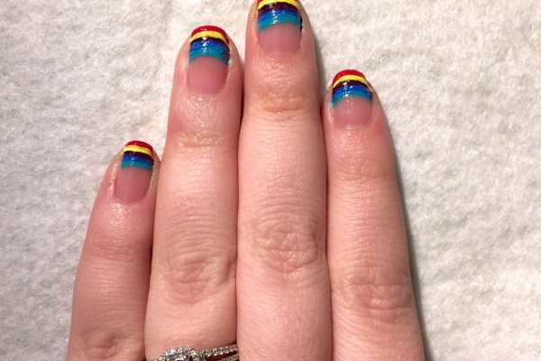

We had a snowstorm on Friday (which also happened to be the first day of Spring!) Thankfully, it warmed up a little over the weekend and melted a good amount of it. Hopefully the Spring decides to stick around for awhile. In anticipation, I found several Springy nail art designs I want to try, starting with this one! Colorful, isn’t it?

This design is super easy. All you do is make stripes in different colors. You can use what ever colors you like- they don’t even have to be shades you’d find in a rainbow! Here is what I used to complete the look.
<h2>Materials:</h2><ul><li>
Acrylic paint in: red, yellow, purple, blue and teal (white and black are pictured but where not used)
</li><li>
Clear top coat
</li><li>
Medium nail art brush
</li></ul><h2>Instructions:</h2><ul><li>
Place a dab of all colors you plan on using on a plate or paper in front of you.
</li><li>
Starting with clean dry nails, dip nail art brush in red, and make a line across each of your tips.
</li><li>
Clean the brush with water, and dip it in the yellow. Follow right underneath the red line.
</li><li>
Repeat process with purple, blue and teal paints. Let dry.
</li></ul><ul><li>
Seal in look with one to two coats of clear top coat. Let dry.
</li></ul>

          
        

          
        

<ul><li>
Clean up excess paint.
</li><li>
Done!
</li></ul>

          
        

          
        

I originally was going to make little white clouds on the thumbs, outlined in black (which is why I had those paints included with the materials) but decided not to. All rainbows seemed more fun!

What do you think of this simple Manicure Monday design for Spring?

