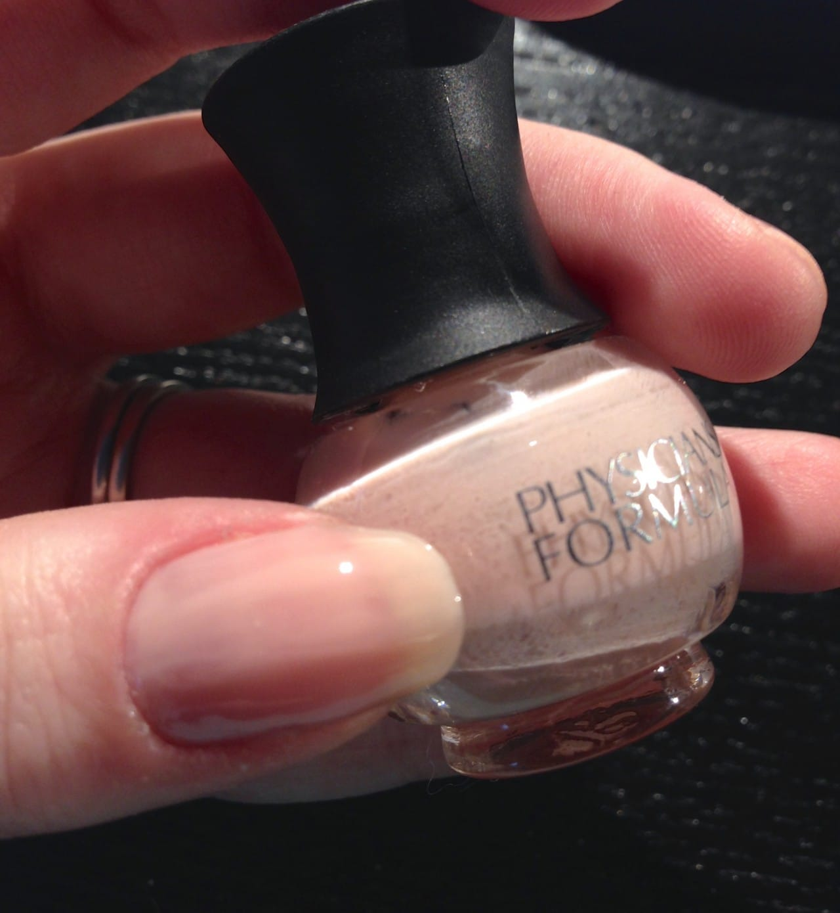
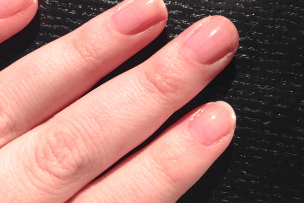
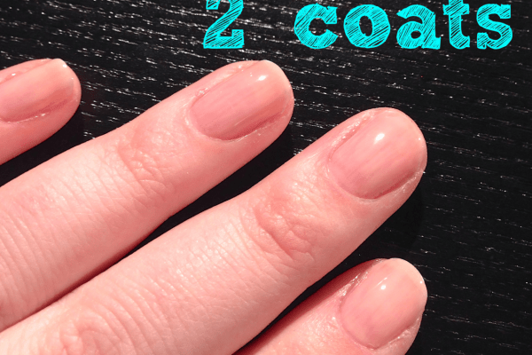
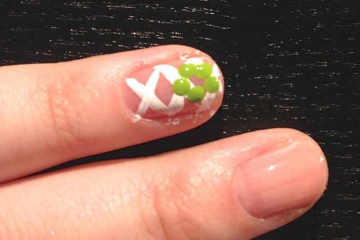
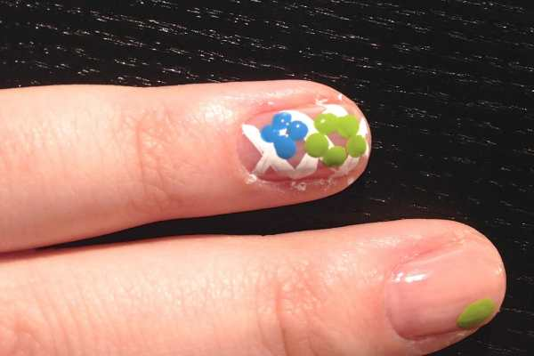
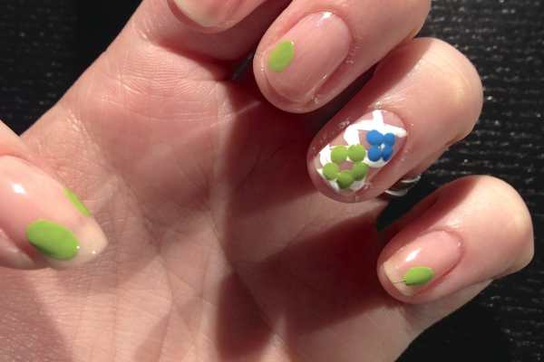
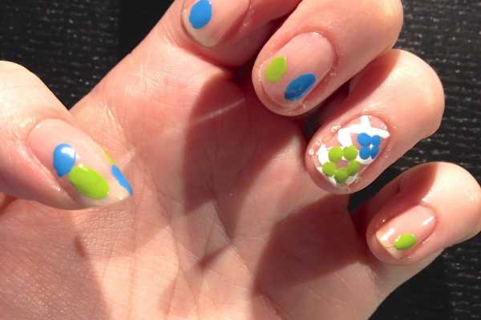
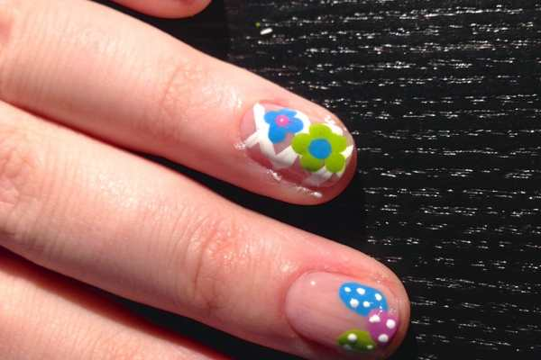
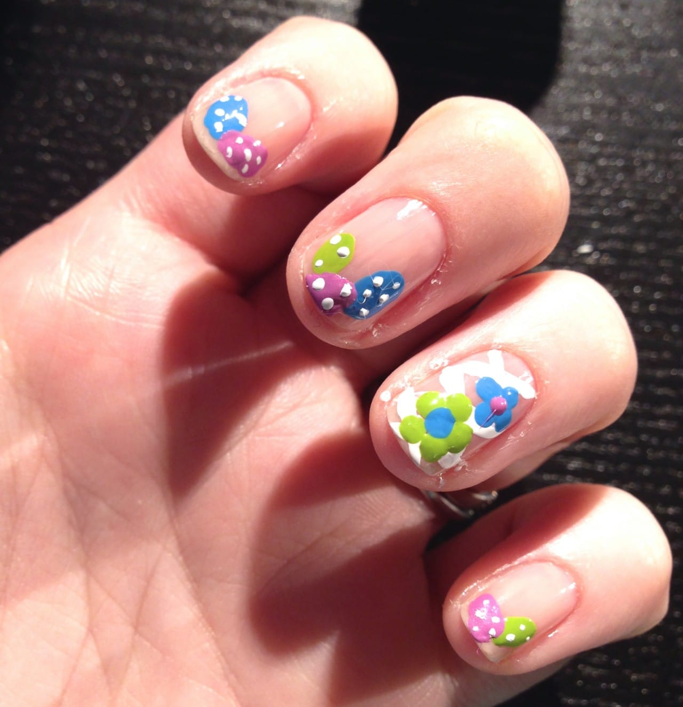
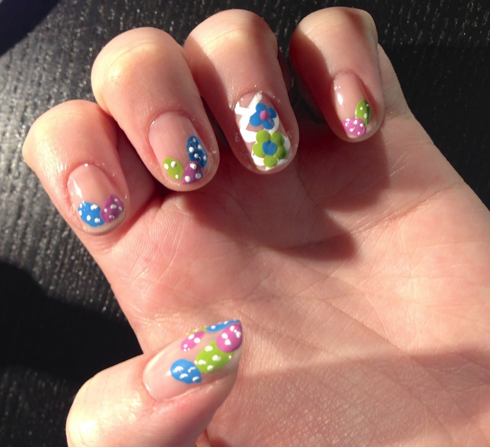

This week’s nail art design is perfect for Easter Sunday! It incorporates little speckled Easter eggs and a little lattice/basket weave accent nail with flowers. They are simple and easy and were fun to paint (even if they were a little hard to do on my left hand!)
<h2>Materials:</h2><ul><li>
Clear base coat
</li><li>
Sheer pink transparent nail polish
</li><li>
Lime or bright green nail polish
</li><li>
Orchid or lavender nail polish
</li><li>
Blue nail polish
</li><li>
White striper
</li><li>
Dotting tools/bobby pins/toothpicks
</li></ul><h2>Instructions:</h2><ul><li>
Start out with clean dry nails.
</li><li>
Do a coat of clear base coat and let it dry.
</li></ul>

<ul><li>
Once dry, you’ll paint your first coat of the sheer pink transparent nail polish on. I picked the lightest shade from my
<a title="Physician&#x27;s Formula Trio: In The Nude" href="http://amzn.to/1peWyRe" target="_blank" rel="noopener noreferrer">Physician’s Formula Trio “In The Nude.”</a>
It’s a great set!
</li></ul>

<ul><li>
After a first coat is dry, do a second if your polish is streaky. I may have even gone for a third with this one, but I was getting too impatient! You can see below that a second coat wasn’t even too noticeable!
</li></ul>

          
        

          
        

<ul><li>
Next you can do your accent nail. I used a white striper to draw a criss-cross basket weave/lattice design on my ring fingers.
</li></ul>

<ul><li>
Next, I used my dotting tool to make two flowers on each accent nail. I made five dots for the bigger flower, and four for the smaller. Use whatever colors you like for the petals! Just be sure the center of each flower is in a contrasting color!
</li></ul>

          
        

          
        

<ul><li>
Now you can move on to the eggs! Make different sized, different colored eggs using your dotting tools on each nail. Play around with them! Put them wherever you like!
</li></ul>

          
        

          
        

          
        

          
        

<ul><li>
Once all your eggs are in a row, it’s time to put speckles on them! I used the tip of my striper tool to do this, but you can use a dotting tool again!
</li></ul>

          
        

          
        

<ul><li>
Put on a coat of clear top coat and you’re golden!
</li></ul>

<ul><li>
Once your nails are totally 110% dry, gently scrap the excess polish off your skin while washing your hands.
</li></ul>

Enjoy your new Easter egg and flower basket nails! Hope you like them! If you use this design, snap a pic and share it in the comments below!

