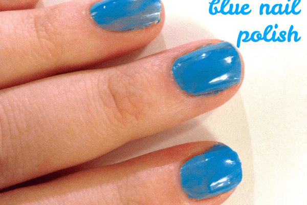
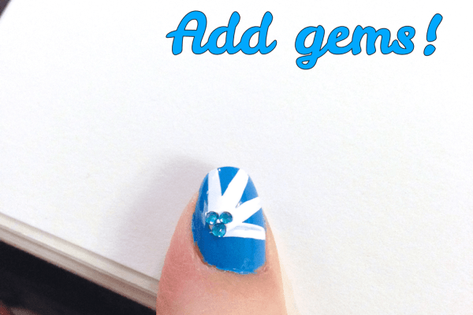
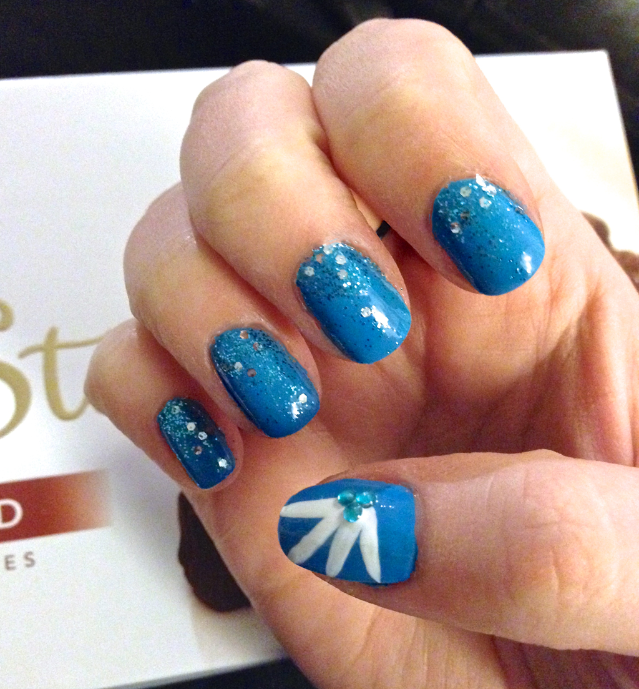
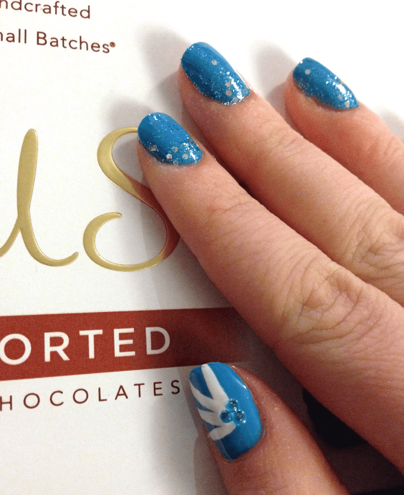

All weekend I felt blue. But not, sad-blue. Blue-skies-blue! It was a gorgeous weekend outside, and I had a great time walking around the gardens and the city, taking in the beautiful weather and blue skies. Feelin’ blue as I was, I decided to end the weekend with a blue manicure.
<h2>Materials:</h2><ul><li>
Clear base/top coat
</li><li>
Light blue nail polish
</li><li>
Blue or turquoise glitter nail polish
</li><li>
White striper (or white nail polish and a thin nail paint brush)
</li><li>
6 nail gems
</li></ul><h2>Instructions:</h2><ul><li>
I started with clean, buffed, shaped dry nails.
<em>
(Apparently TOO dry, since my skin looks like death in these photos. Time for some mega lotioning!)
</em></li><li>
Apply one coat of clear base coat to your nails. Let dry.
</li></ul>

<ul><li>
Next, apply one coat of light blue/sky blue nail polish. I used NYC: In A Minute Quick Dry color in color NY Blues.
</li><li>
After the first coat is totally dry (which doesn’t take too long, hence the quick dry!), do a second coat. Let that dry too!
</li></ul>

          
        

          
        

<ul><li>
When the second coat is dry, it’s time for glitter! Start at the base of your finger nail and drag the blue glitter polish up towards the tip! Do it a couple times on each nail EXCEPT your thumbs, concentrating the glitter at the base, so it looks like it’s bursting out from there. I used one of the old Muppets colors from OPI, called
<a title="Gone Gonzo by OPI" href="http://amzn.to/1kjL8q7" target="_blank" rel="noopener noreferrer">Gone Gonzo</a>
!
</li></ul>

<ul><li>
When you are finished with the glitter, break out your white striper and make four lines on your thumb that begin at the same point. Then add three nail gems (I went with a similar turquoise aqua blue color!) to burst.
</li></ul>

          
        

          
        

<ul><li>
Let dry a bit, then go over each nail with clear top coat.
</li></ul>

<ul><li>
When they are ALL dry (mine weren’t when I took these pics!) clean the excess polish from your skin and you are all done! Enjoy your happy blue nails while eating the chocolates your Husband got you for your 6 month anniversary! 😀
</li></ul>

          
        

          
        

If you like this design or give it a try, show me pics in the comments!

<blockquote>
P.S. – It really is crazy how awful and dry my cuticles look in these photos! They don’t even look like that in real life, just in the photos. I even lotioned them up before the last photo and it didn’t seem to matter! If you guys have any great products you use to get your dry cuticles under control, please share!
</blockquote>
