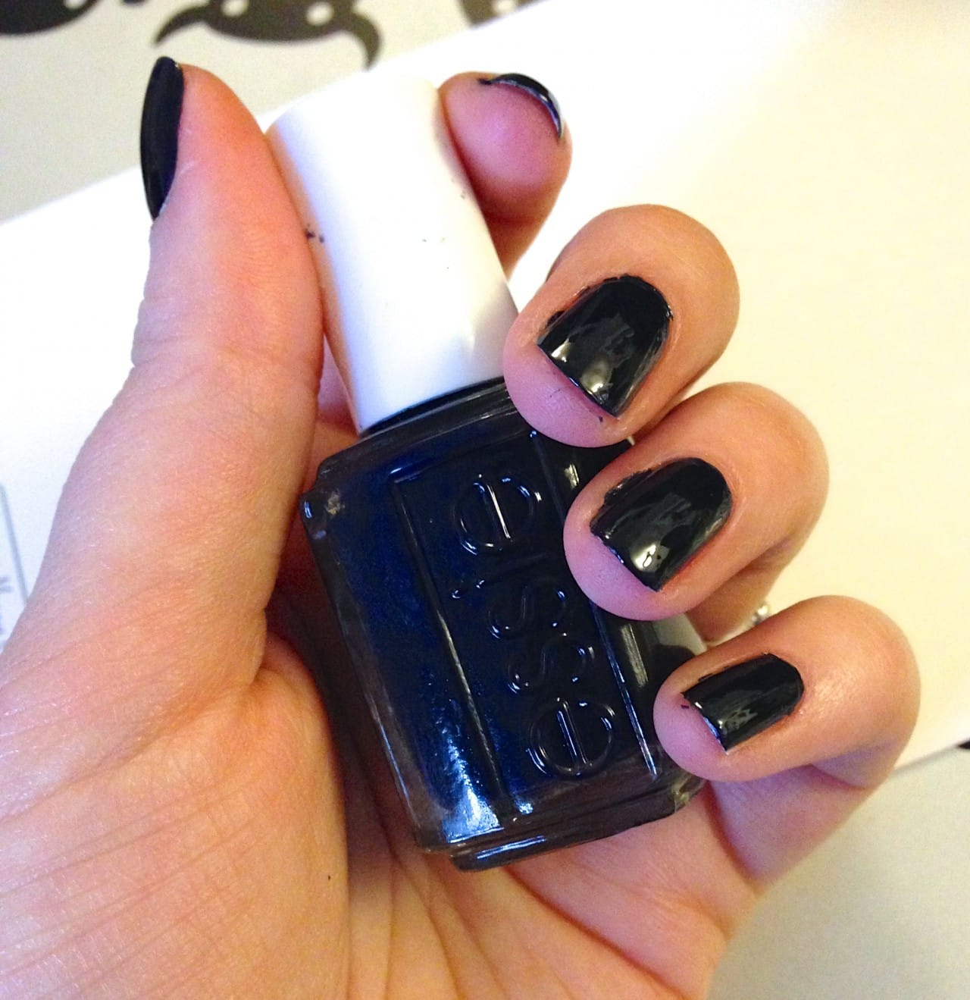
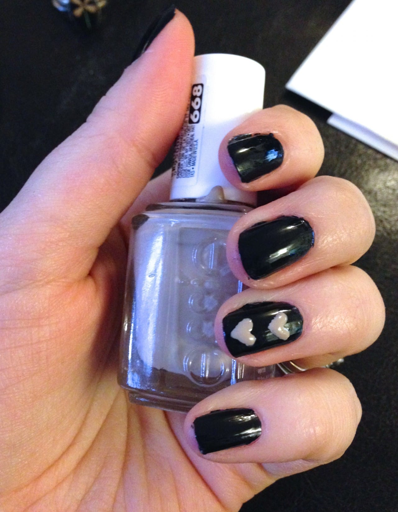
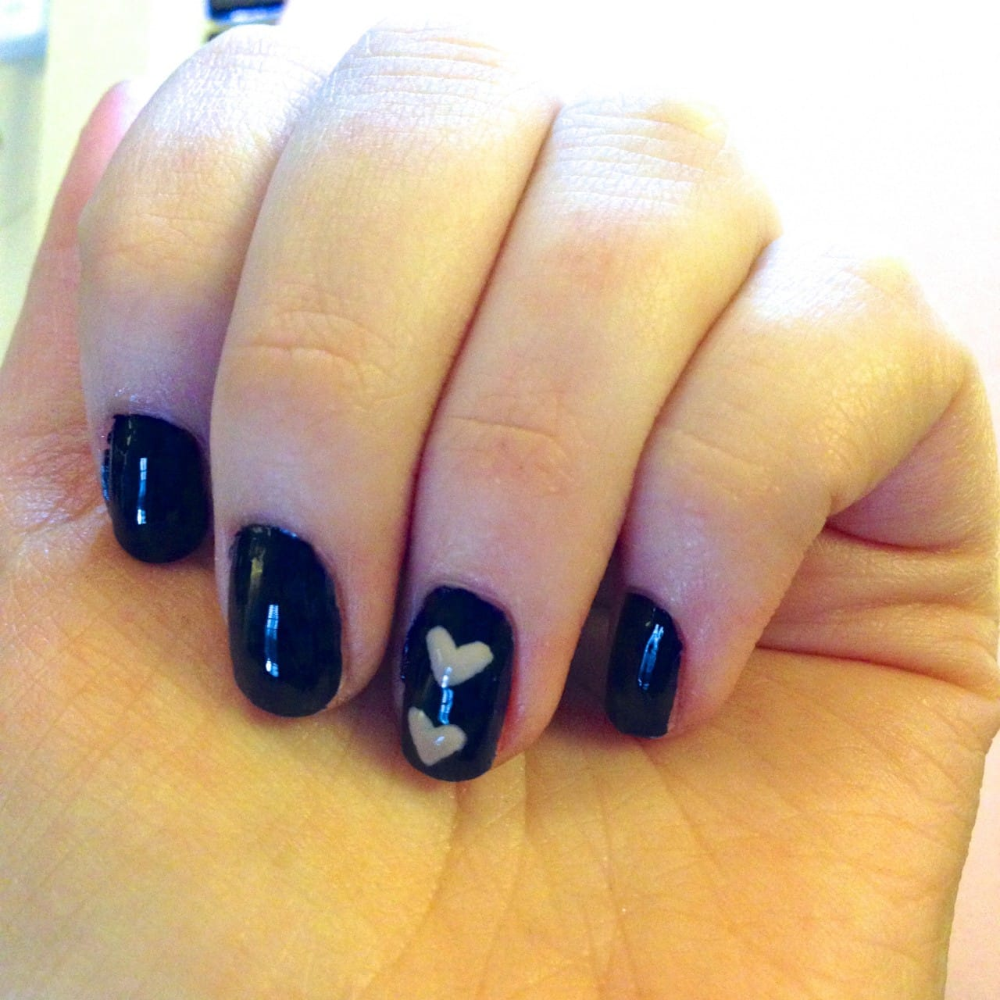

If you’re reading this, I’m still in New Orleans! I come back tonight, though (womp womp!) In the meantime, here is a simple little design I made in honor of my Katie Crafts logo! It’s got the navy, it’s got the pink, it’s got the stacked hearts. Maybe next time I’ll add the “K”! 😉
<h2>Materials:</h2><ul><li>
Clear top and base coat
</li><li>
Navy blue nail polish
</li><li>
Dusty rose nail polish
</li><li>
Toothpick or dotting tool
</li></ul>
I used
<a title="Essie After School Boy Blazer" href="http://amzn.to/1jQWr9O" target="_blank" rel="noopener noreferrer">Essie’s After School Boy Blazer</a>
for the blue polish, and
<a title="Essie Sand Tropez" href="http://amzn.to/1l1jRax" target="_blank" rel="noopener noreferrer">Essie’s Sand Tropez</a>
for the pink.
<h2>Instructions:</h2><ul><li>
Start with clean, manicured nails. Do one coat of clear base coat.
</li></ul>

<ul><li>
When dry, do one to two coats of the blue nail polish. If it’s a thick/opaque polish, you may only need one coat! It will depend on your brand. Let them dry 100%!
</li></ul>

<ul><li>
Using your dotting tool or toothpick, draw two small hearts on top of each other on each of your ring fingers.
</li></ul>

<ul><li>
Let dry!
</li><li>
Use a clear top coat to seal your nails. Let dry, and clean up any extra polish on the skin once dry.
</li></ul>

That’s it for this mega easy Katie Crafts logo design nail art tutorial! Hope you liked it!

