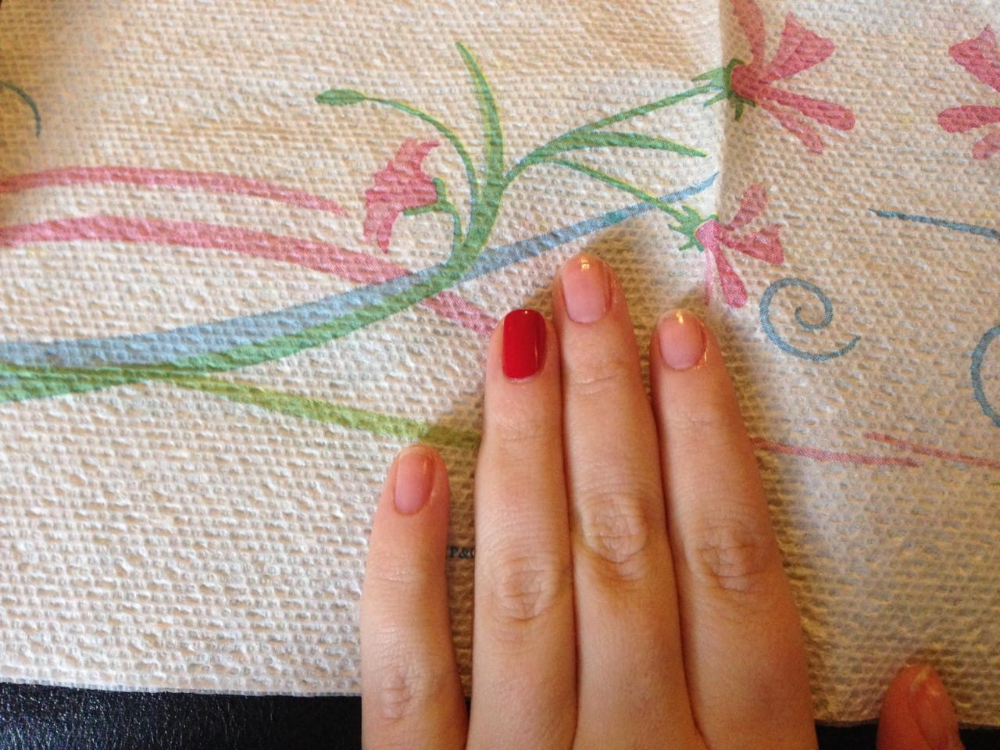
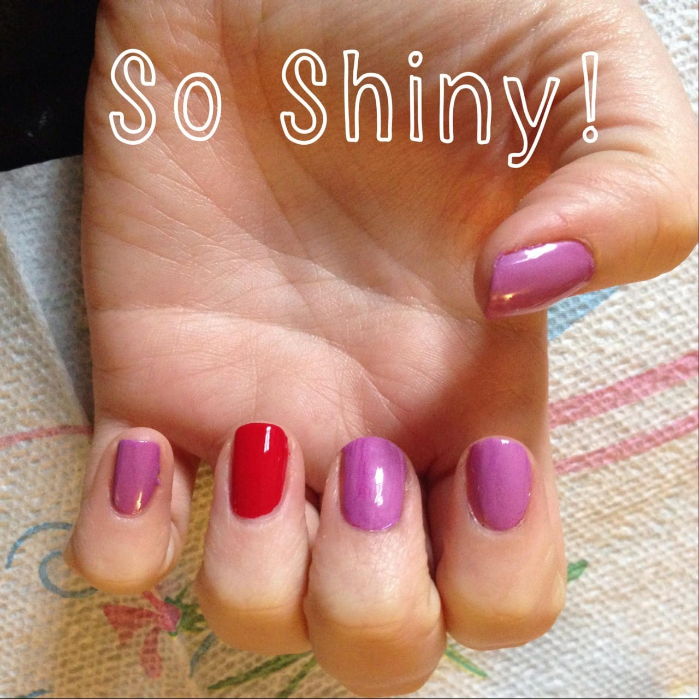
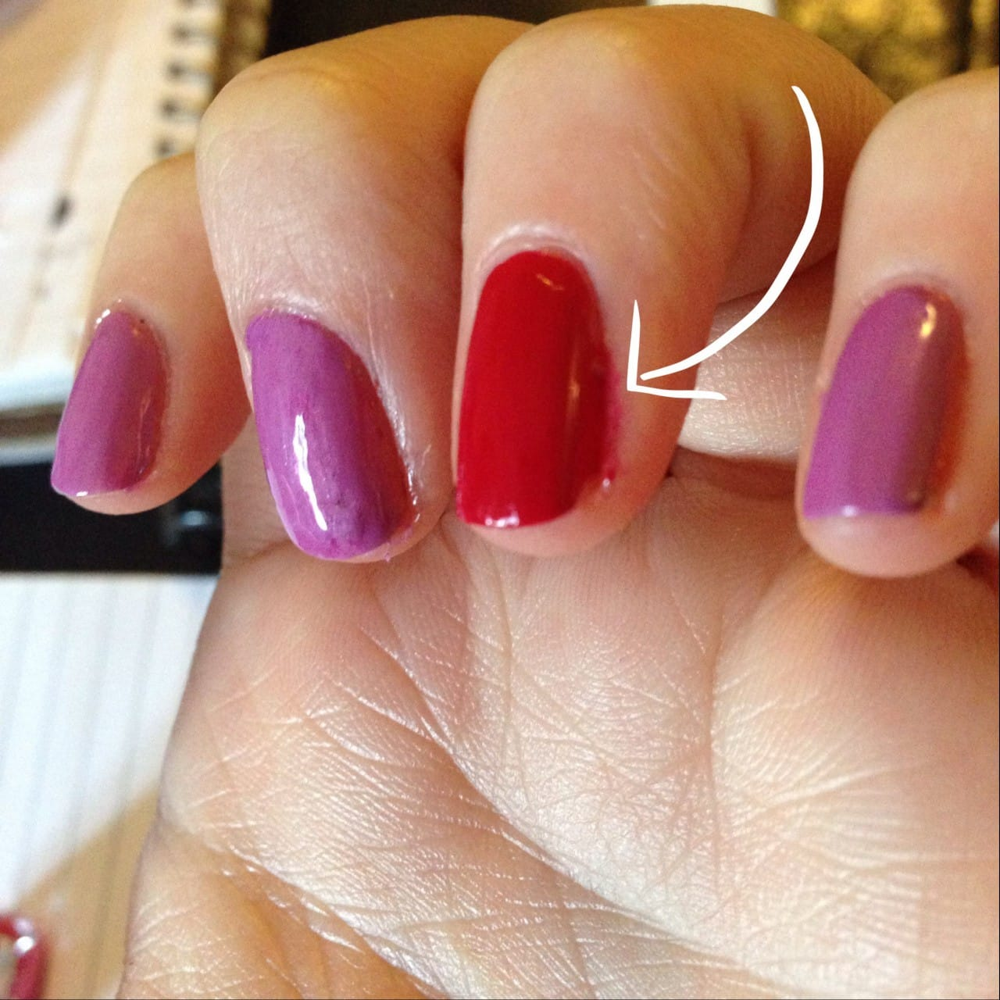
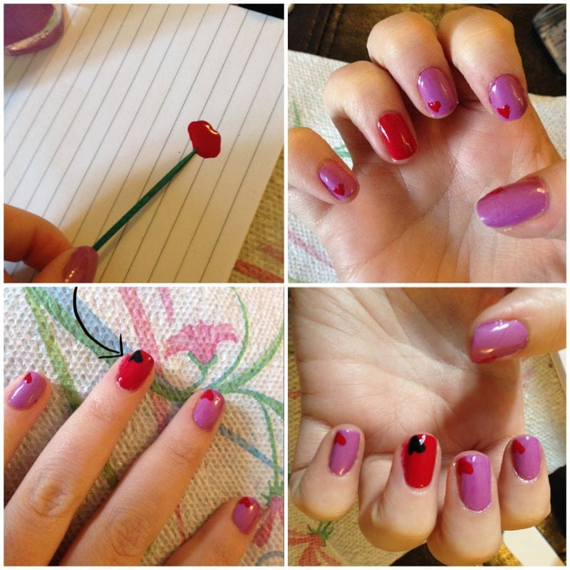

Project: Simple Hearts Nail Art Design
<strong> </strong>
There are an abundance of nail art designs depicting Valentine’s Day, love, romance and more. I decided to keep it simple this week with just a single little heart on each nail. These nails were very easy and quick to do if you want something to celebrate the holiday but don’t have a lot of time to devote to a fancy design!

Materials:
<ul><li>
Clear base/top coat
</li><li>
Red nail polish
</li><li>
Pink or Lilac nail polish
</li><li>
Black nail polish
</li><li>
Toothpick(s)
</li><li>
Cuticle clippers and nail file
</li></ul>
Instructions:

Clean up your nails and cuticles with your clippers and nail file. Wash and dry hands so they are ready to go! Start with a coat of top coat. I love
<a title="Sally Hansen Double Duty" href="http://amzn.to/1fzqv5d" target="_blank" rel="noopener noreferrer"><strong>
Sally Hansen’s Double Duty
</strong></a>
! It doesn’t say fast drying but it totally is. It’s also not super thick and gross like lots of other top coats are.

Next, paint a coat of red polish on each of your ring fingers. I used to leave the ring fingers for last and paint all the others first, but I tend to zone out when I paint my nails and would accidentally paint all of them the same color. I’m trying to teach myself to paint the ring finger first now to avoid doing that!

Now paint the other nails with your lilac or pink polish. I picked
<a title="Sally Hansen Rapid Red" href="http://amzn.to/1eYHPiF" target="_blank" rel="noopener noreferrer"><strong>
Rapid Red
</strong></a>
and
<a title="Sally Hansen Lively Lilac" href="http://amzn.to/1g78UlK" target="_blank" rel="noopener noreferrer"><strong>
Lively Lilac
</strong></a><strong>
Insta-Dri
</strong>
by
<strong>
Sally Hansen
</strong>
. They give nice opaque coats right off the bat, so if you’re in a rush you can pull off just one coat. Let dry completely. Don’t worry about any polish you get on your skin- you can clean that at the end!

Now for the hearts! I went with red hearts on the lilac nails and a black one on the red nails, just to make them a little different. Use a toothpick dipped in polish to draw a little heart, and then fill it in. Let dry a bit before finishing with a last coat of clear polish.

<figure id="attachment_129" aria-describedby="caption-attachment-129" class="post__figure"><figcaption id="caption-attachment-129">
Pre-cleaning-polish-off-skin shot
</figcaption></figure>
When your nails are totally and completely
<strong>
110% dry
</strong>
, wash them with soap and water. Gently scrape any rogue nail polish off your skin. This is a better solution for cleaning your nails than to try to target the nail polish bits with a q-tip and nail polish remover- this way there isn’t a chance of you accidentally messing up your perfectly finished nails.

That’s it- all done!

What colors would you use for this nail art design? Have any other Valentine’s designs I should try out?

