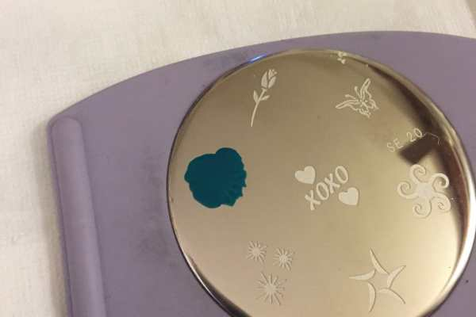
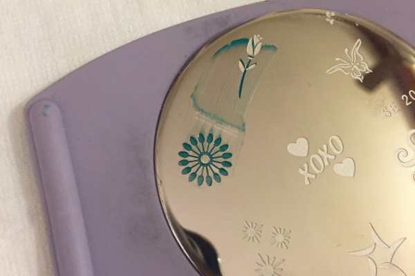
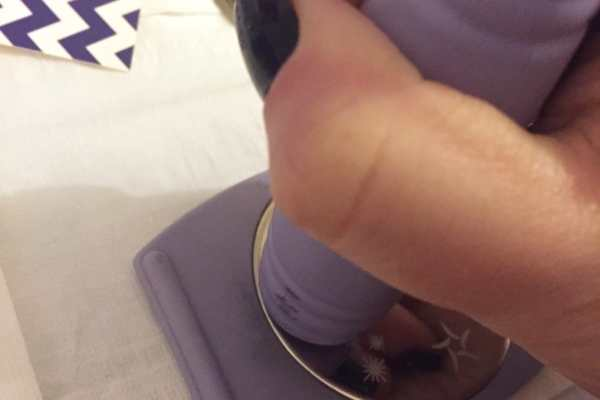
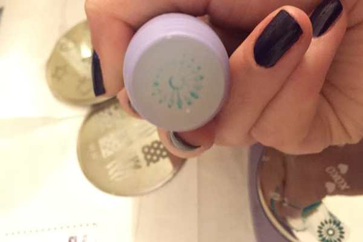
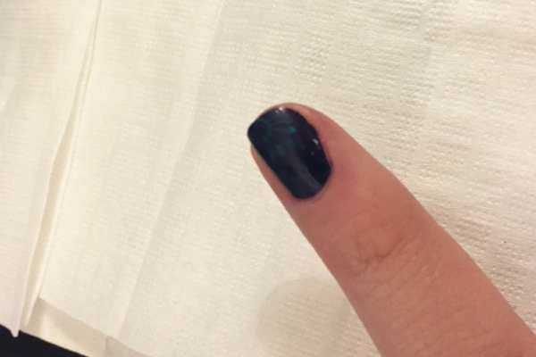
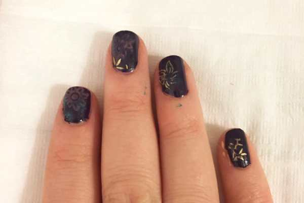
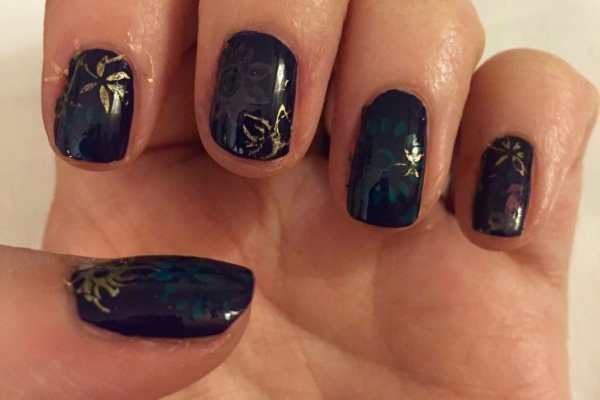

A few years ago, Husband bought me a stamping kit to further my nail art obsession. I tried it a few times and did not have much luck. Next week we are going to the
<strong>
2016
<a href="/philly-flower-show-2015-recap/">Philadelphia Flower Show</a></strong>
(my favorite day of the year!) and I want to have some super cute floral stamped nails for the occasion. I decided I should test out the nail art stamping technique once again!

I’m glad I did because I could clearly see which colors worked together and which did not! I like that each nail has it’s own unique design but they are very dark. For the Flower Show next week, I’ll do a light base coat with darker stamps instead! I’ll be sure to share how that one turns out on my
<strong><a href="https://www.instagram.com/imkatiecrafts/" target="_blank" rel="noopener noreferrer">Instagram Page!</a></strong><h2>Materials:</h2><ul><li>
Stamping kit
</li><li>
Nail polish in various shades
</li><li>
Clear top coat
</li><li>
Scraper tool (my kit came with one, but I lost it somewhere along the way… which is why I used some of my business cards to do the job!)
</li></ul><h2>Instructions:</h2><ul><li>
You’ll need your base coat already on your nails and completely dried!! I did mine in dark purple the evening before I stamped, to ensure by the next day they were 110% ready to go.
</li><li>
Pick your design and place disc in holder.
</li></ul>

          
        

          
        

<ul><li>
Dab the nail polish shade of your choosing on top of the design and immediately scrape away the excess with your tool/business card. Don’t scrape TOO hard, or you’ll remove some of the polish from inside the design.
</li><li>
Press with the stamper tool in a rocking (side to side) motion, never lifting the stamper up. Be sure to apply even pressure. When you think you’ve captured the whole design, lift.
</li></ul>

          
        

          
        

<ul><li>
The stamp should have lifted from the disc and now be on your stamper, staring at you! Pick which nail you want to transfer it to and use the same rocking motion to transfer it on to your nail.
</li></ul>

          
        

          
        

<ul><li>
Repeat steps with however many stamp designs and colors you like! After a few uses, the design with become gummy and you won’t get a clean stamp out of it. You can clean it out with nail polish remover and a q-tip if you want to continue using that design- but remember, you run the risk of nail polish remover touching your nails and ruining what you’ve already done! This is why I had several designs in different colors picked out to combine together.
</li></ul>

          
        

<ul><li>
When dry, add a clear top coat to lock in look. Clean up polish from skin and you’re all done!
</li></ul>
Not all DIYs turn out well, and this is the case for today’s manicure! However, if I didn’t try it out the way I did, I wouldn’t have known what to do for next time. I hope my nails for the Flower Show turn out way better!!

If you have had luck with the stamping technique, share your photos below!

