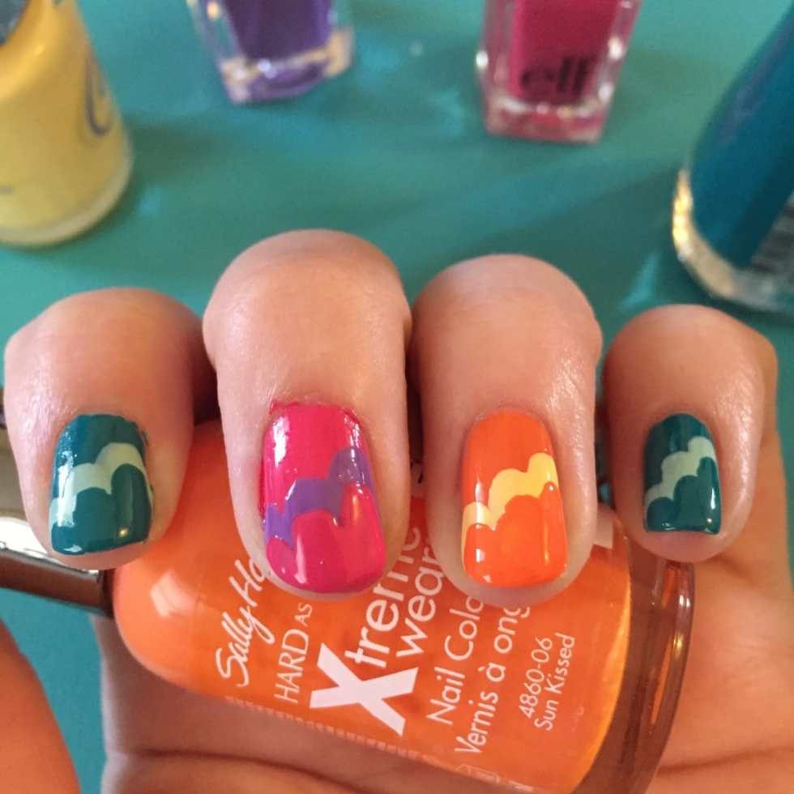
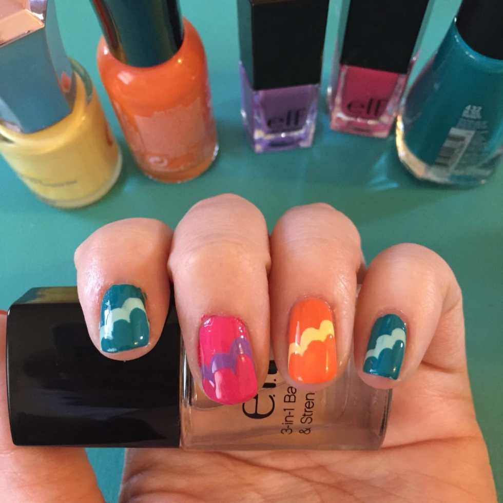
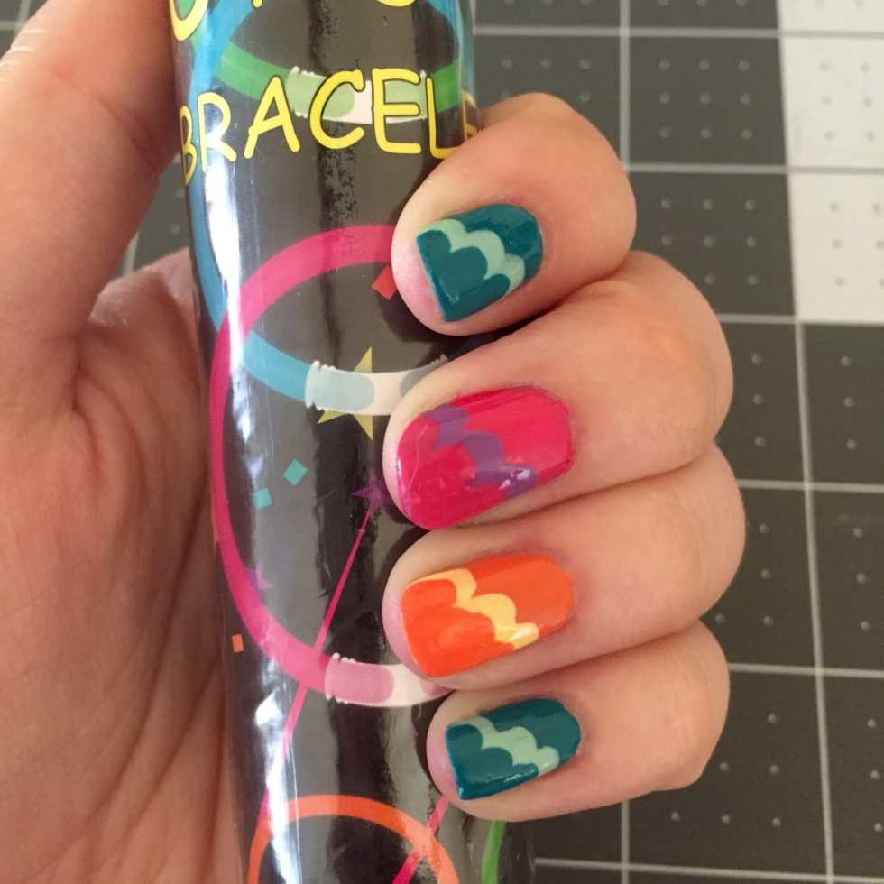
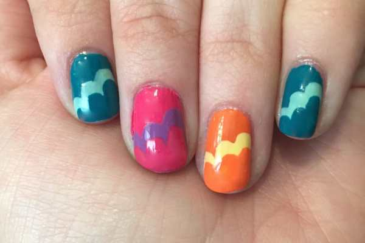
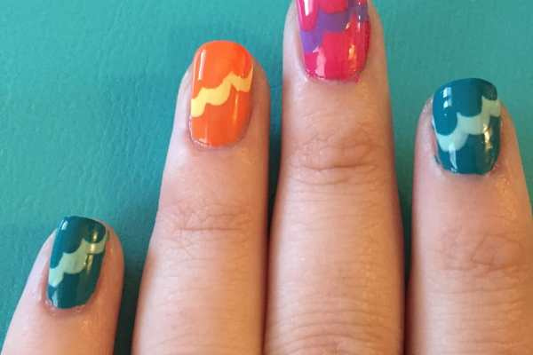

Sorry I’ve been MIA this past week- I’ve had the worst cold ever! I’m still pretty sick, but I managed to give myself a cute manicure yesterday while binge watching Netflix and it’s just in time for Manicure Monday!

This is one of my favorite nail art looks to do because it is SO simple, ANYONE can do it! If you view it one way, the design looks like Summer ocean waves. If you view it the other way, it resembles fluffy clouds. Depending on your chosen color scheme and what look you are going for, you can achieve either (or both!) very easily!

<em>TIP before we get started: If you are leaning more towards the “clouds” look, I suggest pastels! They somehow transform the design into clouds better. I picked six different colors (all with complementary shades) simply because I wanted something Summery and fun. 🙂</em>
<h2>Materials:</h2><ul><li>
At least two different nail polish colors. I used these six: teal, mint, yellow, orange, pink, purple
</li><li>
Clear base and top coat
</li></ul><h2>Instructions:</h2><ul><li>
Give your clean, dry nails a quick base coat of clear polish and let dry.
</li></ul><ul><li>
Choose which of your colors will be featured more predominantly, and use that as your first color, painting the whole nail. I picked teal, orange and pink, alternating each nail. Let dry.
</li><li>
Do a second coat of the same colors and let dry again.
</li></ul>
This next part is what creates the design, and it’s simple because you aren’t using any fancy tools or expertise. You are using the regular brush that the nail polish bottle comes with and you’re making, for lack of a better term, three lines next to each other- that’s it!
<ul><li>
Next, use your complementary color and, beginning at one side of your nail, very simply drag the polish down 3/4 of your nail to the tip on one side. Then, start a little lower (about halfway down your nail) and repeat for the middle stroke. Lastly, create the smallest line in the same fashion, making sure to cover the sides of your nail. Let dry.
</li></ul><ul><li>
Do a second coat of that wave/cloud color on top of it, if it isn’t standing out enough for you. Let dry.
</li></ul>

<ul><li>
Now you will repeat the process above directly on top of the one you just made, only a little bit lower. This allows that “layer” to show through a bit. Use the same colors as the very first coat for the last wave/cloud. Double coat only if necessary. Let completely dry.
</li></ul>

<ul><li>
Seal in with a quick clear top coat and let dry completely. It will take a bit to be totally dry, as you have a LOT of layers of nail polish on your nails!
</li></ul><figure id="attachment_6067" aria-describedby="caption-attachment-6067" class="post__figure"><figcaption id="caption-attachment-6067">
These colors totally remind me of the glow bracelets I just bought for our 4th of July picnic!
</figcaption></figure>
Clouds or Waves????

          
        

          
        

Enjoy your new look!! Next week, I will show the same look again, with a little twist! Stay tuned…. 😉

Do you see clouds or waves when you look at these nails?

