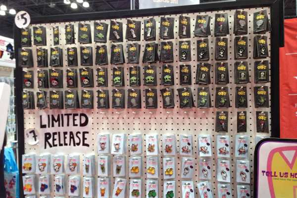
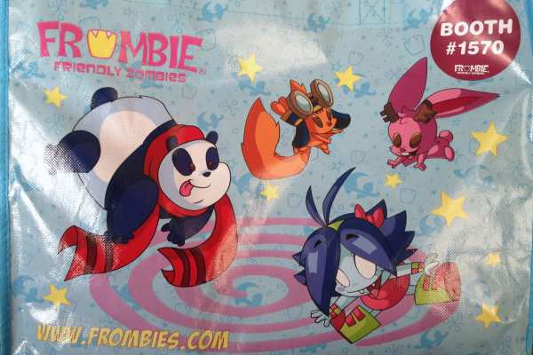
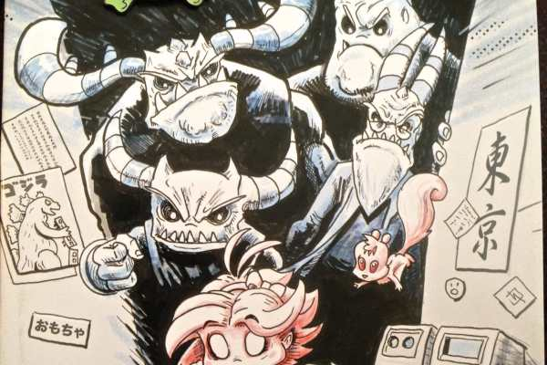
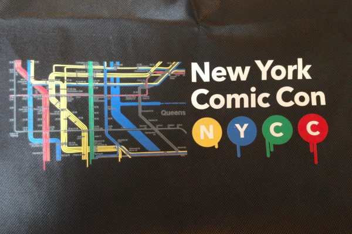
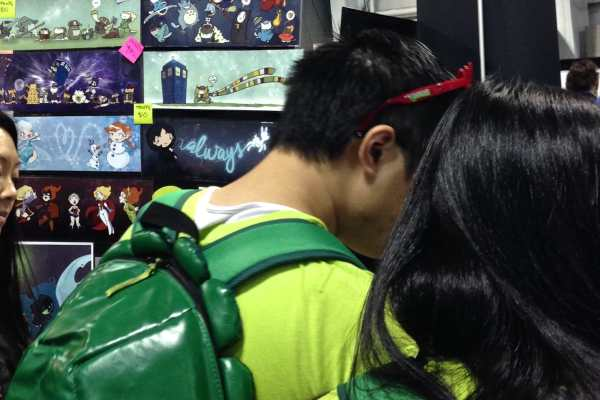
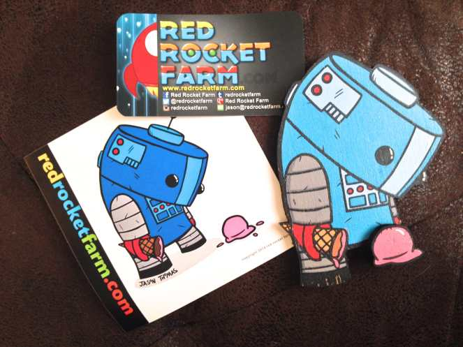

New York Comic Con 2014 Recap

Last Friday, October 9th, I headed to Manhattan for New York Comic Con at the Javits Center! The Husband and I go every year, though we usually hit it up on a Saturday. Last year was insanely horrifically packed, so we were pretty lucky to get Friday tickets this year instead. It was still difficult to navigate the crowds at times, but all-in-all I think a better experience. We saw as much as we could, took pics when we remembered to (which wasn’t as often as we should have!), and ate and bought a lot of stuff! Husband came home with 8 new comics and an adorable print that we’ll hang in our kitchen, and I came home with a couple comics, stickers, a magnet from one of my favorite vendors that I buy from every year, an NYCC shirt, a couple totes and some cute pins- not to mention a plethora of random free stuff!

As always, AMC’s
<em>
The Walking Dead
</em>
was a highlight of the weekend.

There were SO many great vendors on the Show Floor that I wanted to buy pretty much every silly shirt and every adorable stuffed guy that I saw. See that Super Mario Galaxy star above? I am determined to create a pattern to make him myself!

Here are the comics that Husband and I went home with! I only read one so far, but he powered through at least half of them on the train ride home.

We bought super cute pins from Frombie (the friendly zombies) again this year too. Last year I bought a glow in the dark zombie llama, but I can’t find him anywhere! This year, husband bought a glow in the dark skull to adorn to his work bag, and I bought a skeleton cameo that is oh-so-cute. They gave us a free tote and free stickers to boot!

          
        

          
        

          
        

          
        

Of COURSE I had to get a t-shirt and tote bag, because those are my favorite things to collect!

          
        

          
        

How adorable is the above print from modHero? It’s going to be perfect in our green kitchen. Husband also bought a similar print from the same artist, swapping out a cute snail for a sleepy owl! It was a birthday gift for his sister, along with another awesome Where The Wild Things Are inspired print from
<a title="Katie Cook" href="http://katiecandraw.typepad.com/" target="_blank" rel="noopener noreferrer">Katie Cook</a>
(another of my fave vendors to visit each year!) Isn’t it adorable?
<figure id="attachment_4390" aria-describedby="caption-attachment-4390" class="post__figure"><figcaption id="caption-attachment-4390">
photo courtesy of katiecandraw.bigcartel.com
</figcaption></figure>
And here is Katie Cook busy at work in her booth in Artist’s Alley!

          
        

          
        

This little robot mermaid will go somewhere I can see it all the time- like my iPad case! It’s so cute!

The little girl in this photo was totally obsessed, crawling all over him and laughing and smiling. It was crazy adorable to watch!

Here’s my magnet from Red Rocket Farm! Check out his
<a title="Red Rocket Farm on Facebook" href="https://www.facebook.com/redrocketfarm" target="_blank" rel="noopener noreferrer">Facebook page</a>
, too! You are going to love Jason’s work too, I promise.

While I wasn’t dressing up in a full on costume for the convention, I couldn’t go in just any street clothes! So, I made a skirt with some adorable bats on it to show my Halloween-y side. It took a million years to make, but I love it!

If you went to NYCC this past weekend, what was your favorite booth?

