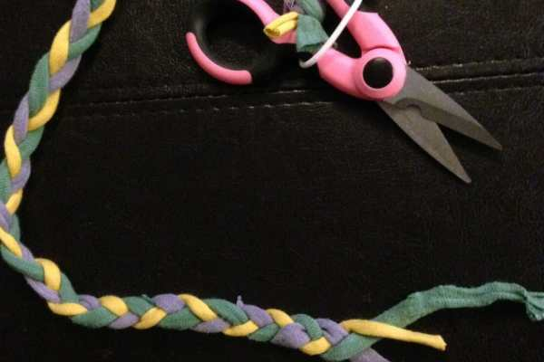
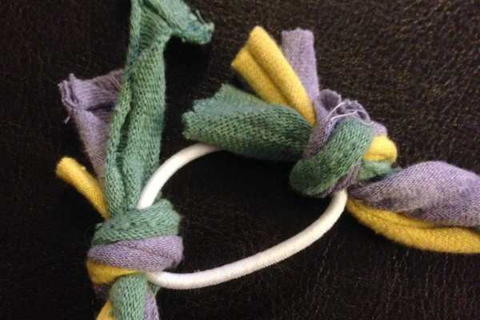
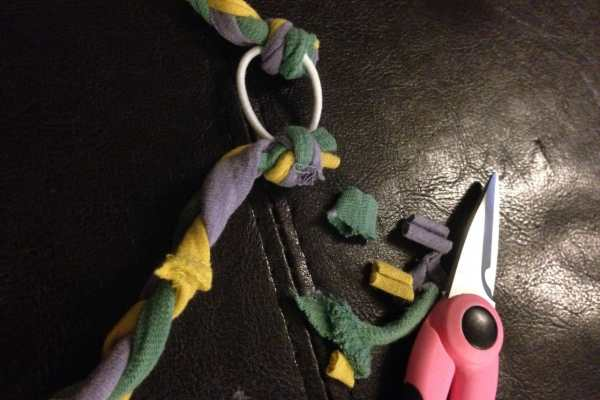
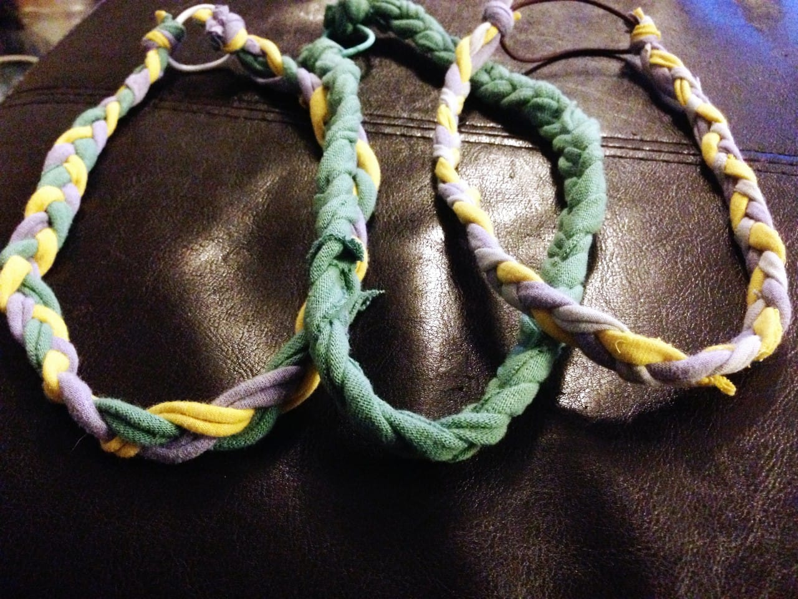
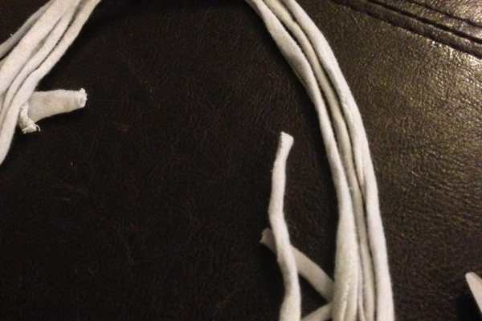
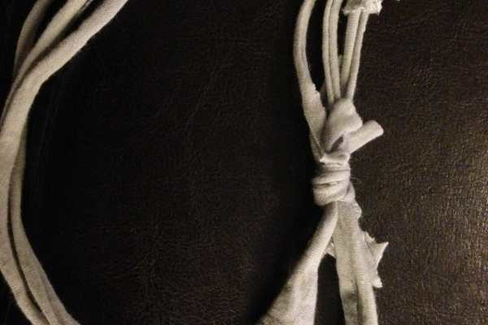
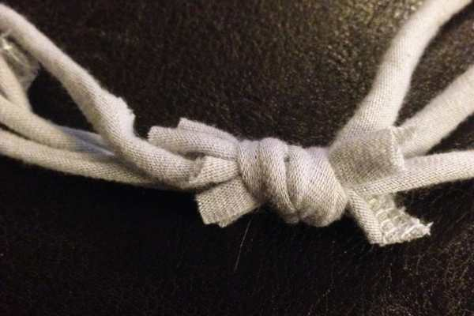
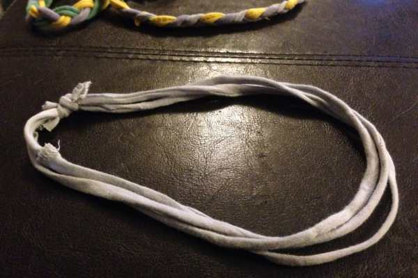
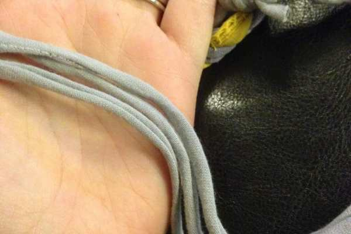

Project: No Sew Braided Headband
<blockquote>
Let me preface this post by saying this is one of the easiest headbands you will
<strong>
ever
</strong>
make. The other easiest is in the Tips!
</blockquote>
Soon (hopefully very soon!) I’ll be able to put away my adorable winter hat and sport some even cuter headbands in weather that doesn’t freeze my face off. In anticipation of such, I’m on a headband-making-spree. In addition to the reversible headbands that require time, patience and a sewing machine (post on those to come!), I’m making these really fun braided headbands in every color that require only a few minutes and no sewing at all!

You already know I love being able to recycle something old into something new (read:
<a title="5 Step T-Shirt Tote" href="/5-step-t-shirt-tote/"><strong>
5 Step T-Shirt Tote!
</strong></a>
), so I’m quite glad to be able to do the same for this project. In fact, I can just about guarantee you already have all the necessary materials to complete this quick DIY right now.
<h2><strong>
Materials:
</strong></h2><ul><li>
One hair elastic
</li><li>
Approx 6 feet of t-shirt yarn: 2 feet of each color*
</li><li>
Scissors
</li></ul>
*This will vary on your head size! Just measure the yarn
<strong>
loosely
</strong>
around your head where your headband will be, then add a few inches to it.

If you’re wondering what t-shirt yarn is, it is quite literally yarn made of t-shirts. Don’t know how to make it? Just ask!
<h2><strong>
Instructions:
</strong></h2>

<ul><li>
Pick your three colors, and be sure to have the same amount of length for each strip.
</li></ul>

<ul><li>
Knot all three together on the hair elastic. It will look gigantic and ugly at first, but just keep pulling it tightly to make it smaller (see the difference above?)
</li></ul>

          
        

          
        

<ul><li>
Braid all the way down, as tight or loose as you desire (tip on this below). I loop the hair elastic on the scissors so I have something holding my yarn down to braid easier. You can do this on anything, though!
</li></ul>

          
        

          
        

          
        

<ul><li>
When only an inch or so is left, tie that to the opposite side of the hair elastic.
</li><li>
Snip off any excess t-shirt yarn.
</li><li>
Done! Now make more in every color you can imagine to match every outfit you own!
</li></ul>

<h2>Tips:</h2><ul><li>
Use three of the same colored yarn strips to make a solid braid, OR two of the same and one different to make a unique look.
</li><li>
The amount of tension you braid the strips with makes a very tight smaller braid or a loose larger one. Figure out what you like!
</li><li>
If the thought of braiding just completely exhausts you, you can still have an adorable headband. Just take those three t-shirt yarn strips, lay them nice and flat next to each other, and knot all the ends together. No braiding, no hair elastic. SUPER CUTE. {see below}
</li></ul>

          
        

          
        

          
        

          
        

          
        

          
        

These t-shirt yarn no sew braided headbands are such a great way to up-cycle your old t-shirts. Also, these braids can be used in jewelry, belts and more once you get the hang of them. I’ll be sure to post again when I try them in another project! If you have any questions, just ask below!

