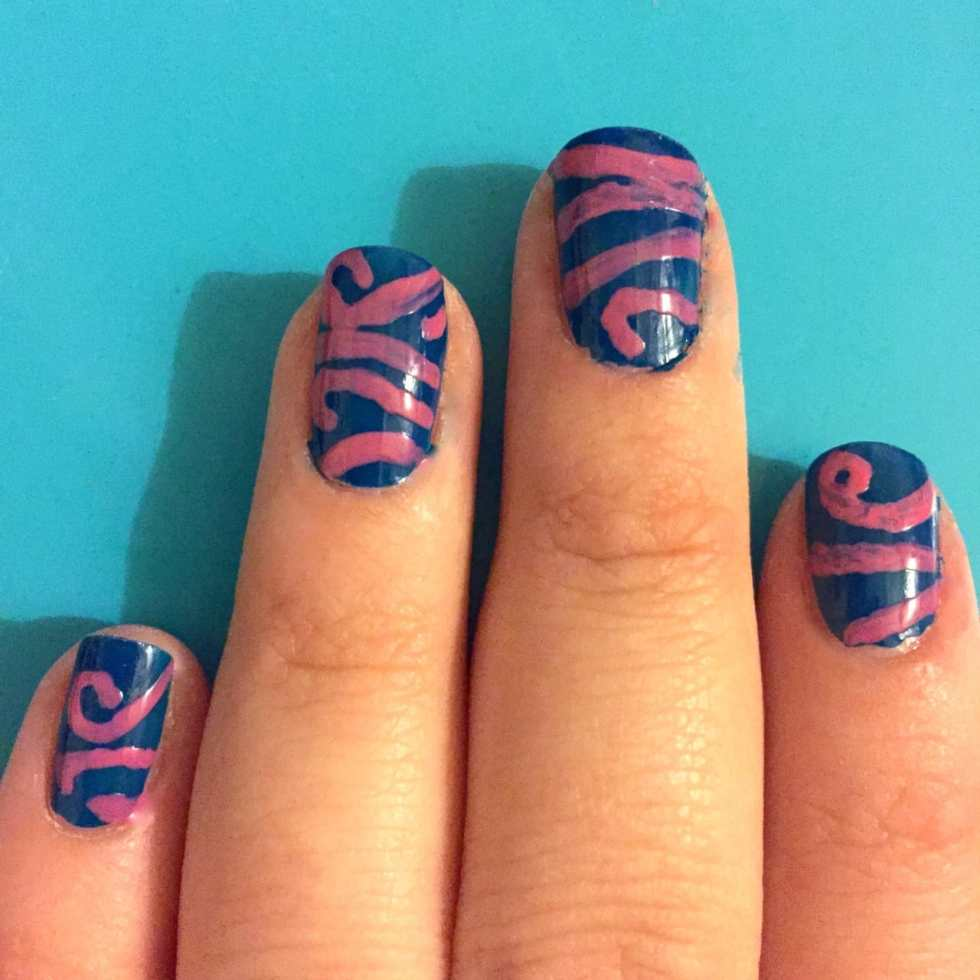
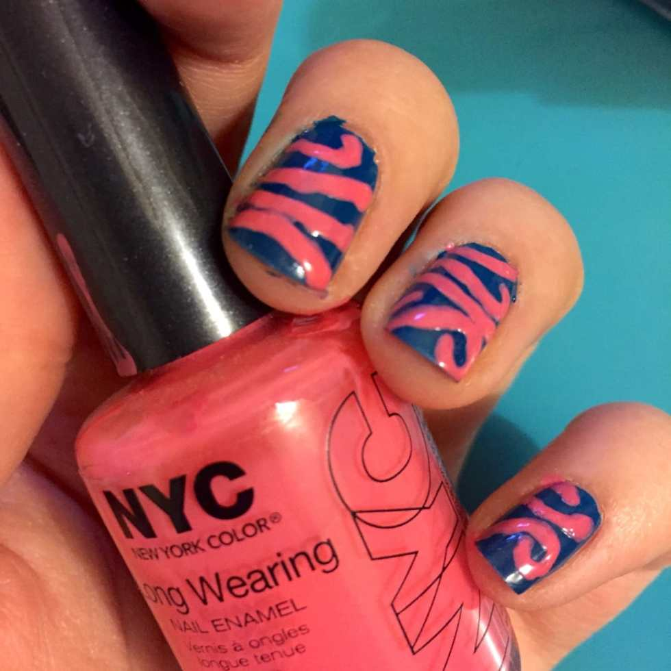
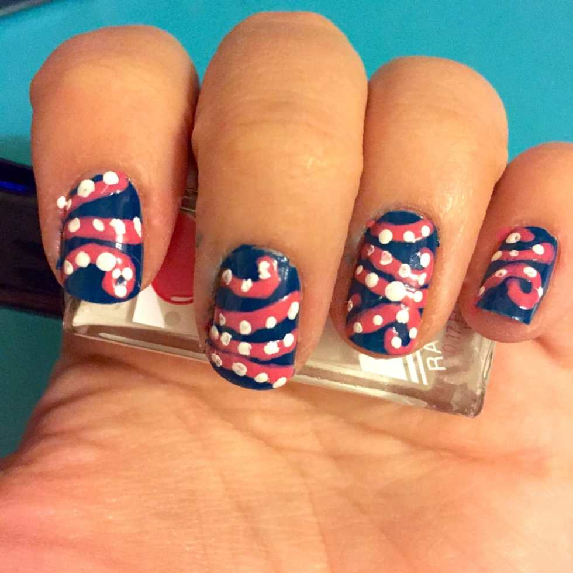
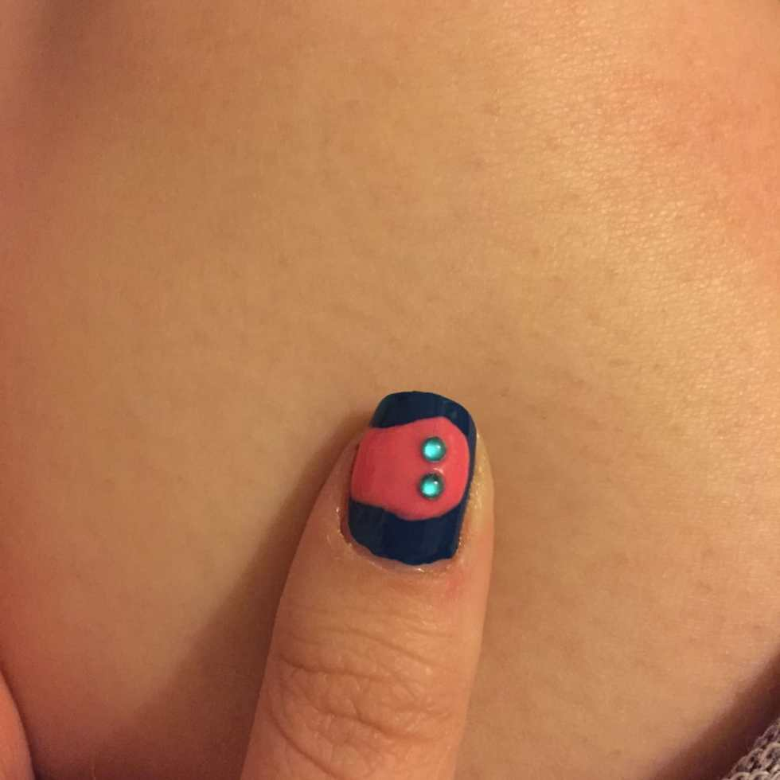
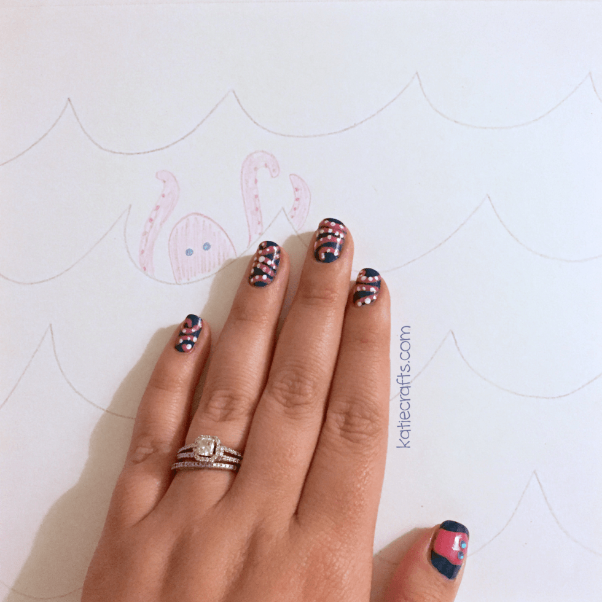

I told you in my
<strong><a href="/crab-nail-art/">Crab nail art</a></strong>
post last week that I’d be continuing on with the Sea Theme until Summer was over, and here is the next installment! These are by far my favorite nails to date, and I’ll be doing them again in the future. I probably won’t even wait until the Summer! They were fun to paint and came out adorably!

These nails look involved, but I promise you they were not. It was a regular coat of polish, then I used a nail art brush to simply paint the sea creature on. That’s it! So cute!

The below horrifying picture is all the fingers quickly photoshopped next to each other evenly, so you can clearly see the Octopus (as taking a proper pic of my fingers perfectly next to each other was impossible.) Can you imagine how terrifying it would be if your fingers were all the same height!??!! So scary. But at least you get the idea of what the creature will look like!
<h2>Materials:</h2><ul><li>
Clear base coat
</li><li>
Dark blue nail polish
</li><li>
Hot pink nail polish
</li><li>
White nail polish
</li><li>
Clear top coat
</li><li>
Dotting tool
</li><li>
Nail art brush
</li><li>
4 Gems (I chose turquoise)
</li></ul><h2>Instructions:</h2><ul><li>
Paint your clean, dry nails in clear top coat and let dry. You will want to take this extra step before using the blue polish because the blue can stain your nails and be a pain to get off later!
</li></ul><ul><li>
Paint one to two coats of blue polish on your nails, depending on the brand you use. I needed two coats with my Candies polish. Let dry completely!
</li></ul><ul><li>
Pour a little pink nail polish onto a paper plate or something of the like (I used the inside of a plastic bottle cap!) Dip your nail art brush into it and draw the outline of an octopus head on your thumbs. It should almost resemble the top of a ghost! Paint it in and let it dry.
</li></ul>

<ul><li>
Decide where you want your arms to go. I sketched mine out on a piece of paper first, but you can just use mine as the basis of yours if you like! I made sure between the other four fingers on each hand that there were 8 ends to the arms so he had the correct amount. Use your nail art brush to paint on the straight, curved and curly arms! Just go slowly and it will come out great. Let dry.
</li></ul>

<ul><li>
By the time you complete your second hand, the first should be dry. Repaint on top of everything you just did to make it really pop. Repeat on other hand. Let dry.
</li></ul>

<ul><li>
Using your white nail polish and the smallest end of a dotting tool (or toothpick!), make tiny tentacles on each arm. Place them wherever you want, however many you want! Let dry.
</li></ul>

<ul><li>
Seal in look with clear top coat after everything is
<em>
100% dry.
</em>
Add gems to octopus head for a 3D look, or draw on little eyes with black polish and the dotting tool.
</li></ul>

<ul><li>
Clean up any rogue polish that got on your skin (I had a lot!) and enjoy!
</li></ul>

Hope you liked my Octopus nail art! There is one week of Summer left- what should my last look be?

