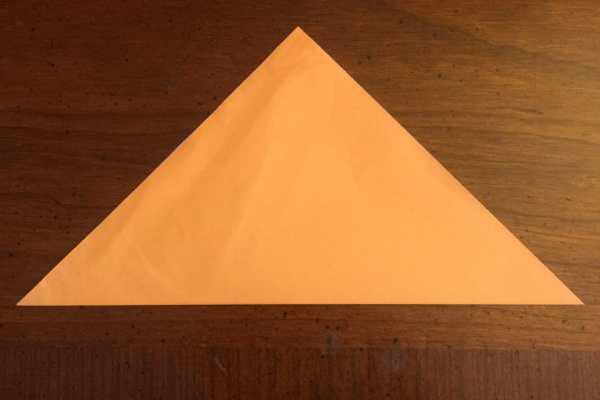
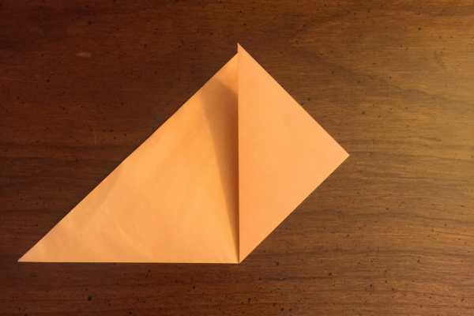
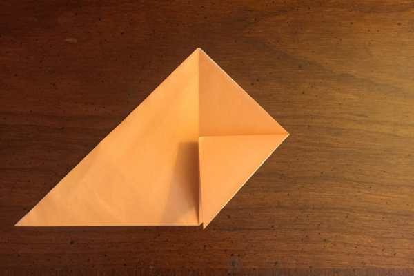
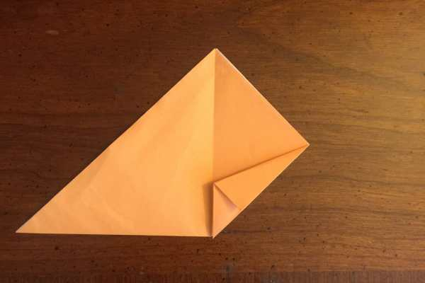
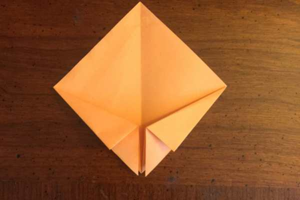
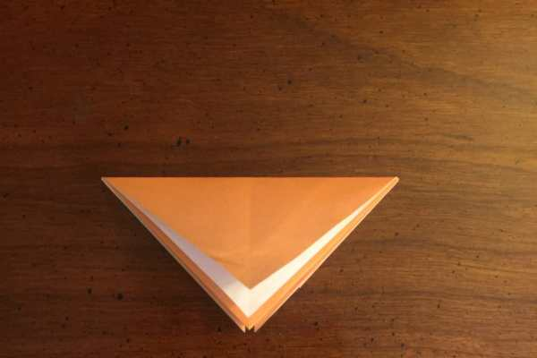
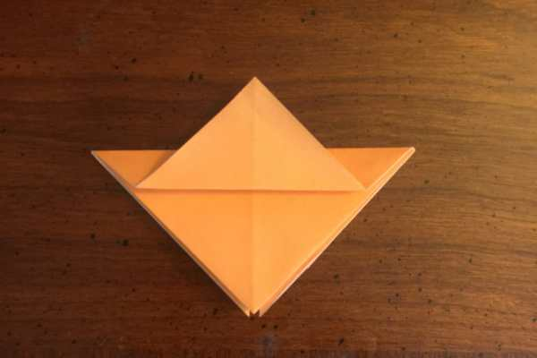
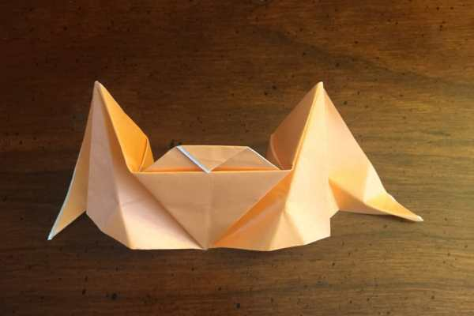

Project: Origami Easy Halloween Bat Tutorial

Hey everyone, Husband here! I’m back after a longer than intended absence with a new origami for you! I’m not sure if you all know, but
<a href="/5-halloween-crochet-patterns/">Halloween</a>
is one of our favorite holidays around here– Katie absolutely ADORES it and seeing her get into it as much as she does really makes me love it even more.

Get out your scariest crafting supplies and let’s do this!

          
        

          
        

<h3>Step 1</h3>
Start with a square of origami paper with the color side down.
<h3>Step 2</h3>
Fold the bottom corner up and create a triangle.

          
        

          
        

<h3>Step 3</h3>
Fold the right corner over to the left corner and make sure the folds are tight.
<h3>Step 4</h3>
Unfold the right corner and instead fold it up, touching the point of the triangle.

          
        

          
        

<h3>Step 5</h3>
Still using the right corner, fold it back down until it touches the bottom of the triangle, lining the edges up.
<h3>Step 6</h3>
Using the top of the piece you just folded, fold the top part down and to the right again.

          
        

          
        

<h3>Step 7</h3>
Repeat steps 4, 5 and 6 on the lefthand side making sure they both match.
<h3>Step 8</h3>
Flip the paper over and fold the two top pieces down until they touch the bottom of the triangle.

          
        

          
        

<h3>Step 9</h3>
Fold both pieces back up a bit more than halfway and press the crease.
<h3>Step 10</h3>
Fold the tip of the piece you just folded under itself to make the bat’s little head!

          
        

          
        

          
        

<h3>Step 11</h3>
Take the right and lefthand sides and fold them up, touching the edges to the top of the triangle and press them flat
<h3>Step 12</h3>
I tried to make this step as easy to follow as possible, so bear with me! See the two little flaps on the bottom right and lefthand sides? Grab them and tug them gently until the bat unfurls himself.
<h3>Step 13</h3>
Flip him over and enjoy your very own bat. SO SPOOKY.

Now that you’ve gotten a taste of making your own little bat, don’t stop now! Make a few– make a dozen– MAKE A MILLION IN ALL DIFFERENT COLORS! Well, maybe don’t make a million, I’ll be back next week with another ghastly origami post and I want you to try that one, too!

Let me know how your bats turn out in the comments!

