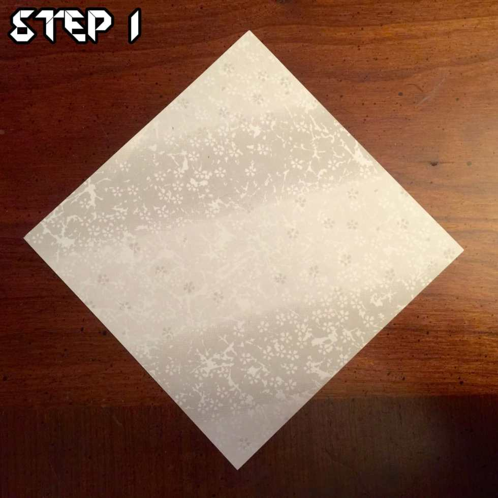
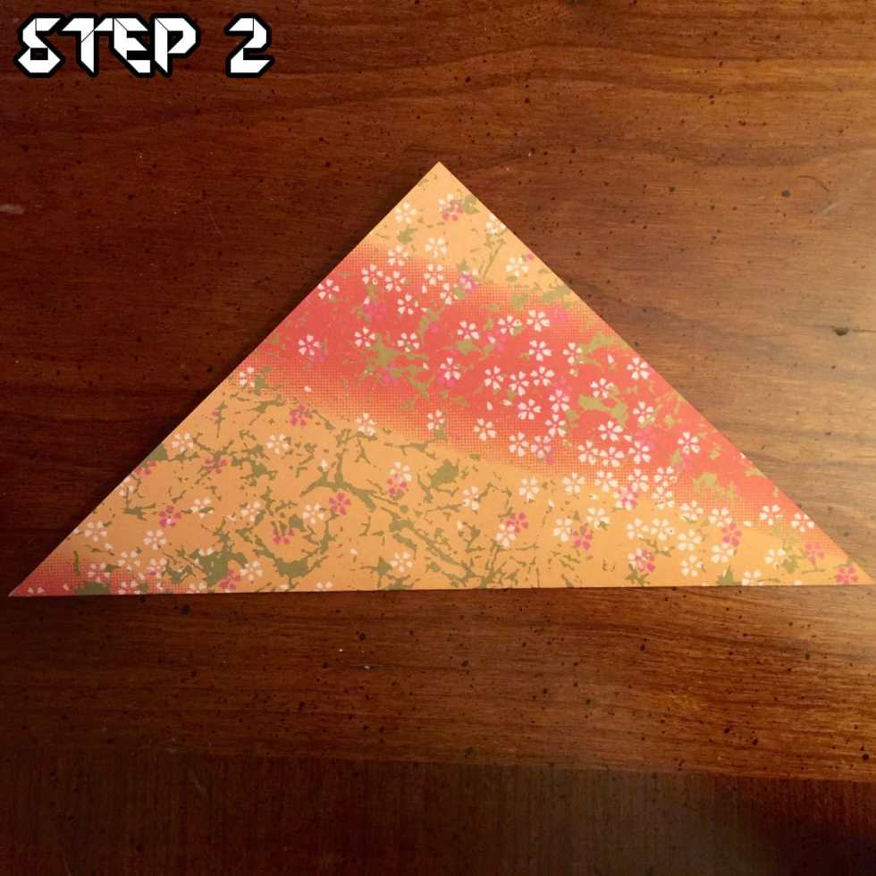
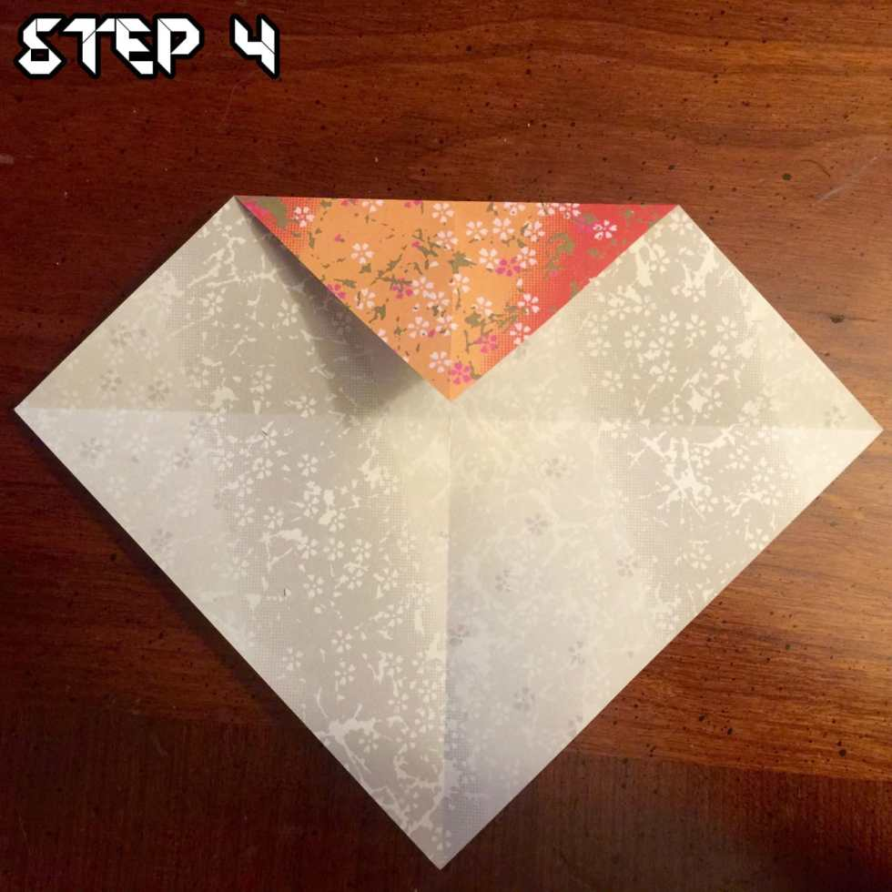
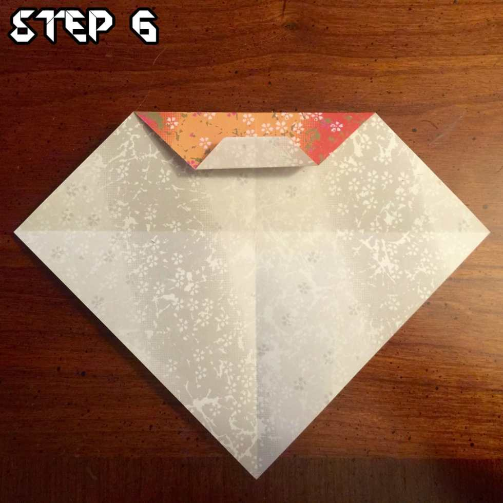
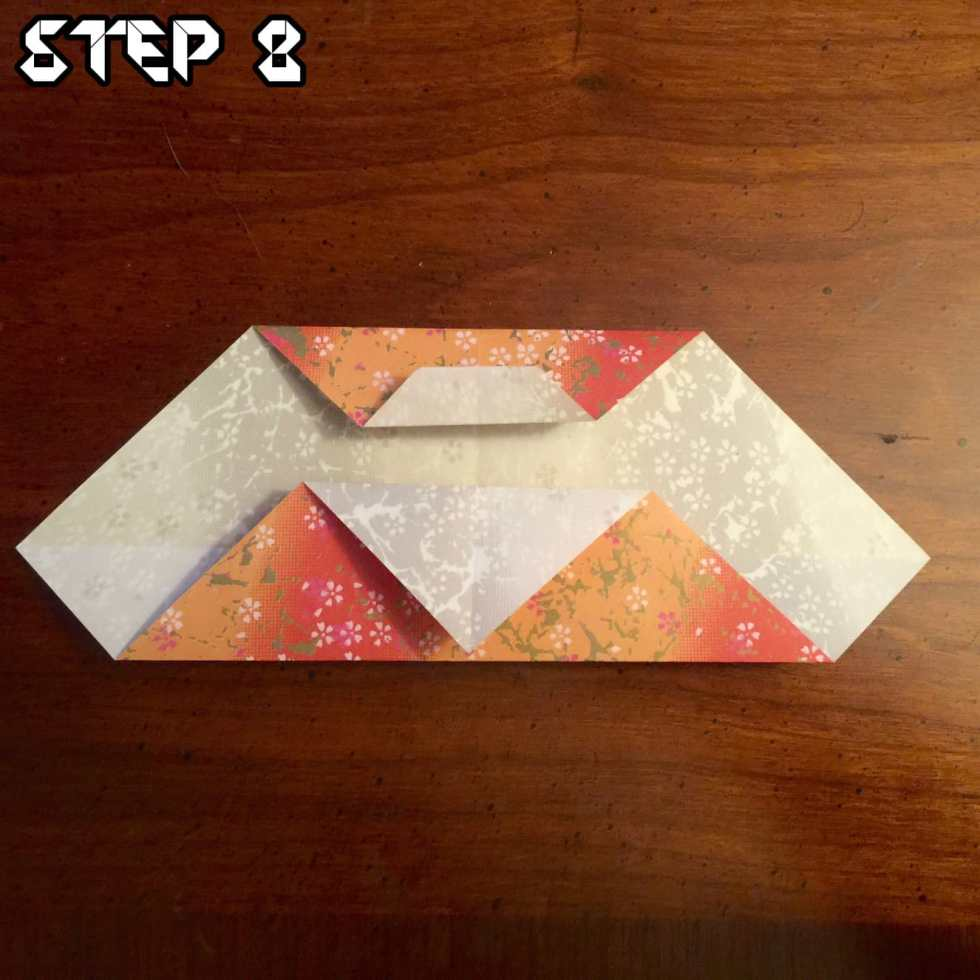
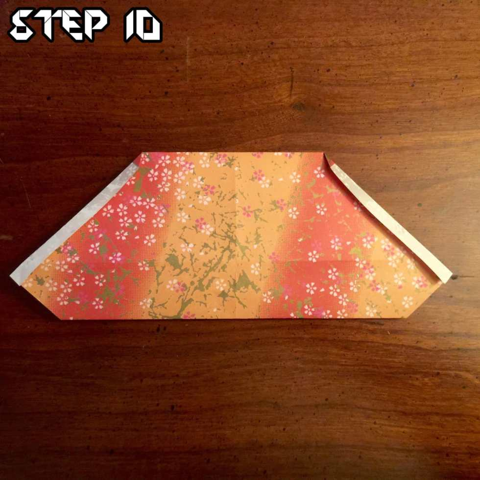
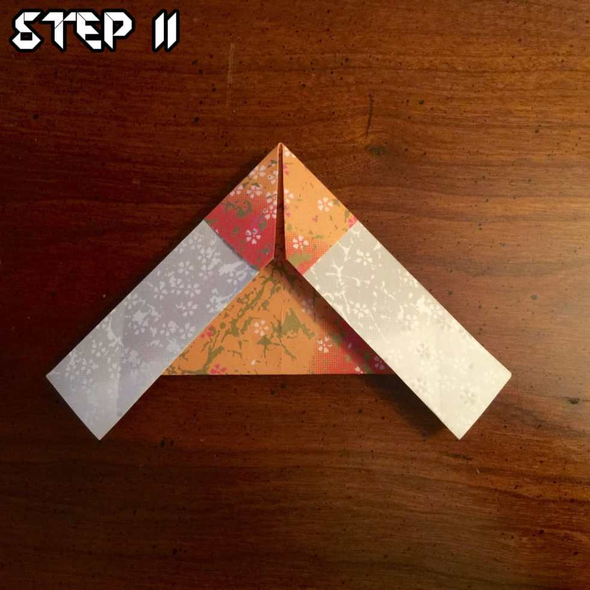
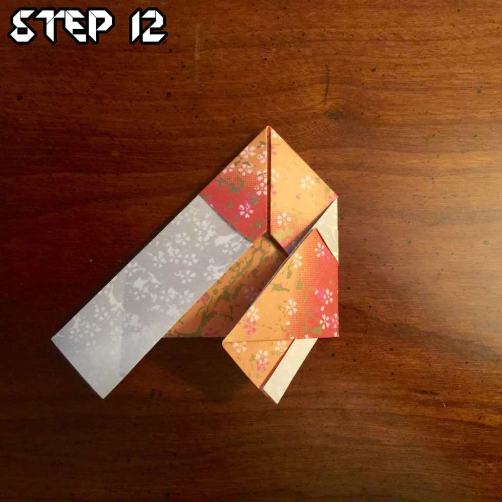
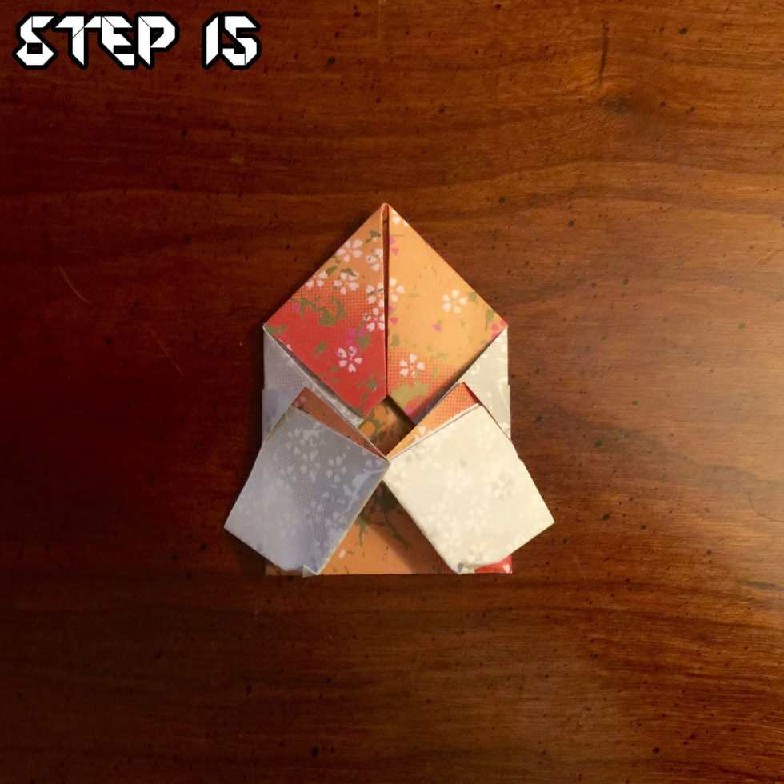

<em>?On the ninth day of Christmas, Katie Crafts gave to me…?</em>
<blockquote>
<em>A cute origami Santa post from Husband! Check it out below!</em>
</blockquote>
Hey everyone, Husband here! Christmas is right around the corner and this time of year Katie and I really like making all sorts of stuff. We cook a ton, decorate a bunch and even dress up the cats. Last year, Mabel was a christmas tree and she LOVED it. With all the creativity flying around, I thought it quite prudent that I make a holiday themed origami for you to try your hand at (read: Katie bullied me).

This little guy is a little more complicated than some of the previous tutorials we’ve done, but I believe in you. Let’s do this!

          
        

          
        

<h3>Step 1</h3>
Start with a square of origami paper with the white side up with a pointed side up. Red will work best for Santa’s outfit, but any color will do. Green would be great for an elf!
<h3>Step 2</h3>
Pull the bottom part of the paper up and crease the line.

          
        

          
        

<h3>Step 3</h3>
Fold the paper again side to side and crease that fold as well. Doing that will make the next few folds much easier.
<h3>Step 4</h3>
Take the top point and fold it down to the middle of the square where the creases meet.

          
        

          
        

<h3>Step 5</h3>
Grab the point from the piece you just folded and drag it halfway up, then crease the fold.
<h3>Step 6</h3>
Now take the very top of the point and fold it under itself, tucking the point below the most recent fold.

          
        

          
        

<h3>Step 7</h3>
Fold the bottom point up until the tip meets the edge of the paper. It looks a little off here, but that’s just the angle of the photo. The point should be touching the top edge of your crease.
<h3>Step 8</h3>
Just like we did for the top, fold the bottom point down until it meets the edge of the crease.

          
        

          
        

<h3>Step 9</h3>
Flip the paper over and make sure the longer edges are on top.
<h3>Step 10</h3>
Fold the left and right edges in about 1/8th of an inch so that it matches mine.

          
        

          
        

<h3>Step 11</h3>
Take the top right corner and fold it in towards the middle of the paper (almost as if you’re making a paper airplane). Do the same for the top left corner.
<h3>Step 12</h3>
Take the right wing and fold it in. Make sure that it lines up with the edge where the color meets the white part of the paper.

          
        

          
        

<h3>Step 13</h3>
Repeat step 12 with the left wing, making sure it lines up and then press the crease.
<h3>Step 14</h3>
Unfold the wings and take the bottom of the right wing. Fold it up and tuck it in to the little paper pocket that was formed from step 12.

          
        

          
        

<h3>Step 15</h3>
Repeat step 14 for the lefthand side, making sure to tuck the wing in to the little pocket.
<h3>Step 16</h3>
Flip the paper over and draw a little face on it! Hello Santa (or little elf, if you went with the green)!

That’s all there is to it! I really hope you enjoyed making your very own little Santa Claus. Post a picture of yours in the comments and let Katie and I know how they came out!

