
This week, Husband and I met up with my friend and her babies for a super fun day at the
<a href="http://www.philadelphiazoo.org/zoo/Visit-the-Zoo.htm?gclid=CPC_ue60uscCFcsXHwodPyQKsQ" target="_blank" rel="noopener noreferrer">Philadelphia Zoo</a>
! It was pretty sweltering and humid, but it wasn’t too crowded and we still had a great time. Husband took some photos while we were there, so I’m sharing our day in pictures with you!

Did You Know: The Philadelphia Zoo is the America’s very first zoo?! It’s over 42 acres and more than 1300 animals call it home! Because we went early and it was so hot, many animals were hiding in their habitats, especially the larger cats and such. We were still able to get photos of some of them, though they were all pretty sleepy! I didn’t judge though- I was too. Hope you enjoy the pics below!

          
        

          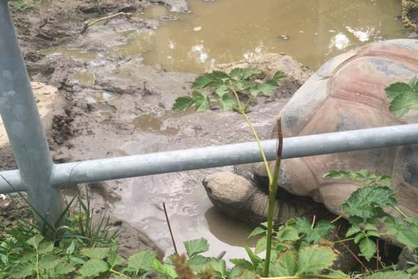
        

We were some of the “lucky” viewers to catch the giant tortoises mating in the wee hours of the morning. That was just lovely. Sorry, no pics of that. 😛

          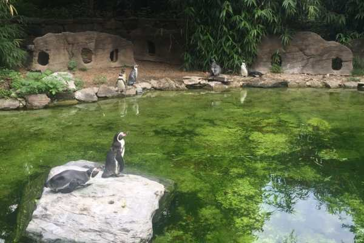
        

          
        

This goose had quite the honker!

Mr. Rhino was busy having breakfast and wouldn’t turn around for a photo, so we only got his butt!

          
        

          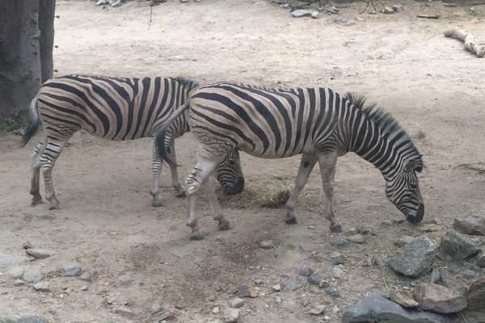
        

          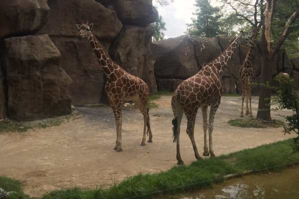
        

          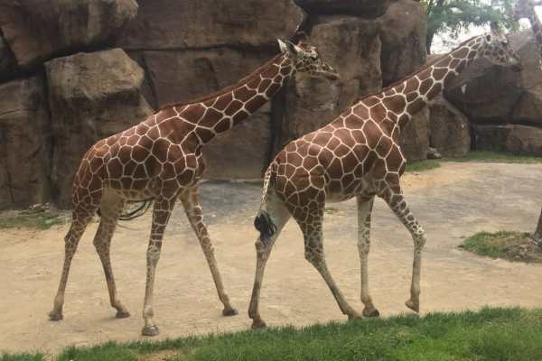
        

We caught on camera a gross mating ritual with the giraffes, but I am NOT including those pics! Little man was most excited for the giraffes, and especially liked the largest one, whose name was Gus.

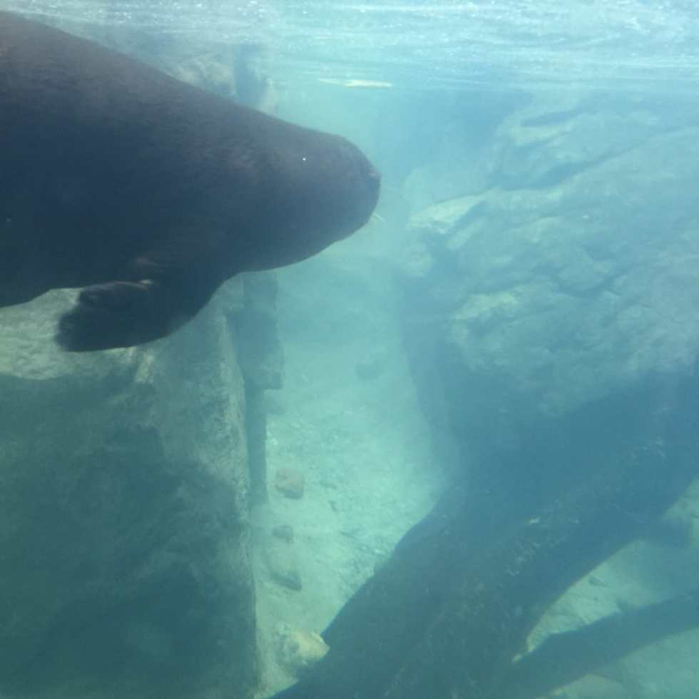

The sea otters were playing nonstop! They were like little puppies. They’d all swim to one side to play with a toy and then one by one slide over to the other side, watching behind them to make sure they were all together before playing again. So cute!

Too hot for the cheetah, who just lounged on top of the hut the whole time!

These monkeys both looked and smelled like skunks.

          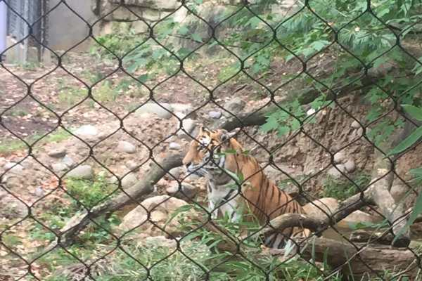
        

          
        

The tiger was quite happy to lounge in the water and made no attempts to move.

          
        

          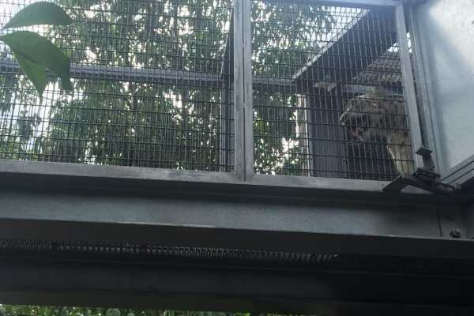
        

The zoo has a new thing called “Zoo 360,” where there are tunneled cages amongst some of the habitats, so the animals can move through them and be RIGHT on top of us. We snapped a few shots of this guy, who looks scary with his mouth open but was really just panting. In case you didn’t know, it was very hot that day.

          
        

          
        

This art was made entirely out of spark plugs!

          
        

          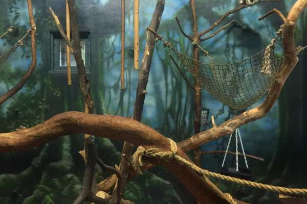
        

          
        

          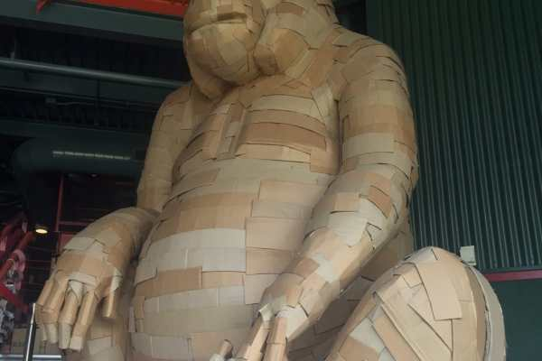
        

The monkey house also smelled (obviously!) but was air conditioned, so we didn’t mind!

          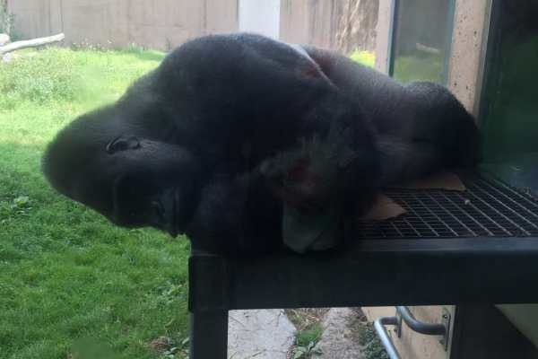
        

          
        

This not-so-little guy just about broke my heart. He didn’t even fit on that platform to sleep properly (though he had a huge inside and outside to choose from, so not sure why he picked there anyway!) but it was RIGHT by a big window with TONS of kids taking selfies and being loud next to him. He even put his fingers in his ears at one point, presumably to drown out the noise. I was so sad for him. 🙁

          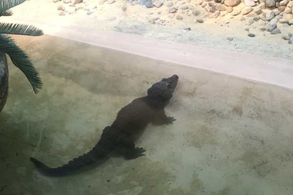
        

          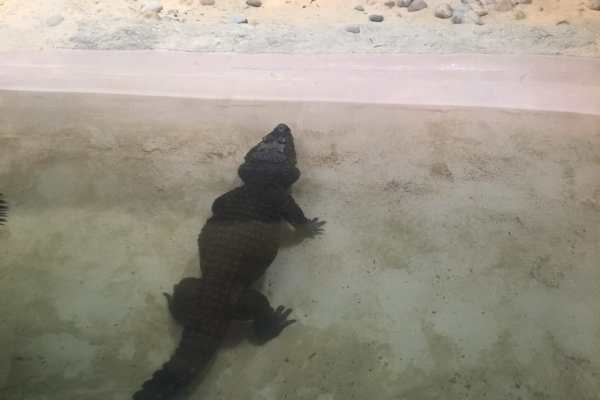
        

Another air conditioned haven was the reptiles &#x26; amphibians house. Little man was excited for this too, because he really wanted to see a crocodile! Once he did, he was wired, and dragged me all over to see every reptile he could find!

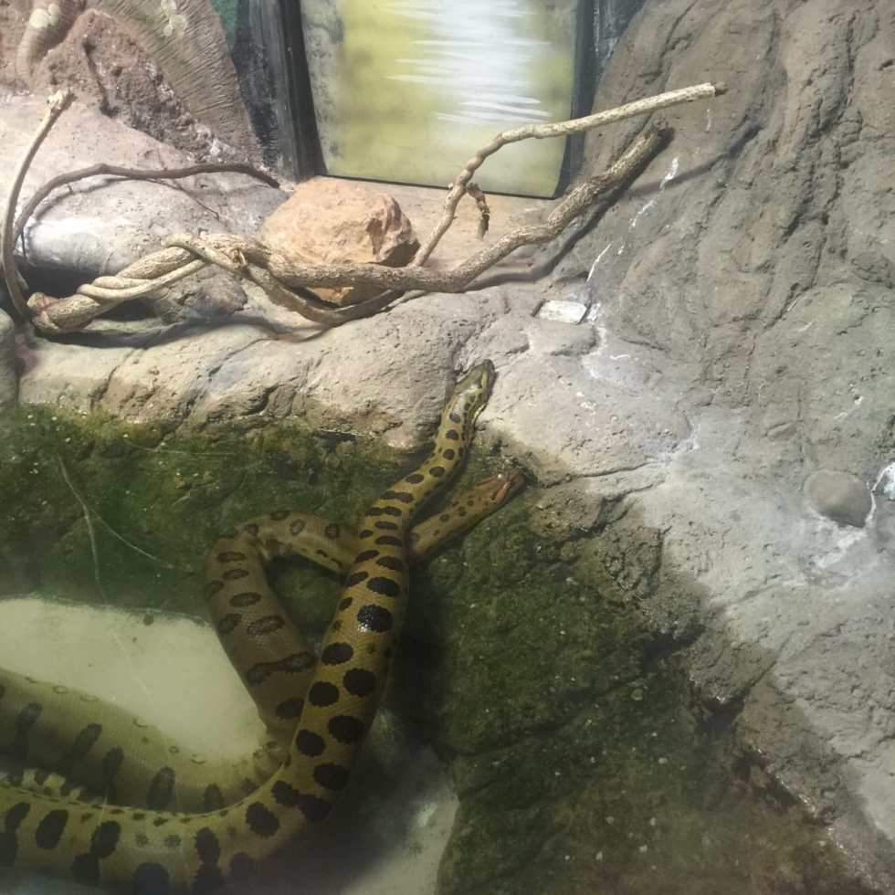

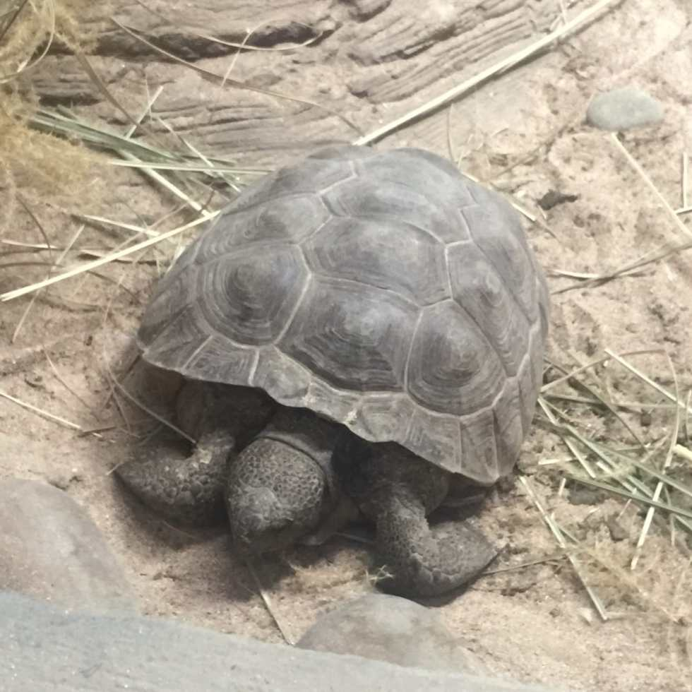

          
        

          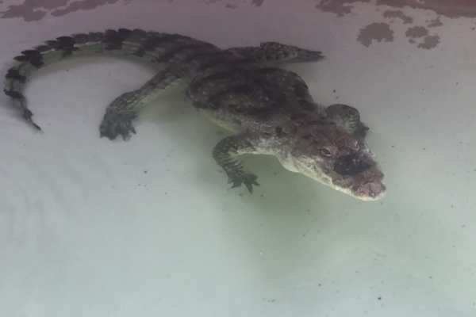
        

I think this one was the Nile Crocodile, which made me think of Peter Pan!

          
        

          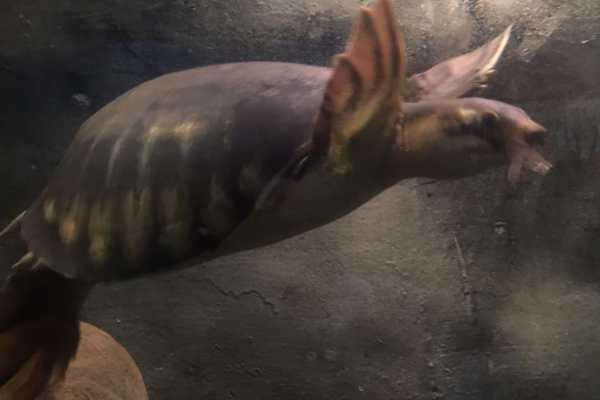
        

          
        

          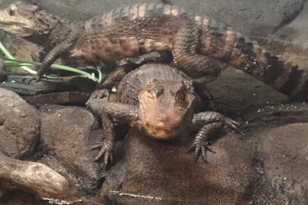
        

More snakes!

          
        

          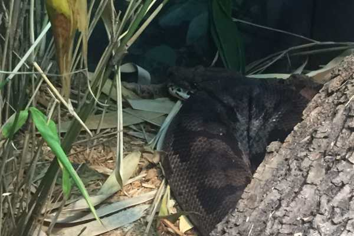
        

          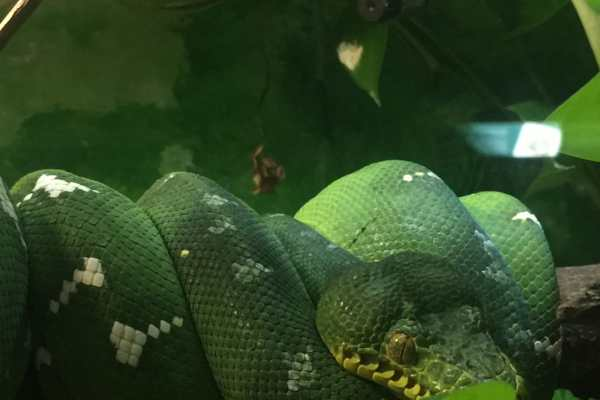
        

          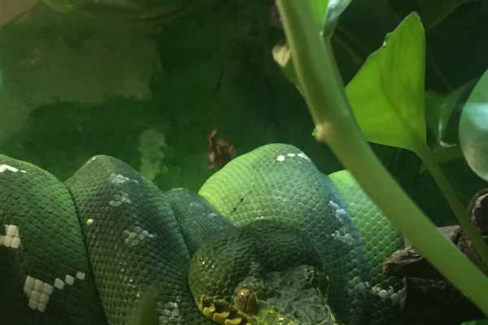
        

          
        

          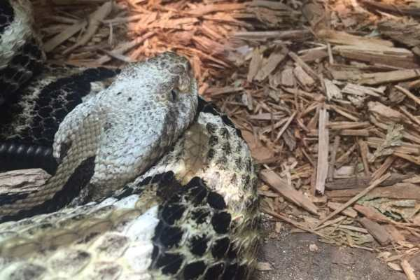
        

          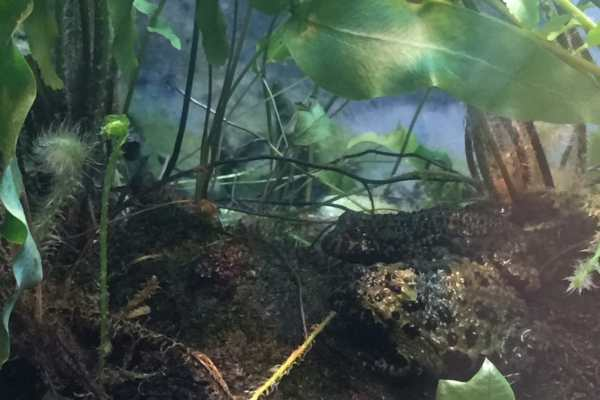
        

          
        

Big old happy salamander!

          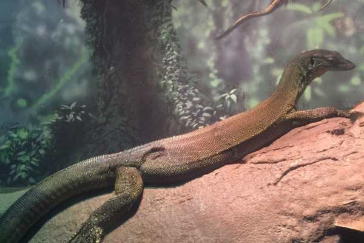
        

          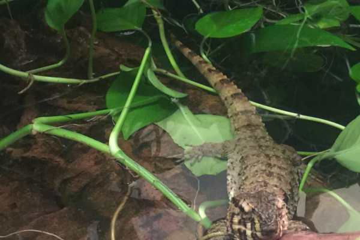
        

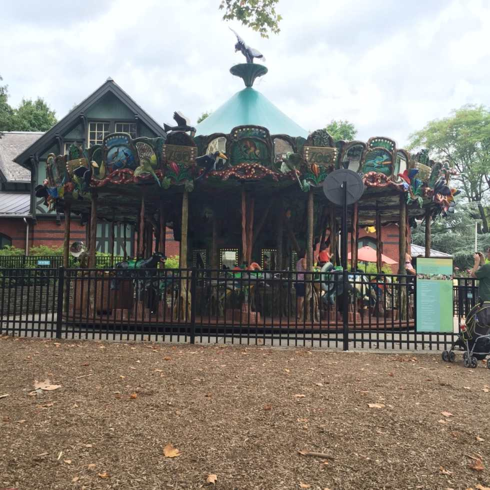

The carousel that played mellow French music the whole day.

          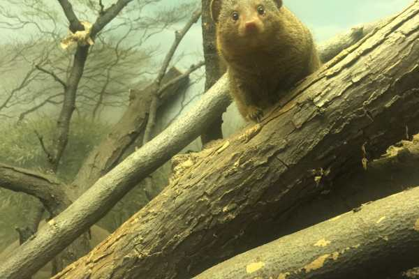
        

          
        

Doesn’t this mongoose look fake!?! It looks like some kind of taxidermy exhibit, but I promise, he’s real! He and his little beady eyes!

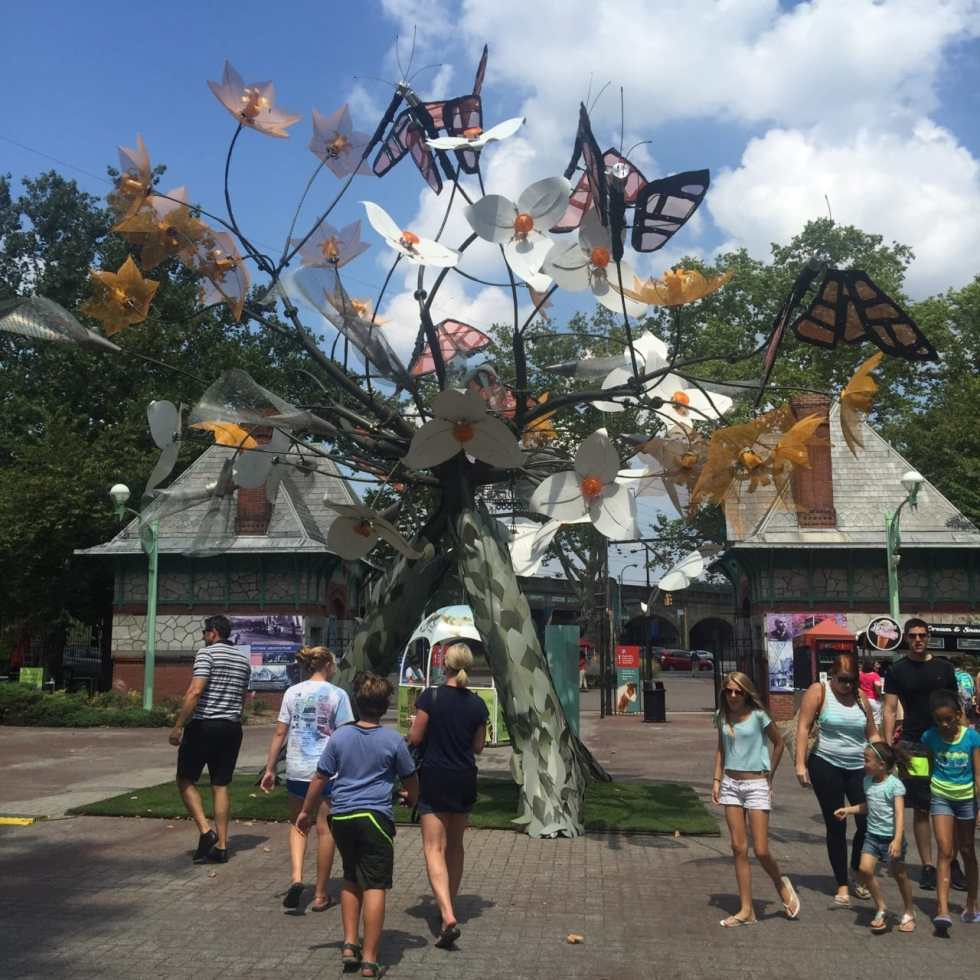

Flower and butterflies metalwork sculpture on the way in/out of the park!

Despite the heat, we had a wonderful day! I hope we get to go back again soon- preferably in the cooler months of Autumn!

Have you ever been to the Philadelphia Zoo? What is your favorite animal?

