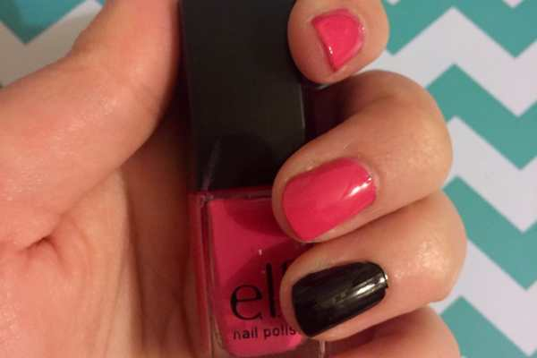
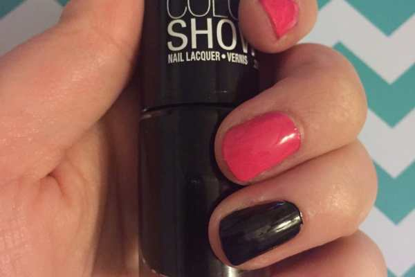

Valentine’s Day is in less than a month! That means I have a few more Manicure Mondays to figure out how I want to wear my nails on February 14th. My first design is a mega simple one, that requires no skill and just a few coats of polish. Try my quick &#x26; easy Valentine’s Day nails if you’re in a rush or looking for something effortless!
<h2>Materials:</h2><ul><li>
Pink nail polish
</li><li>
Black nail polish
</li><li>
Red glitter nail polish
</li><li>
Clear top coat
</li></ul><h2>Instructions:</h2><ul><li>
Begin with clean, dry nails. Do one coat of pink on all nails except your accent nail (I picked my ring finger for this.) Let dry.
</li><li>
Paint accent nails with black polish. Let dry.
</li></ul>

          
        

          
        

<ul><li>
Do a second coat of each if it isn’t opaque enough yet. Let dry.
</li><li>
When the black is totally dry, paint a coat or two of the red glitter on top to make it pop!
</li></ul><ul><li>
Seal in the whole look with clear polish and you’re good to go!
</li></ul>
Was that not the easiest Valentine’s nail look ever?! I hope you liked it too!

What are you planning on doing to your nails for V-Day?

