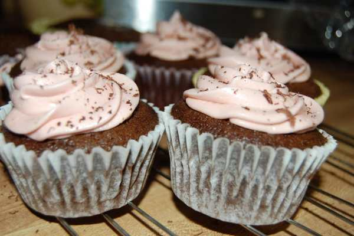
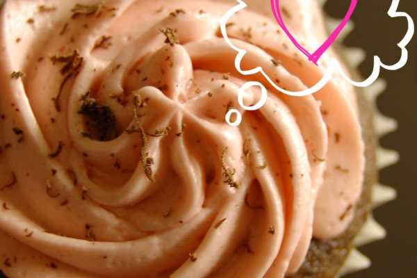
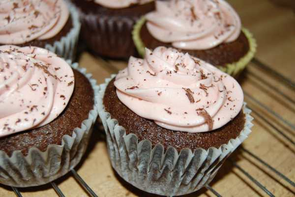

Recipe: Raspberry Kahlua Frosted Chocolate Cupcakes

Some of you may not know this about me, but I used to be a little obsessed with cupcakes. I made them all the time. Like, ALL the time. Especially when I first moved to Philly (which happens to be six years ago today!) Over the years I’ve come up with some really awesome recipes, and this is just one of the many that I’m going to share!

This recipe is for cupcakes that are made completely from scratch. Not all of my recipes are, though. You can (as I’ve done with this recipe several times) use a boxed mix as your starting point and add to it. Even if you make the cupcakes entirely out of a box, it really doesn’t matter. The key is having freshly made frosting- it really makes all the difference in the world.

I came up with this recipe one evening in a fit of pure genius. I was in the mood to bake. I had
<a title="Torani Raspberry Syrup" href="http://amzn.to/1f6DpWj" target="_blank" rel="noopener noreferrer"><strong>
Torani raspberry syrup
</strong></a>
on hand, though I can’t remember where it came from. I had just bought a bottle of Kahlua. I already loved the flavoring of dark chocolate with raspberry, so I figured I would just combine it all and see what happened. It was a pretty damn good choice.
<h2>Ingredients for Chocolate Cake*:</h2><ul><li>
2/3 cup butter
</li><li>
1 2/3 cups sugar
</li><li>
3 eggs
</li><li>
2 cups flour
</li><li>
1 ¼ tsp. baking soda
</li><li>
¼ tsp. baking powder
</li><li>
1 2/3 cups milk
</li><li>
1 shot of Kahlua
</li></ul>
<em>*If you do decide to go the boxed chocolate cake route instead, just be sure to add in your 1 shot of Kahlua!</em>
<h2>Ingredients for Frosting:</h2><ul><li>
½ cup solid vegetable shortening*
</li><li>
½ cup butter or margarine, softened
</li><li>
4 cups confectioner’s sugar, sifted
</li><li>
1 tsp. clear vanilla extract
</li><li>
2 Tablespoons milk
</li><li>
1 shot Kahlua
</li><li>
Approx. 3 Tablespoons Raspberry syrup (to taste)
</li><li>
Pink and Purple food dye (optional to obtain color)
</li><li>
2 oz dark chocolate, shaved (optional for decoration)
</li></ul>
<em>*I usually use butter flavored shortening for its lovely buttery flavor. Being buttery, though, makes the shortening and therefore the frosting yellow. If you want a pure white buttercream frosting, I recommend using regular vegetable shortening.</em>
<h2>Instructions for Chocolate Cake:</h2><ul><li>
Cream butter, sugar, eggs and Kahlua together using electric mixer until well blended and fluffy.
</li><li>
Combine the rest of the dry ingredients in separate bowl.
</li><li>
Alternating, add dry mixture and milk to creamed butter mixture.
</li><li>
Pour batter into each cupcake paper, approximately 2/3 way full.
</li><li>
Pop in pre-heated oven for 15-17 minutes, or until a toothpick inserted in center of cupcake comes out clean.
</li><li>
Let cool in pan for ten minutes before transferring to wire rack to cool completely.
</li></ul><h2>Instructions for Frosting:</h2><ul><li>
In large bowl, cream together shortening and butter with an electric mixer.
</li><li>
Add vanilla and Kahlua and beat together, scraping down sides of bowl as needed.
</li><li>
Gradually add one cup of sugar at a time, mixing well after each addition. If after all four cups of sugar has been added and beaten together, you still do not have the consistency you want, add more sugar, slowly, until you achieve it.
</li><li>
Add milk and beat at medium speed until light and fluffy.
</li><li>
Slowly add raspberry syrup one tablespoon at a time and beat together. It is very sweet so it is important to add only a little at a time so that you may taste it to see if it is to your liking. I used three tablespoons before it was the flavor I wanted.
</li><li>
I also wanted the frosting to be a raspberry color, so I used two drops of pink and three drops of purple food coloring.
</li><li>
Ice your cupcakes only when completely cooled. Use a
<a title="Wilton Master Decorating Tips Set" href="http://amzn.to/1jmVwN0" target="_blank" rel="noopener noreferrer">fun frosting tip</a>
if you like.
</li><li>
Shave chocolate (I’d go with a good one, like
<a title="Lindt 70% Dark Chocolate" href="http://amzn.to/1gpzwhM" target="_blank" rel="noopener noreferrer"><strong>
Lindt
</strong></a>
. It’s the first thing you’ll taste!) on top of each cupcake to give a little something extra. If you have raspberries on hand, put one or two on top. Be creative!
</li></ul>

          
        

          
        

          
        

Hopefully you haven’t had too much of the Kahlua whilst baking and are able to enjoy your finished product! As with any buttercream frosted cakes, store your Raspberry Kahlua Frosted Chocolate Cupcakes in the refrigerator until ready to eat. Try not to eat them all in one sitting. Good luck!

My cupcake recipe box is an overflowing one, so if you have a recipe you’d like to see on here, tell me in the comments! I’m sure I have something you’ll like!

