
Project: Reversible Tote Bag Tutorial

Hooray for Friday! Let’s celebrate with one of my favorite things to make! It takes a bit of time (okay, more time for me than it probably should, but then again I only am just learning how to use my sewing machine), but the results are a sturdy, well-made tote bag, that happens to be reversible, that you can use this weekend. How lovely!

This bag takes me a couple of hours to make, but hopefully with practice I can get it down to an hour. It may seem a little daunting as a beginner project, but it was actually one of the very first things I learned to make. For those of you who are sewing geniuses already, this will be a piece of cake for you.
<h2>Materials:</h2><ul><li>
One yard each of two different patterned fabrics (try to make them the same fabric type, though. i.e. both cotton, both duck, etc.)
</li><li>
Scissors
</li><li>
Matching thread in both fabric colors
</li><li>
Nylon webbing, 60″ worth
</li><li>
Interfacing if you have it (I did not use any in this tutorial)
</li><li>
Sewing machine
</li><li>
Pins
</li><li>
Chalk or pencil
</li><li>
Pinking shears (optional)
</li><li>
Measuring tape or ruler
</li></ul><h2>Instructions:</h2><ul><li>
Start off with two fabrics that you totally love together. I picked these adorable little whales and contrasting polka dots for this tote I made for a friend (hope you liked it, Erika!)
</li><li>
One fabric at a time, lay them flat wrong side up, and measure 15 inches across the width, and 30 inches down the length. Mark with your chalk or pencil. Do so for the second fabric as well. You won’t end up using the entire yard of either fabric, but put the scraps away for another project!
</li></ul><ul><li>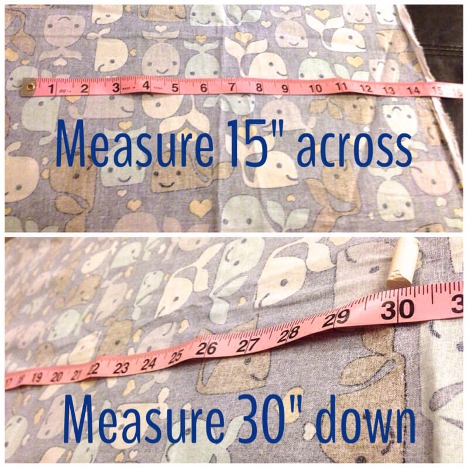
Cut along your chalk/pencil lines on each fabric and you’ll end up with two long pieces of fabric.
</li></ul>
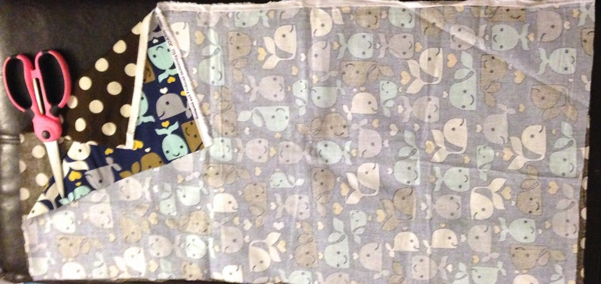
<ul><li>
Next, take fabric 1 (which I’ll refer to now as “whales”) and fold it in half, right sides facing each other, to make a square. Pin on three sides, leaving the top of the bag opened &#x26; unpinned.
</li><li>
Do the same for fabric 2 (which I’ll refer to now as “polka dots”).
</li></ul>
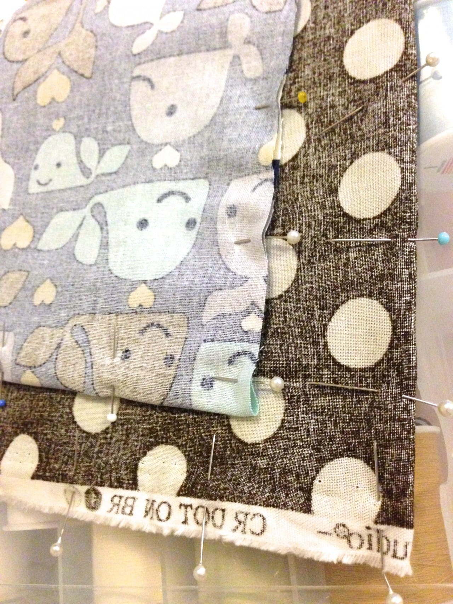
<ul><li>
Now do a straight stitch around the pinned sides of “whales,” approximately a half inch away from each edge. Repeat for “polka dots.”
</li><li>
Use scissors or pinking shears to snip off the excess fabric.
</li></ul>
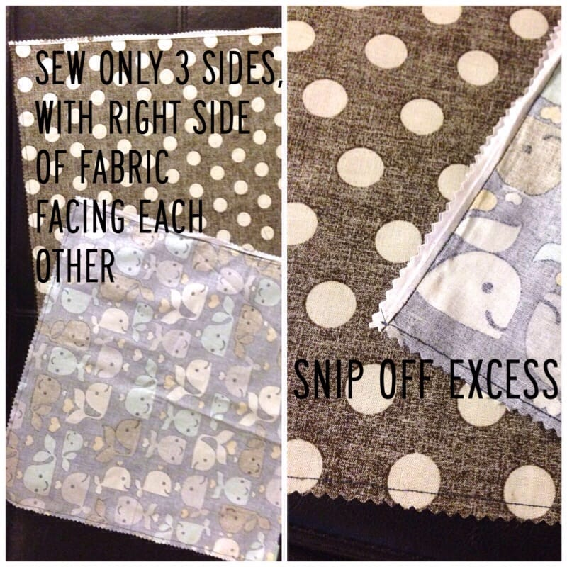
<ul><li>
Now it’s time to make the neat little boxed corners. Simply pinch the sewed corners of the bag to make a triangle, smooth the ridge over to one side, and stitch across it about 1″ to 1 1/2″ from the corner. See photos below for help!
</li></ul>

          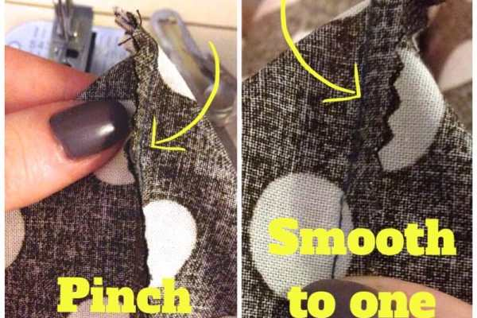
        

          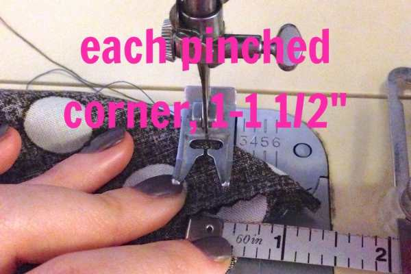
        

          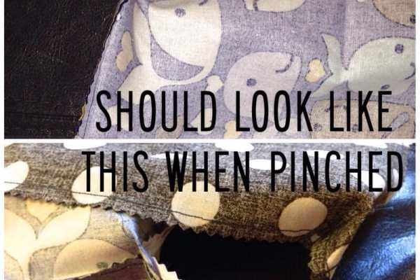
        

<ul><li>
Now flip just one of the bag halves inside out (I did “whales”), and then stick it inside the other bag (“polka dots”)! Right sides of the fabrics (the patterned sides) should be facing.
</li></ul>
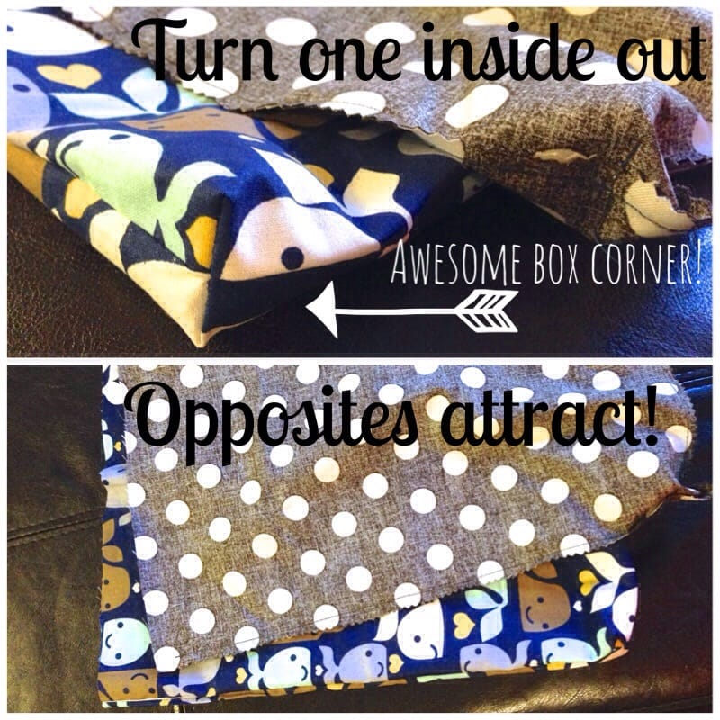
<ul><li>
The four layers of fabric should look like this:
</li></ul>
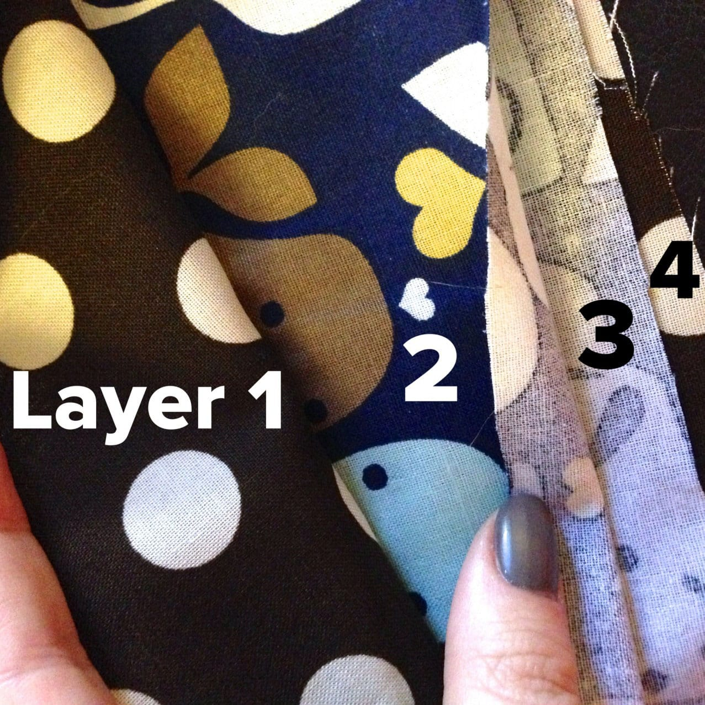
<ul><li>
Now you’ll need to make the handles. You can make your own using the same fabric, but I really like to use heavy nylon webbing. It’s strong, sturdy, and SO much easier than making your own. Just measure and snip! I buy mine from
<a title="Nylon Heavy Webbing" href="http://amzn.to/1cdUvHF" target="_blank" rel="noopener noreferrer"><strong>
Amazon
</strong></a>
, usually in black because it matches everything, but you can get pretty much any color you like! Cut your 60″ strip in half, and you’ve got yourself two 30″ handles!
</li><li>
Lay one handle between layers 1 and 2 of the fabric. Measure 3″ from the edge (about 2.5 inches from the seam) and pin the handles down nice and flat. Pin across the entire side of the bag.
</li><li>
Repeat for second handle between layers 3 and 4 of fabric. Pin, leaving a 4 or 5 inch opening somewhere around the bag for turning. I usually do this from right after the handle on one side around the edge and to right before the handle on the other side.
</li></ul>

          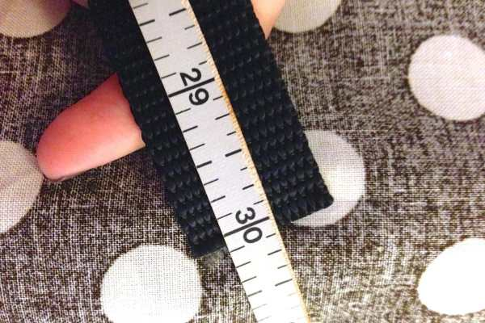
        

          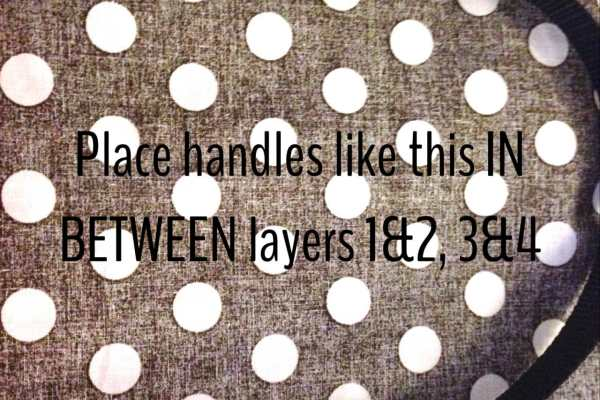
        

          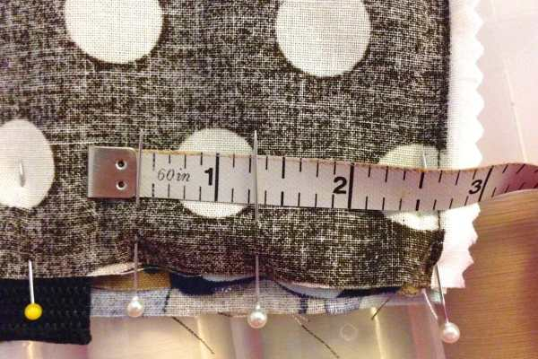
        

          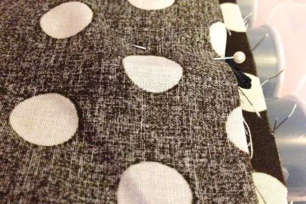
        

          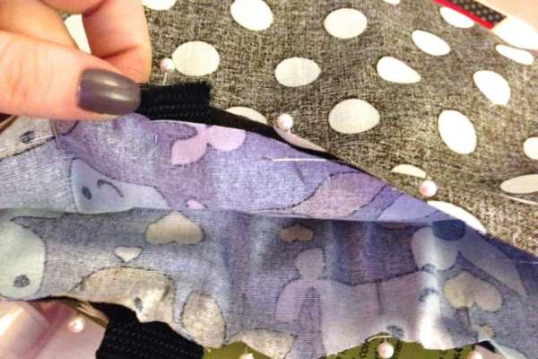
        

<ul><li>
Sew around the bag, 1/2 inch from the edge, leaving the gap for turning. Go back over the handles a few times each.
</li><li>
When done sewing, snip off excess.
</li><li>
Turn back inside out through the gap.
</li></ul>

          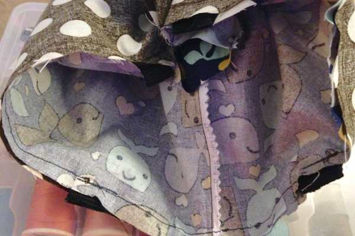
        

          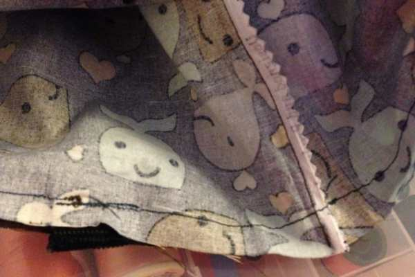
        

          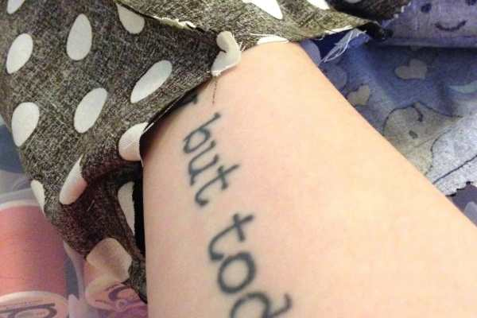
        

<ul><li>
Once the bag has both it’s right sides facing out, flatten or steam out wrinkles, and then tuck one of the layers inside the other layer to make a bag.
</li></ul>

          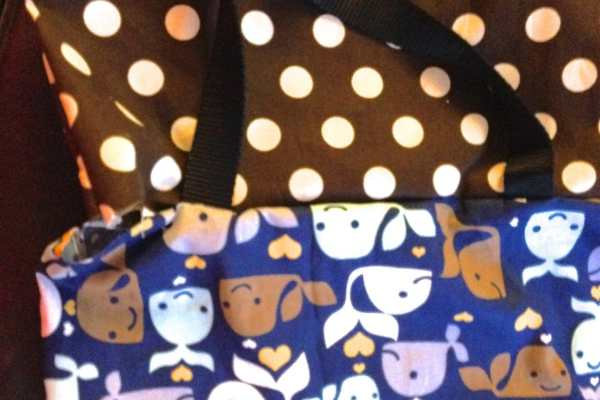
        

          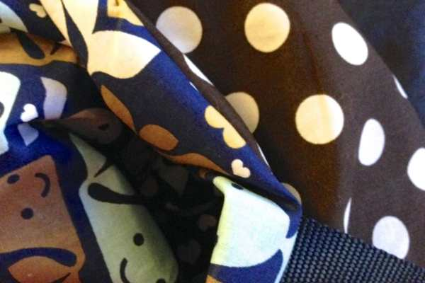
        

<ul><li>
Flatten bag and pin ALL the way around this time. When you hit the gap, fold the fabric into itself and pin to make it even with the rest.
</li><li>
Switch your sewing machine to the zig zag stitch, and stitch around all the way the tote, pulling out pins as you go.
</li></ul>

          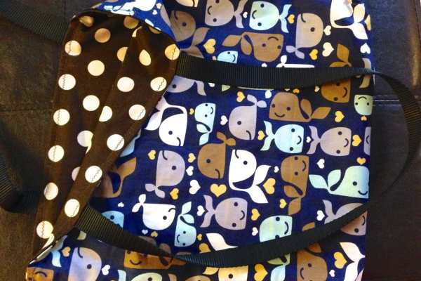
        

          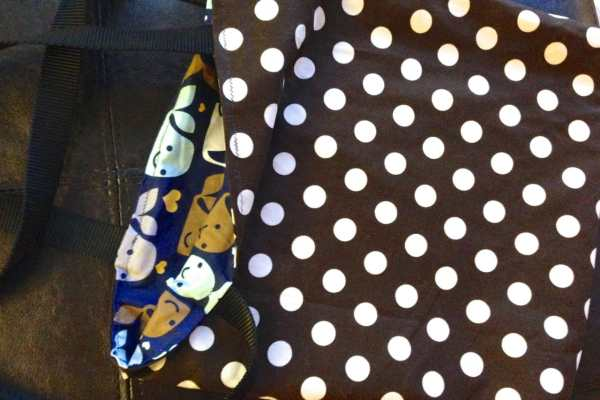
        

ALL DONE! Enjoy your brand new crazy cute reversible tote bag all over town!

          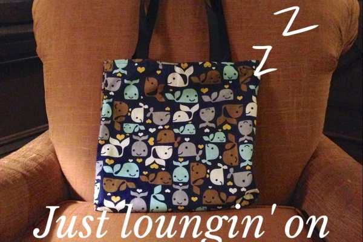
        

          
        

          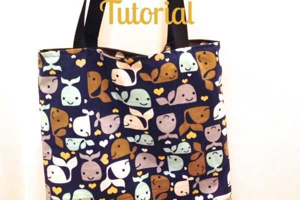
        

<h2>Tips:</h2><ul><li>
I don’t use interfacing, because it’s too expensive for my experiments.. and I’m too lazy to try the extra step. You can certainly use it, though, and it will probably make the project hold it’s shape even better. Once I’m 100% confident in my skills, I will probably move on to using it!
</li></ul>
If you make one of these reversible totes, let me know how it turns out! Have a great weekend!

