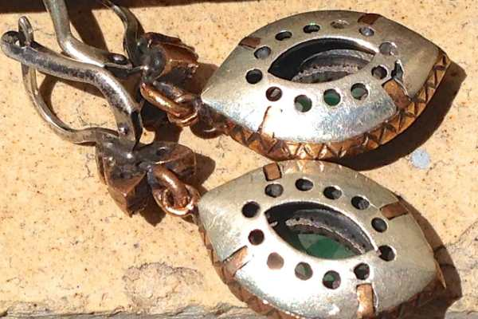
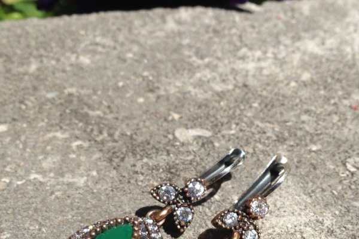
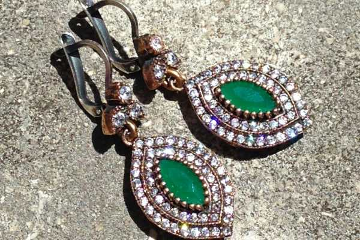
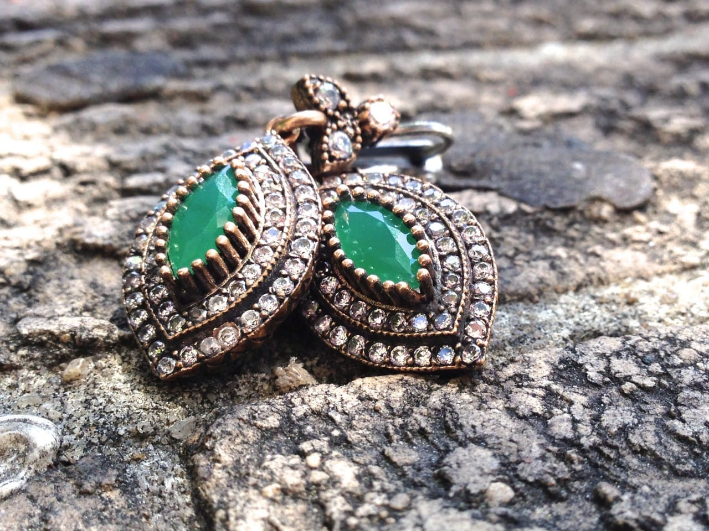
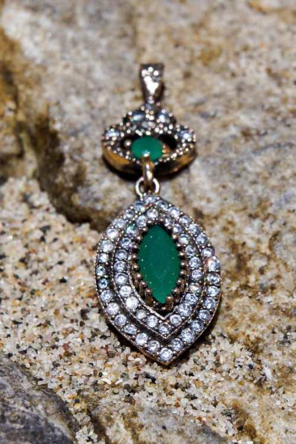

When Daniela from
<a title="Rica Jewels California" href="http://ricajewels.com/" target="_blank" rel="noopener noreferrer">Rica Jewels California</a>
reached out to me about a possible review and giveaway for my readers, I was pretty excited! I remember entering a giveaway for one of her pieces over on
<a title="The Art and Tree Chatter of Aquariann" href="http://blog.aquariann.com/" target="_blank" rel="noopener noreferrer">The Art &#x26; Tree Chatter of Aquariann</a>
, and thinking how talented she was. I popped into her
<a title="Rica Jewels California on Etsy" href="https://www.etsy.com/shop/RicaJewelsCalifornia" target="_blank" rel="noopener noreferrer">Etsy shop</a>
again to see what she was up to and was immediately drawn to several items. Her unique and beautiful jewelry is just gorgeous! I swiftly replied to her to let her know I’d LOVE to review one of her items and am even more excited to offer one to you guys!

In her Etsy shop, I totally fell in love with a pair of
<a title="Emerald sterling Silver Earrings at Rica Jewels California" href="https://www.etsy.com/listing/156943743/emerald-sterling-silver-earrings?ref=shop_home_feat_3" target="_blank" rel="noopener noreferrer">Emerald Sterling Silver Earrings</a>
. When she offered those as one of the options for the review, I pretty much flipped! I was so in love with them already and could totally picture wearing them with several outfits hanging in my closet. She shipped them over in a cute little drawstring jewelry bag with her logo on it, which I can definitely appreciate since I love when things are personalized. Then I opened the bag like it was Christmas morning! The earrings- oh my gosh!

          
        

          
        

The photos just don’t do them justice. I had to wait for a sunny day to photograph them outside to try to capture the sparkliness of them, but in person they are a thousand times more beautiful, especially when the sun catches them.

These amazing Turkish style earrings measure at just about two inches in length and are comprised of sterling silver, and Emerald and cubic zirconia stones. They have a good weight to them- usually earrings of this size are way too heavy for my ears, but these aren’t. They are very comfortable to wear, too!

          
        

          
        

I just can’t get over the sparkle! I’m wearing them to the wedding I’m attending this weekend to jazz up my plain black dress. I can’t wait! I know for certain I am going to get compliments on them- they’re amongst the prettiest earrings I own! The best part is these earrings are
<em>
only $42
</em>
– a total steal for something so stunning!

          
        

          
        

One of my favorite things about Daniela’s shop is the charity aspect. As you know, I also donate part of
<a title="Katie Crafts on Etsy" href="https://www.etsy.com/shop/katiecrafts" target="_blank" rel="noopener noreferrer">my Etsy shop</a>
profits to my favorite charity:
<a title="Celebrating Mom!" href="/celebrating-mom/">the American Brain Tumor Association</a>
. Daniela feels the same, and donates to her favorite cause with the purchase of items from her shop! On the business card inside the package, there is a photo of the sweet little girl, Luz, that Rica Jewels California sponsors through
<a title="ChildFund" href="https://www.childfund.org/" target="_blank" rel="noopener noreferrer">ChildFund</a>
. It’s such a wonderful cause!

<figure id="attachment_2391" aria-describedby="caption-attachment-2391" class="post__figure"><figcaption id="caption-attachment-2391">
My Husband took this photo! Of COURSE it’s better than all the ones I took!
</figcaption></figure><h2>Giveaway!</h2>
Today you have the chance to win the gorgeous matching Turkish style
<a title="Emerald Pendant from Rica Jewels California" href="https://www.etsy.com/listing/156646472/emerald-pendant-may-birthstone-turkish?ref=shop_home_active_7" target="_blank" rel="noopener noreferrer">Emerald pendant</a>
to my earrings! If your birthday is this month, then winning May’s birthstone would make this giveaway even sweeter!

This giveaway ends on
<em>
Tuesday, May 20th at 11:59PM ET
</em>
. It is open worldwide to adults 18 and older. If your entry cannot be verified (or you are a bot and not a human!!), it will be disqualified.
 <a id="rc-64ecfa6" class="rafl" href="http://www.rafflecopter.com/rafl/display/64ecfa6/" rel="nofollow noopener noreferrer" target="_blank">a Rafflecopter giveaway</a>
If you don’t want to wait to see if you’re a winner, or want something else from Rica Jewel’s Shop, she has plenty of coupons available! You can get free shipping on sales over $35 before taxes if you use the code FREESHIPPING.

When you follow them on Etsy and like them on Facebook, you can get 5% off using coupon code LIKEFACEBOOK. Great deals! Thanks again, Daniela, for the lovely earrings and the opportunity for my readers to win your pendant!

