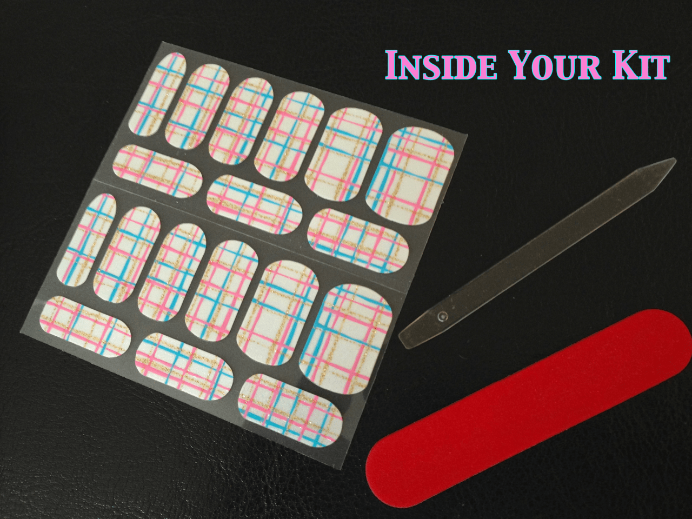
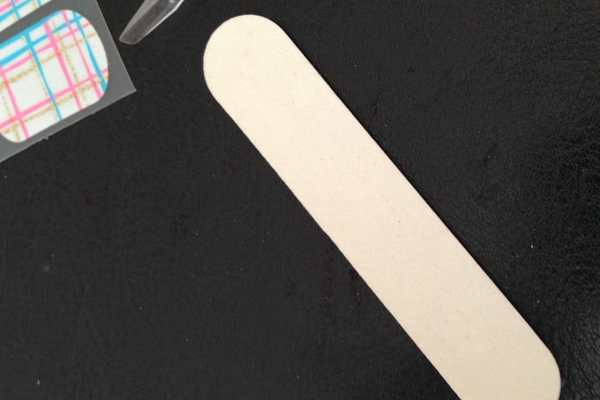
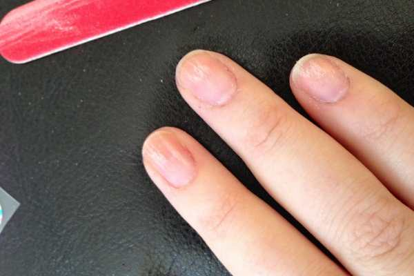
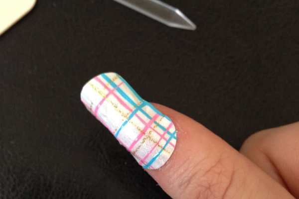
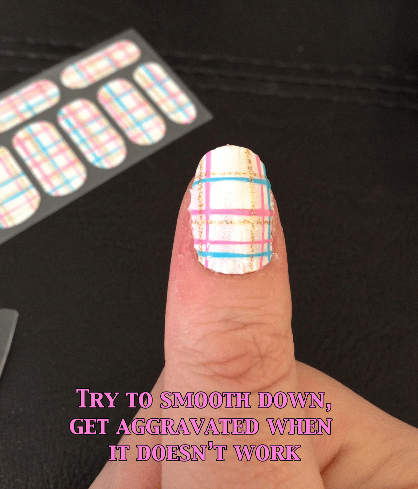
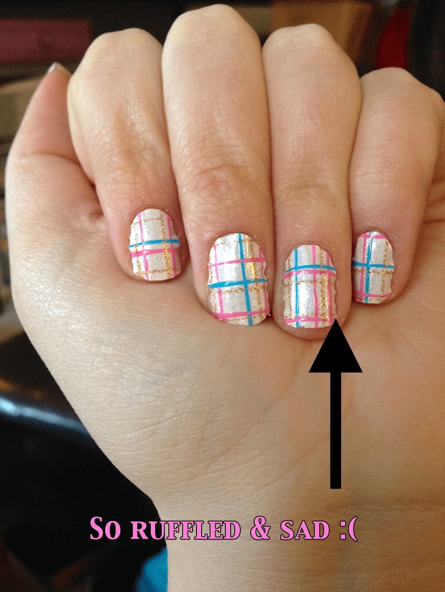
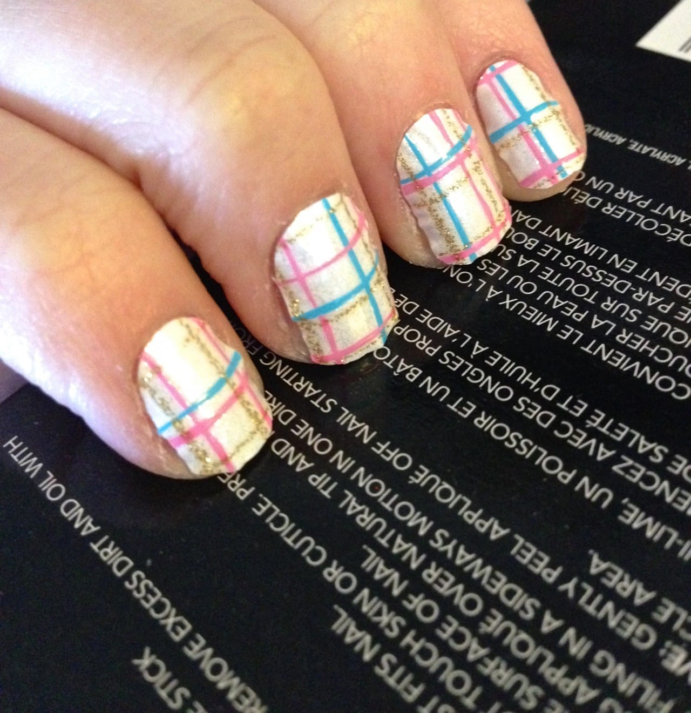

I teeter back and forth between really loving nail wraps, and really hating them. That’s because half of the time I have a positive experience, and the other half are negative ones. I’ve tried many Sally Hansen ones and had great success- and many of the same brand were complete failures. I found the new Revlon Nail Art 3D Jewel Appliqués Candy Vibes in my CVS yesterday and though I’d give them a whirl.

The display in the store was cheerful, with several different design options for $11 each. Similarly priced to other brands, and with the closest “Spring” decoration I could find (which was my purpose for going to CVS to begin with), I figured “why not?” and bought the Revlon Nail Art in a really cute design called “Frosting.” I especially loved the stripes of gold glitter!

In the package you received 18 appliqués in different sizes, a small plastic cuticle stick and a “mini file and a buffer.” I didn’t see any buffer in my package, so I assume they refer to the other side of the nail file as the buffer- even though both sides very much felt the same. Still, I followed the directions and washed my hands. Then I filed them with one side and buffed them with the other (see below).

          
        

          
        

          
        

Sadly, this was one of my negative-I-really-hate-nail-wraps experiences. I’m sure other people will use these exact ones and have a great time with them! I envy those people. I really, really wanted them to work out! On the plus side, once on the nail I was able to easily lift them and replace them (without them losing their stickiness) to fix them which other brands don’t let me do. On the other hand, no matter how much smoothing down I did, how much time and attention was spent to try to get them perfectly fit to my nail, they just kept lifting, bubbling, and making little ruffles around the edges.

I love the convenience of wraps or appliqués like these. The Revlon ones boast “UV cured technology made to last”; “no dry time”; and “won’t dry out” qualities. These are all well and good, but if they look awful on my nails I don’t particularly want them to last! I’ll inevitably try them out again, praying that my first attempt was just a sad fluke, because they really are adorable.

Ah well, some of these experiments work and some fail. Just wish the failures didn’t cost so much money!

Have you tried Revlon Nail Art Appliqués before? Is there a trick I am not getting to have them actually work!? What other brands have you tried and loved, or tried and hated?

