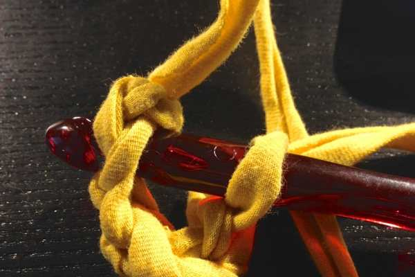
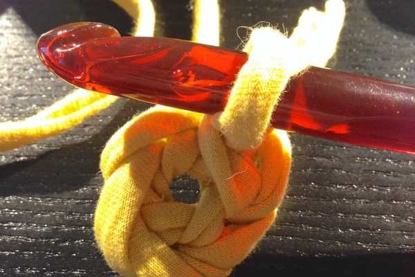
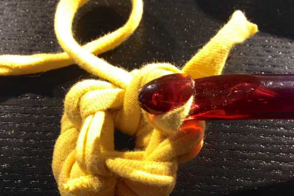
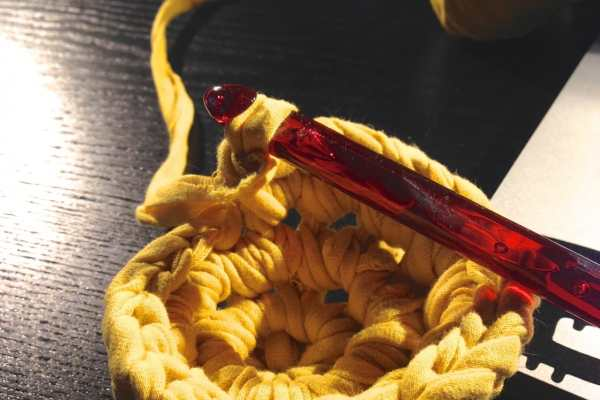
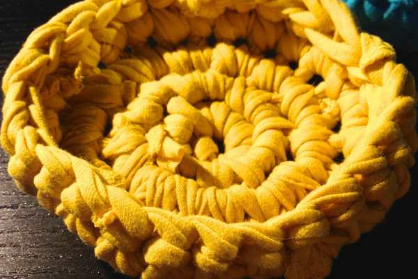
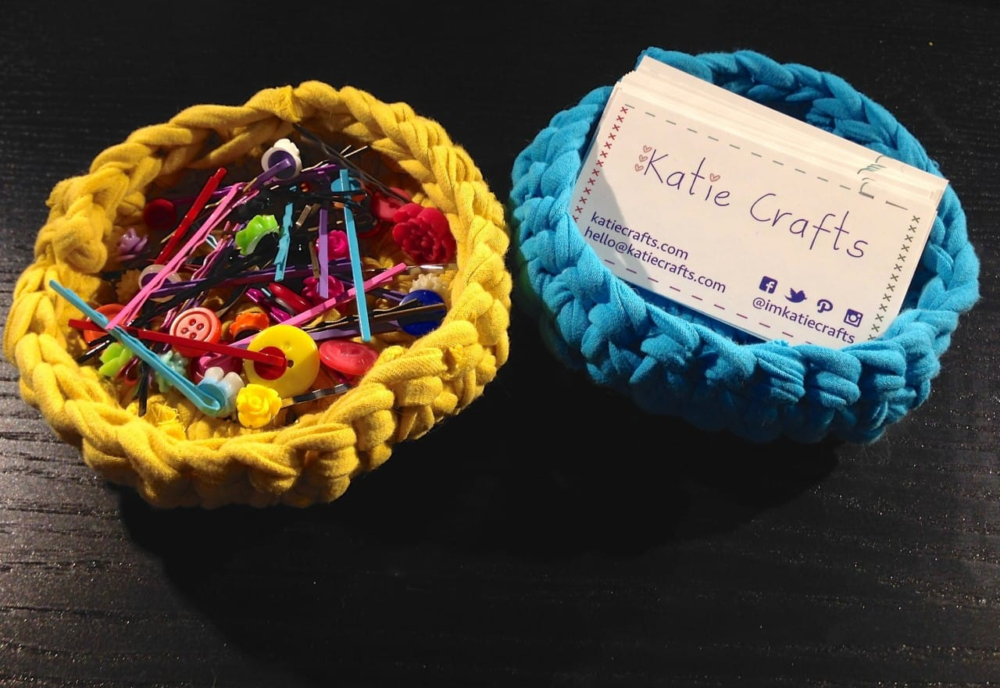

Project: Small Crocheted Bowl Pattern
<strong> </strong>
You may remember me mentioning that I acquired a new
<a title="Sunday Funday: Issue 3" href="/sunday-funday-issue-3/">crafting desk</a>
from IKEA the other day. I won’t be posting photos of it til it’s 100% completed and adorable, but in the process of getting it to that point I’m finding I need more storage baskets and bowls than I’d realized. Rather than buy even more than I already have, I thought I’d take a stab at making them myself!

These small crocheted bowls use the
<a title="How To Make T-Shirt Yarn" href="/how-to-make-t-shirt-yarn/">t-shirt yarn</a>
I made last week, and are shallow and flat enough to hold things like my hair pins, business cards and more. I can’t wait to get a little shelf for the desk that I can line these pretty little guys up on! They are certainly adorable and I’ll surely be making more! Did I mention they are also a great beginner project for someone who wants to work in rounds?
<h2></h2><h2>Materials:</h2><ul><li>
T-shirt yarn
</li><li>
P-16 crochet hook (11.5 mm)
</li><li>
Scissors
</li></ul><h2>Instructions:</h2>
Key**-
<ul><li>
ch = chain
</li><li>
ea = each
</li><li>
inc = increase
</li><li>
sc = single crochet
</li><li>
sl st = slip stitch
</li><li>
st = stitch
</li><li>
( )* = repeat work that is inside the parentheses amount of times listed
</li></ul>
**Need help with these terms? Don’t forget about my
<a title="Crash Course in Crochet" href="/crash-course-in-crochet/">Crash Course in Crochet!</a>
This pattern is worked in continuous rounds.

          
        

          
        

<ul><li>
Begin with sl st on to the hook leaving 2 inch tail
</li></ul><ul><li>
To crochet “in the round,” ch 5 then sl st through the first loop to create a ring
</li></ul>

          
        

          
        

          
        

<ul><li>
Next, sc 5 through center, turning as you go; pull on tail to close center hole a little
</li></ul>
It will resemble a tall little yarn ball, but that’s okay! You’re on the right track.

          
        

          
        

<ul><li>
To inc, work (2 sc in each stitch)* in next 20 stitches
</li></ul>
You can see after the first 10 (with 2 sc in ea st) that it’s already forming a small bowl. It’s even taller after 20 and will look like it’s maybe getting too tall, or perhaps looks somewhat wonky. Don’t worry about this! At the end it will look much better and you’ll work to shape it with your hands.

<ul><li>
Last round is 40 sc (only one in ea st this time) around, turning as you go.
</li></ul><ul><li>
Tie off; snip off excess; weave in ends
</li></ul><ul><li>
Stretch and mold bowl into it’s proper shape.
</li></ul>

          
        

          
        

Finished! Use your new brightly colored crafty little bowl to hold whatever needs holding.

What would you use these little bowls for? If you try out the pattern, let me know in the comments! And don’t forget to enter the contest (it goes til Monday!) to win a pair of crocheted flower hair pins- just check out
<a title="Featured Etsy Shop: Made With Sweetness" href="/featured-etsy-shop-made-with-sweetness/"><strong>
yesterday’s blog!
</strong></a>
