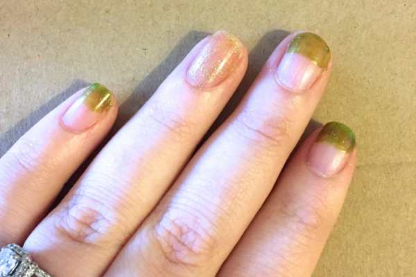
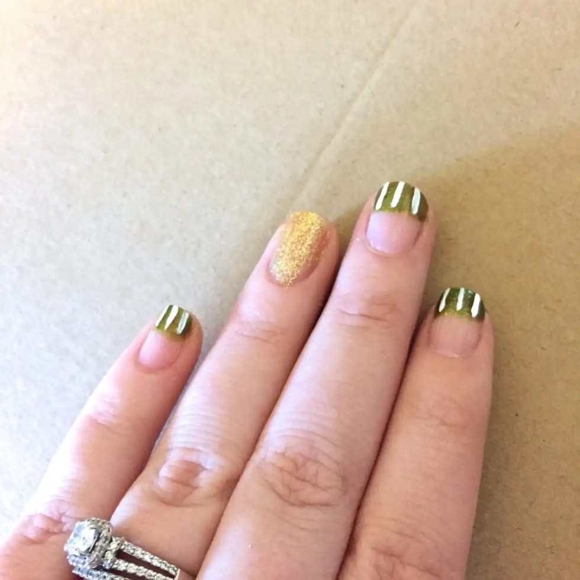
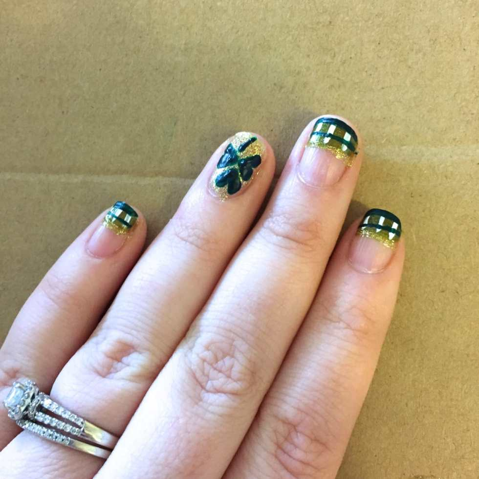
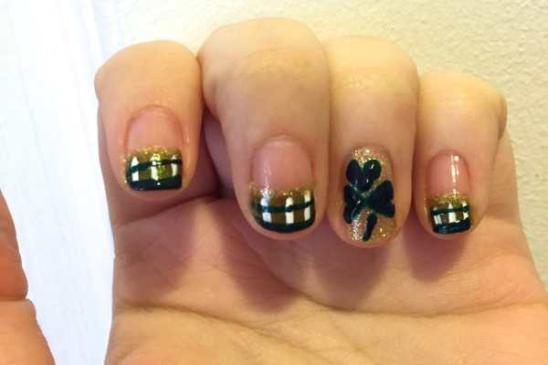
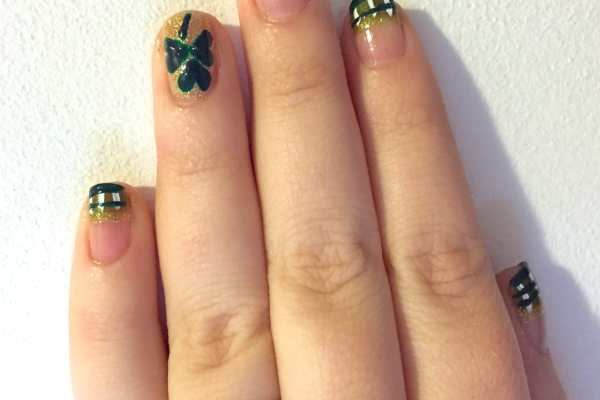
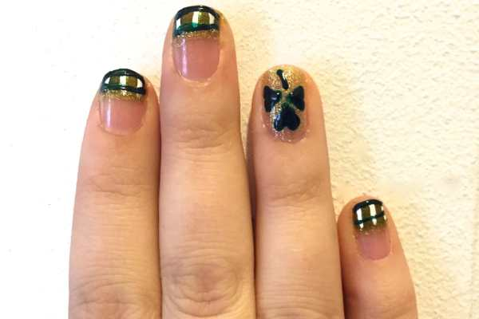

Tomorrow is Saint Patrick’s Day (and today is my baby cat’s 10th birthday!) I recently saw a really cute design by
<strong>
CutePolish
</strong>
on
<strong>
YouTube
</strong>
(one of my favorite channels!) where she showed a design called
<a title="Cute Polish Lucky Green Plaid Nails on YouTube" href="https://www.youtube.com/watch?v=fmkZbglUOBw" target="_blank" rel="noopener noreferrer"><strong>
“Lucky Green Plaid Nails.”
</strong></a>
I really liked it for the upcoming holiday, so I made a few changes and came up with my own similar design, inspired by hers!
<h2>Materials:</h2><ul><li>
Green glitter nail polish
</li><li>
Gold glitter nail polish
</li><li>
Clear top coat
</li><li>
White acrylic paint
</li><li>
Dark green acrylic paint
</li><li>
Large dotting tool
</li><li>
Nail art brush
</li></ul><h2>Instructions:</h2><ul><li>
Starting with clean, dry nails, do one coat of gold glitter nail polish on your ring fingers (or on whichever finger you want to be your accent nail!)
</li><li>
Next, do one layer of green glitter polish on all your other nails, in the fashion of a larger french tip. About 1/3 – 1/2 of the way down is good!
</li></ul>

          
        

          
        

<ul><li>
Let dry, and then do a second coat of gold and green on each.
</li></ul><ul><li>
Put a little dab of white acrylic and green acrylic paints on your workspace. I used a piece of cardboard I had, but you can use a paper plate!
</li></ul><ul><li>
When your nails are dry, use your nail art brush dipped in white paint to draw vertical lines on each of the green glitter tips you have. Lines don’t need to be perfect when you’re getting to the middle of your nail, because that will be covered with a gold line soon anyway!
</li></ul>

<ul><li>
When the white is dry, clean off your brush and use the green paint to draw horizontal lines on top of the white stripes, beginning at the tip of your nail.
</li></ul>

<ul><li>
Paint a shamrock on your nails by using your large dotting tool! Make a large dot with green paint, another large dot right next to it, and drag it down to create a heart. Three hearts will make a shamrock! Then use your nail art brush to make the stem.
</li></ul>

<ul><li>
With a clean nail art brush, use your gold glitter polish to create a gold stripe on the end of each plaid design. Let dry.
</li><li>
Seal in your look with clear nail polish and you’re all set!
</li></ul>

          
        

          
        

I think it came out really cute! What do you think of my St. Patrick’s Day nail art design with plaid and shamrocks? If you try it out for tomorrow, share pics with me in the comments!!

          
        

          
        

