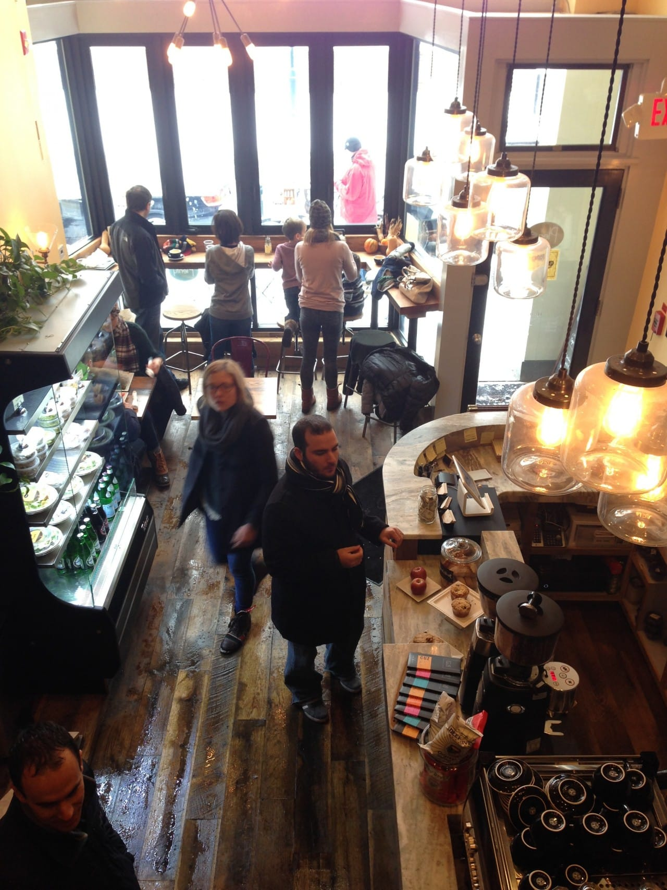
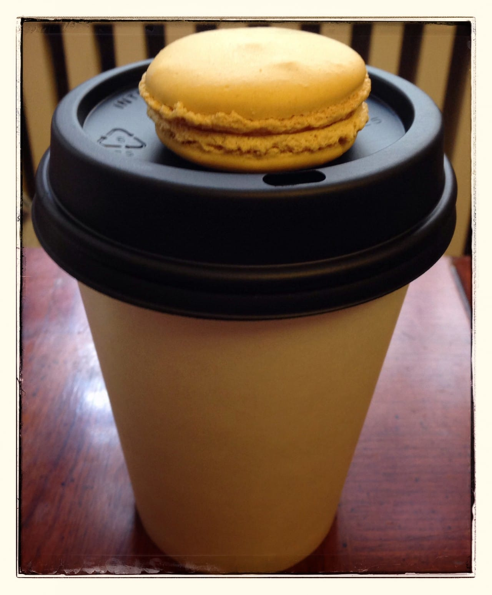

Happy Sunday!

Each Sunday, I will have a
<strong>
“Sunday Funday”
</strong>
post, where I fill in my favorite things for each week in five categories.

They’ll be flexible, but they’ll basically be as follows:
<ol><li><strong>
Makes Me Laugh
</strong>
– (think YouTube and think cat videos… probably for most of the time!)
</li><li><strong>
What I’m Reading
</strong>
– a book, article or snippet I read this week that I loved
</li><li><strong>
Place I Love
</strong>
– a place, past or present, that I’ve visited and adored
</li><li><strong>
Something Delicious
</strong>
– something completely tasty that I either ate this week, or found the recipe for and cannot wait to try making
</li><li><strong>
Project That Inspires
</strong>
– this will be a project, craft or the like that I’ve found and draw inspiration from. Maybe it will be something I try in the future! If you have ideas for this or want one of your projects to be considered (and your blog linked to it), just send me an email!
</li></ol>
Without further ado, let us get on with
<strong>
Sunday Funday: Issue 1!
</strong><h2>Makes Me Laugh: Smitten – Simon’s Cat (A Valentine’s Special)</h2>
Ahhh
<a title="Simon&#x27;s Cat" href="http://www.youtube.com/user/simonscat?feature=watch" target="_blank" rel="noopener noreferrer"><strong>
Simon’s Cat
</strong></a>
! How I love you. A new Valentine’s short was posted this week that was adorable, so I must share it with you!
 <h2>What I’m Reading: “Meet Me at the Cupcake Café” by Jenny Colgan</h2>
Right now, I’m smack in the middle of a cute book by
<strong>
Jenny Colgan
</strong>
called
<a title="" meet="" me="" at="" the="" cupcake="" café&#x26;#x26;#x26;#x26;#x26;#x22;="" by="" jenny="" colgan&#x26;#x26;#x26;#x26;#x26;#x22;="" href="http://amzn.to/1erpp9m" target="_blank" rel="noopener noreferrer"><strong>
“Meet Me at the Cupcake Café.”
</strong></a>
It’s about a woman who is passionate for baking and decides to open a café after being laid off her desk job. It’s super cute and fluffy- just the type of reading I’m in to lately. Anything that’s heavy or makes me cry just isn’t in the cards right now.
<strong>
Bonus:
</strong>
Included before every chapter of this book is a delicious recipe! I’ll certainly be trying some out.
<h2>Place I Love: Plenty Café!</h2>
<a title="Plenty Cafe Philadelphia" href="http://www.plentyphiladelphia.com/" target="_blank" rel="noopener noreferrer"><strong>Plenty</strong></a>

is my absolute favorite coffee shop here in Rittenhouse, and conveniently only a block away. The Husband (in the black coat standing at the counter!) and I are obsessed and go there many, many times a week. Sometimes we bring along our books to read or our laptops to work. It’s lovely.

<h2>Something Delicious: Café Mocha &#x26; Lemon Macaron!</h2>
<a title="Plenty Cafe Philadelphia" href="http://www.plentyphiladelphia.com/" target="_blank" rel="noopener noreferrer"><strong>Plenty</strong></a>

(in addition to amazing food and being one of my favorite places to visit) has the best café mocha
<strong>
ever
</strong>
(made with homemade chocolate!) and this week they also happened to have macarons, too! My favorite coffee AND my favorite dessert? Perfection.

<h2>Project That Inspires: Bow Belt by Tilly and the Buttons</h2>
I really want to start making cute belts for dresses before the Spring weather hits, and am totally in love with this
<strong><a title="Tilly and the Buttons" href="http://www.tillyandthebuttons.com" target="_blank" rel="noopener noreferrer">Bow Belt by Tilly and the Buttons</a>
!
</strong>
Check out her
<strong><a title="Tilly and the Buttons - Bow Belt Tutorial" href="http://www.tillyandthebuttons.com/2010/06/bow-belt-tutorial.html" target="_blank" rel="noopener noreferrer">tutorial</a></strong>
for instructions on how to make your own!

That’s it for this issue of Sunday Funday! Hope you liked it! Have a loverly day!

