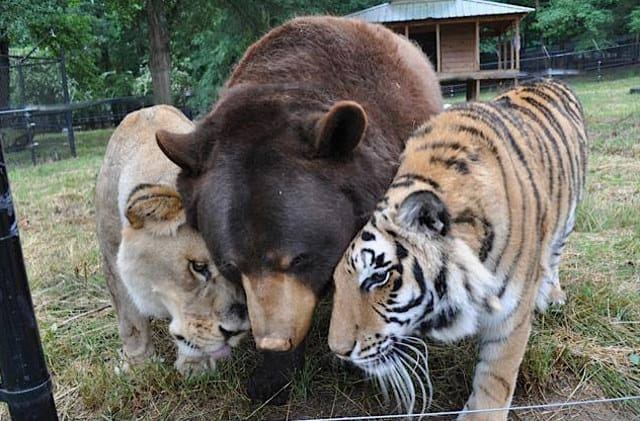
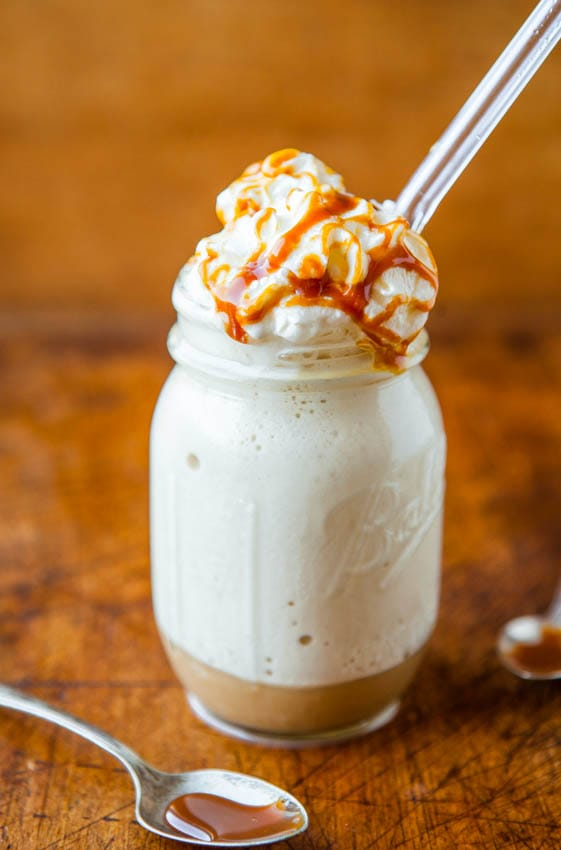

Happy Sunday! Also, happy almost Memorial Day! Many of you have off tomorrow and are looking forward to a nice long weekend (you lucky people who I am mega jealous of!), so why not spend some extra relaxing time by checking out today’s post! There are some great ideas in it, and a few things that are sure to make you giggle!
<h2>Makes Me Laugh: Nobody Is Perfect</h2>
This little comic by
<a title="Pablo Stanley" href="http://www.stanleycolors.com/" target="_blank" rel="noopener noreferrer">Pablo Stanley</a>
is simple, cute and pretty hilarious! Check out his other stuff, too!
<h2>What I’m Reading: Lion, Tiger And Bear Are Real Life BFFs</h2>
Ok so this easily could have doubled as my thing that makes me giggle, but since there was an article (and video!) involved, it’s officially my something I read! These three guys were found together during a police drug raid, and have grown up together in Georgia since. The black bear is Baloo (obvi), the African lion is Leo (duh) and the Bengal tiger is Shere Hkhan- together they are “BLT”! I’m dying. How cute are they together! Besties!
<a title="BLT" href="http://geekologie.com/2014/05/odd-couples-lion-tiger-and-bear-are-real.php?utm_source=feedburner&#x26;utm_medium=feed&#x26;utm_campaign=Feed%3A+geekologie%2FiShm+%28Geekologie+-+Gadgets%2C+Gizmos%2C+and+Awesome%29" target="_blank" rel="noopener noreferrer">Read more here!</a>

<h2>Place I Love: The French Quarter in New Orleans</h2>
It’s gotta be pretty obvious, considering my post on Friday! I just adored it there [plus it made me feel like I was on the set of “The Originals,” so there’s that… 😉 ] Go read
<a title="NOLA in a Nutshell" href="/nola-in-a-nutshell/">my recap</a>
to see more pics!

<h2>Something Delicious: Skinny Caramel Frappucino</h2>
When I spotted this recipe on
<a title="Averie Cooks" href="http://www.averiecooks.com/2013/06/skinny-caramel-frappuccino.html" target="_blank" rel="noopener noreferrer">Averie Cooks</a>
, I knew I had to try it! I can’t wait to get all the ingredients and give it a go. It looks so yummy!

<h2>Project That Inspires: Lace Back Flannel</h2>
I have both an old flannel shirt that I was about to throw away, and a large section of lace that I’ve been wondering what to do with! I will absolutely be trying this tutorial out! Stay tuned for pics of it (but only if it’s somewhat successful!) Thanks for the great tutorial from
<a title="Dana&#x27;s Fashion Blog" href="http://fashion.onblog.at/en/diy-tutorial-6-spice-up-a-plaid-dress-with-lace" target="_blank" rel="noopener noreferrer">Dana’s Fashion Blog</a>
!

Have a fabulous rest-of-your Memorial Day Weekend!

