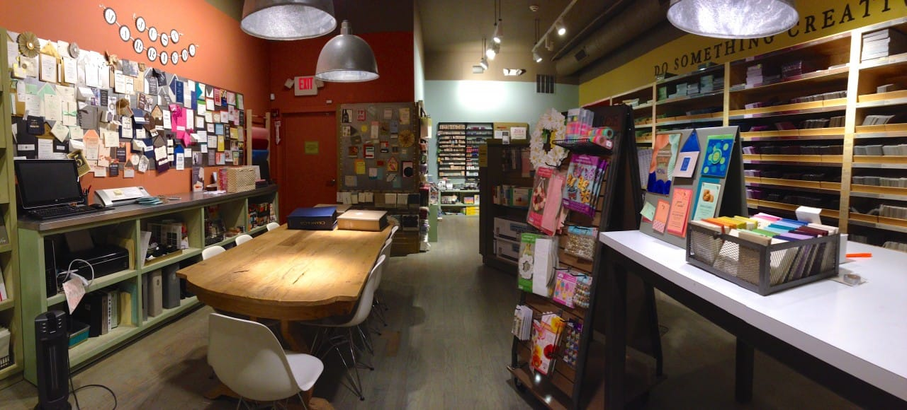

Happy Sunday! Today is sure a hot one. We are spending as much of today as we can in the air conditioning, but are planning to take a wander outside at some point. Chances are, we’ll end up in a coffee shop anyway! For now, here are my weekly picks!
<h2>Makes Me Laugh: Fabulous Pup</h2>
I have nothing else to say about this guy. He’s the best. End of story.
<h2>What I’m Reading: Matched by Ally Condie</h2>
I bought my sister several books for her birthday,
<a title="Matched by Ally Condie" href="http://www.matched-book.com/book-matched.html" target="_blank" rel="noopener noreferrer"><strong>
Matched by Ally Condie
</strong></a>
being one of them. She read it in a day (typical) and passed it along to me. I liked it waaay more than I thought I would! It was really great. I’ll impatiently wait until she gets the rest of the series so I can borrow those too!

<h2>Place I Love: Paper Source</h2>
I know I gave you an overload of
<a title="Happy Donut Day!" href="/happy-donut-day/">donut themed items from Paper Source</a>
the other day, so it made sense to use it as my place I love this week! There are very few art stores in my area of the city, and were zero crafting stores until Paper Source opened. I’m very glad it did, though my wallet probably isn’t. Things in the store are quite pricey, but also super adorable! It’s especially great when I have a specific project in mind and can’t wait for the materials for it to be delivered- I can just walk the three blocks to Paper Source and get what I need. I love it!

<h2>Something Delicious: Cheesy Pull Apart Rolls</h2>
This recipe looks insanely easy! I have GOT to try them out! I know Husband will approve! Yummm!

<h2>Project That Inspires: How To Wear A Head Scarf</h2>
Okay, so this isn’t a project, really. Still, I love all the different ways
<a title="5 Ways To Way A Head Scarf on Frayed Jewelry" href="http://frayedjewelry.com/five-ways-to-rock-your-hair-scarf/" target="_blank" rel="noopener noreferrer">Frayed Jewelry</a>
suggests how to wear a head scarf, especially since I have a few that I still don’t know how to wear! I will definitely try all five ways and see if any of them look good on me.

That’s all I’ve got for today! Hope your Sunday is as fabulous as that pup!

