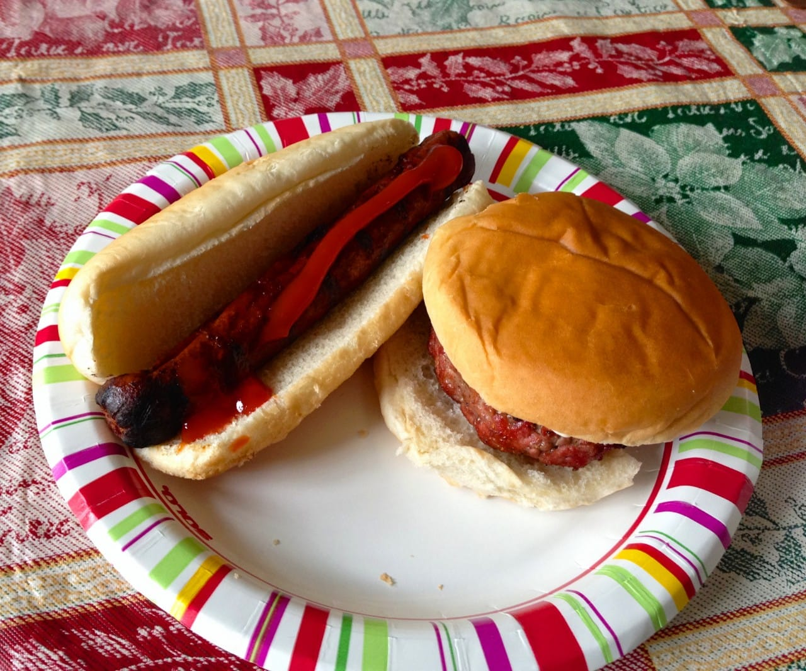

Happy Father’s Day, to all you Dads out there! We honor you today with all-things-fatherly as a recurring theme in our normal categories. Hope your day is as great as you are!

It was much easier to make the
<a title="Sunday Funday: Issue 13, Mom Edition" href="/sunday-funday-issue-13-mom-edition/">Sunday Funday: Mom Edition</a>
post, let me tell you! My mom always loved everything I loved, so seeing things from her perspective was very easy to do. My DAD, however, likes to hunt, go crabbing, cook, tend to his garden and watch terrible reality TV shows about repossessing cars and fishing. That’s about it. I still managed to find things to fit into my weekly categories that remind me of him, though! Enjoy!
<h2>Makes Me Laugh: Dad Jokes</h2>
My grandfather used to say this all the time, and my Dad still does. I pretty much can’t say “haircut” around him without him chiming in.
<h2>What I’m Reading: Father’s Day Sayings</h2>
I found a website called
<a title="Funny Father&#x27;s Day Quotes" href="http://funnyfathersdayquotes.com/2014/funny-fathers-day-poem-from-son-daughter-top-famous-poems-songs-2014.html" target="_blank" rel="noopener noreferrer">Funny Father’s Day Quotes</a>
(yeah, it actually exists) that had these 10 most popular Father’s Day sayings! They are pretty good!

<h2>Place I Love: Home</h2>
Home is many things to many people, and even though I’ve lived in Philly for over 5 years, and elsewhere before it, my parent’s house is where I grew up and will always be “home” to me. I’ll be sad when my Dad sells it, for sure. But for now, it’s still his, ours, home. In the summer we’d sit on the deck by the pool and sip on beers and float on rafts and it was lovely. So lovely, I think we’ll go do that right now!
<h2></h2><h2>Something Delicious: Anything On The Grill!</h2>
One thing I miss desperately about the suburbs is cooking everything on the grill in the summertime! Food just tastes better that way. ESPECIALLY burgers &#x26; burnt hot dogs! MMMM!

<h2>Project That Inspires: Weed Killing Potion</h2>
Since Dad’s garden is well under way, I’m going to try out this easy formula from
<a title="Creek Line House Weed Killer" href="http://creeklinehouse.com/2013/06/magical-natural-weed-killing-potion.html#_a5y_p=619996" target="_blank" rel="noopener noreferrer">Creek Line House</a>
for making him some homemade (natural!) weed killer! I hope it works!

Once again, hope your Father’s Day is wonderful!

