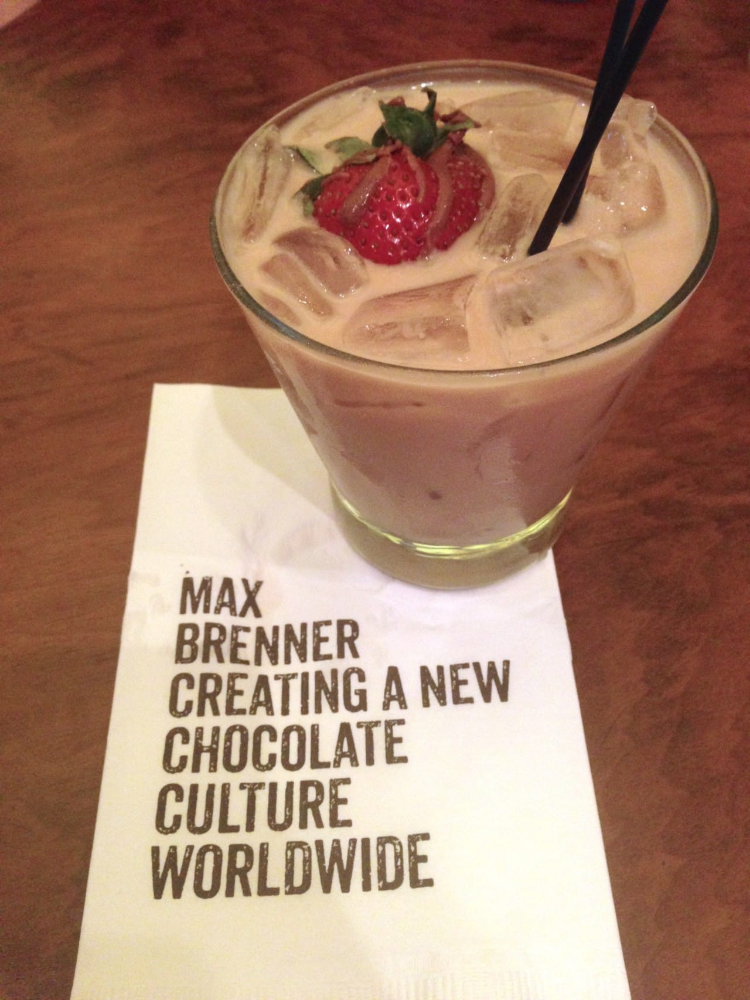
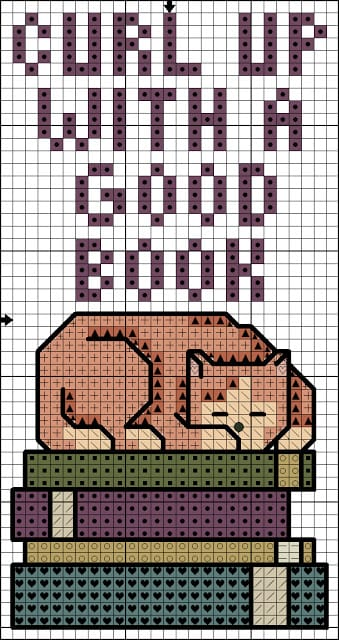

And it’s Sunday once more! This last week with Sister here has FLOWN by! If you haven’t had a chance to read her awesome posts this week for
<em><a title="Sunday Funday: Issue 19" href="/sunday-funday-issue-19/">Sunday Funday: Issue 19</a></em>
or
<a title="S’mores 5 Ways!" href="/smores-5-ways/"><em>
S’mores 5 Ways
</em></a>
, you definitely should! Hopefully I can persuade her to blog for Katie Crafts on the regular! Even though we were super busy this week, I still found time to come up with all my weekly faves.
<h2>Makes Me Laugh: Piggy In Bucket</h2>
Maybe this pig is in Tupperware and not so much a bucket, but whatever he is doing, I’m dying. He’s so happy! And smiling! And sooooooooosososososo cute! I laughed pretty hard when I saw him. And now I want a baby piglet to be friends with the baby elephant I also want. Thanks for finding me another great pic, Husband!
<h2>What I’m Reading: “What Alice Forgot” by Liane Moriarty</h2>
I told you last time that I was reading
<a title="" the="" husband&#x26;#x26;#x26;#x26;#x26;#x27;s="" secret&#x26;#x26;#x26;#x26;#x26;#x22;="" by="" liane="" moriarty&#x26;#x26;#x26;#x26;#x26;#x22;="" href="http://amzn.to/1pRdsGd" target="_blank" rel="noopener noreferrer">“The Husband’s Secret”</a>
by Liane Moriarty, and that I already had this book sitting on my shelf as well. I finished up the last book – which was absolutely amazingly fantastic, by the way – and immediately had to begin this one! Liane’s writing is just superb! You really FEEL what the characters are feeling and really get invested in the stories. I absolutely recommend you check her out! I’m only on the fifth chapter of
<a title="" what="" alice="" forgot&#x26;#x26;#x26;#x26;#x26;#x22;="" by="" liane="" moriarty&#x26;#x26;#x26;#x26;#x26;#x22;="" href="http://amzn.to/1zgNFcc" target="_blank" rel="noopener noreferrer">“What Alice Forgot”</a>
but I love it so far, and I can’t wait til Liane’s newest book,
<a title="" big="" little="" lies&#x26;#x26;#x26;#x26;#x26;#x22;="" by="" liane="" moriarty&#x26;#x26;#x26;#x26;#x26;#x22;="" href="http://amzn.to/1tarN1P" target="_blank" rel="noopener noreferrer">“Big Little Lies”</a>
, comes out at the end of the month!

<h2>Place I Love: Reading Terminal</h2>
I really, really love
<a title="Reading Terminal Market" href="http://readingterminalmarket.org/" target="_blank" rel="noopener noreferrer">Reading Terminal</a>
, a giant indoor marketplace in Philly. I brought Sister here once before but it was so brief she didn’t really get to see much. We wanted to grab lunch before heading to
<a title="Spruce Street Harbor Park" href="/spruce-street-harbor-park/">Spruce Street Harbor Park</a>
the other day, so this is where we went – they’ve got something for everyone! 🙂

<h2>Something Delicious: Chocolate Martini at Max Brenner</h2>
I really don’t need to explain this one, do I? It is chocolate. It is a martini. It is topped with a chocolate drizzled strawberry. It is just perfect. It was also half price because we went during
<a title="Center City Sips" href="http://www.centercityphila.org/life/SipsPartic.php" target="_blank" rel="noopener noreferrer">Center City Sips</a>
.
<a title="Max Brenner" href="http://maxbrenner.com/" target="_blank" rel="noopener noreferrer">Max Brenner</a>
(chocolate by the bald man!) does it again!

<h2>Project I Love: Cross Stitched Cat Bookmark</h2>
While Sister and I were brainstorming new ideas for the blog, we came across cross stitching. Neither of us has tried it before and we think it may be fun to take up! I have a trillion other things I’m working on, so while I will perhaps dabble in it shortly, hopefully Jessica enjoys it enough to keep at it and get a few posts on it done. We haven’t had anything needlepoint related yet! While searching for project ideas, I came across this pattern on
<a title="Killer Crafts &#x26; Crafty Killers" href="http://anastasiapollack.blogspot.com/2013/04/crafts-with-anastasia-cross-stitched.html" target="_blank" rel="noopener noreferrer">Killer Crafts &#x26; Crafty Killers</a>
for a simple cross stitched book mark- it seems like the kind of project that will be right up my sister’s alley! New craft, reading, and cats? YUP!

Well, that’s all she wrote! Happy Sunday!

