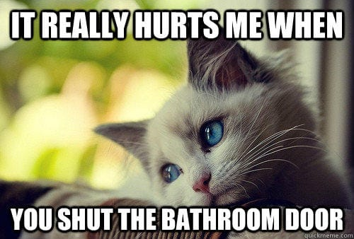
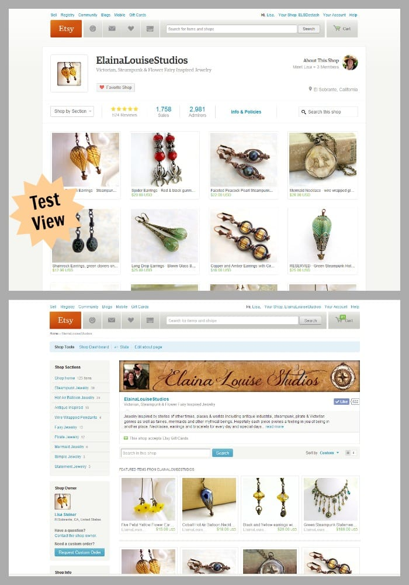
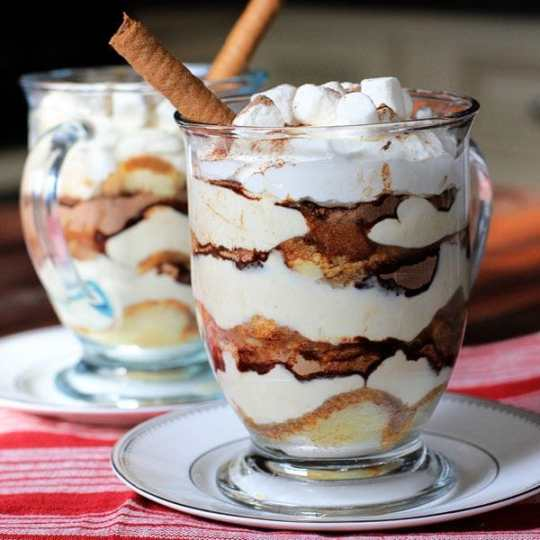
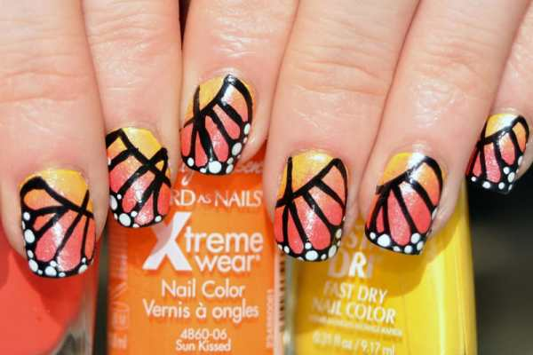
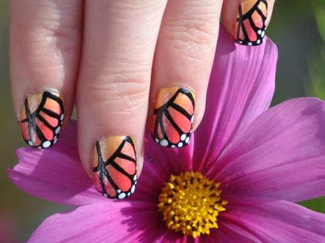

Brrrrr!! It’s ridiculously cold out there this weekend, with another snowstorm on the way! I plan on staying bundled up at home all day today, and I hope you get to do the same. While you’re under the covers, enjoy my Sunday Funday: Issue 3!
<h2>Makes Me Laugh: First World Problems Cat</h2>
The Husband sends me First World Problems Cat memes all the time. He just sent me this one which I especially loved since both our cats do this. They will cry and paw as if they are starved to death and we haven’t fed them in ages, and then we go to the kitchen to find there IS food in their bowl, it’s just not right in the middle. They are such weirdos!

This one made me laugh, too, since they always follow us into the bathroom OR scratch on the door while we’re in there!

<h2>What I’m Reading: Upcoming Etsy Changes</h2>
Etsy

is currently testing out new layouts and looks for shops. I’m not one of the many sellers who gets to see this new possible update, but I’m not hearing great things! Apparently there are several changes, including doing away with your storefront banner entirely. I hope that part doesn’t stick, since it seems to be the only means to personalize your shop at the moment.
<a title="Elaina Louise Studios on Etsy" href="https://www.etsy.com/shop/elainalouisestudios" target="_blank" rel="noopener noreferrer"><strong>
Elaina Louise Studios
</strong></a>
took a shot of the differences below. If you hadn’t heard the news yet, you can read more about it in their
<a title="Etsy Announcements" href="https://www.etsy.com/teams/7716/announcements/discuss/13996023/page/1" target="_blank" rel="noopener noreferrer">announcements</a>
.

<h2>Place I Love: Ikea!</h2>
The Husband randomly decided we no longer need a couch and instead, we should furnish the area it lives with a crafting desk. How could I say no? We rented a car and went to
<a title="Ikea" href="http://www.ikea.com/us/en/" target="_blank" rel="noopener noreferrer"><strong>
Ikea
</strong></a>
on Saturday. We came home with a large table, a bar stool (which is possibly too tall and will have to go back for the shorter one), a wire shelving unit for under the table and some red lamps. He’s finishing putting the table together while I type this. I can’t wait to see it all in it’s new space!

<h2>Something Delicious: Bailey’s and Hot Chocolate Tiramisu</h2>
This is pretty much exactly what I am craving on a day like today! The full recipe is on
<a title="Pham Fatale Baileys and Hot Chocolate Tiramisu" href="http://www.phamfatale.com/id_2976/title_Baileys-and-Hot-Chocolate-Tiramisu/" target="_blank" rel="noopener noreferrer"><strong>
Pham Fatale
</strong></a>
, so be sure to check her site out! I wish I had all the ingredients to make it right now!!

<h2>Project That Inspires: Monarch Butterfly Nails</h2>
This whole next week is the
<a title="PHS Philadelphia Flower Show" href="http://theflowershow.com/" target="_blank" rel="noopener noreferrer"><strong>
PHS Philadelphia Flower Show
</strong></a>
! The Husband and I have gone every year since we started dating, so it’s a special annual date for us. This year the theme is
<strong>
ARTiculture
</strong>
(I’m so excited!) and in addition to the add-ons at the show, there is a new feature:
<a title="The Philadelphia Flower Show: Butterfly Experience" href="http://theflowershow.com/attractions/the-butterfly-experience/" target="_blank" rel="noopener noreferrer"><strong>
The Butterfly Experience!
</strong></a>
There will be over
<strong>
1000
</strong>
butterflies flitting around and I can’t wait to see them all! I found this beautiful
<strong>
Monarch Butterfly
</strong>
nail design by
<a title="Cut Out and Keep Monarch Butterfly Nails" href="http://www.cutoutandkeep.net/projects/monarch-butterfly-nails-2" target="_blank" rel="noopener noreferrer"><strong>
Dottidol on Cut Out + Keep
</strong></a>
and loved it! I hope I have the time to try it out before the show!

          
        

          
        

          
        

Hope the remainder of your weekend is a warm and cozy one! Be sure to read my blog daily during National Crochet Month to find out about lots of giveaways, patterns and fun!

