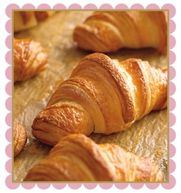
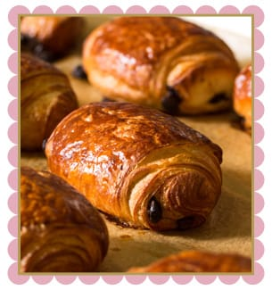
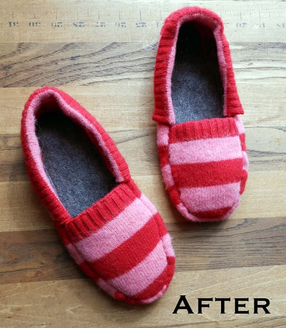

Yesterday was so nice out! We walked around the city for hours, got some much needed haircuts, had lunch and even ditched our coats at one point because it was getting too warm. How is it possible it’s supposed to snow tonight?! Spring is in just
<strong>
4 days
</strong>
! Hurry up! In the meantime, read my Sunday Funday: Issue 5!
<h2>Makes Me Laugh: Baby Elephant Running</h2>
The Husband sent me this little .gif the other day. I LOVE BABY ELEPHANTS! They are just so cute, especially with the wisps on top of their heads. Watching this mama elephant waltz across the street and a moment later seeing this baby bounding behind her was too cute. “WAIT FOR MEEEE!” That’s all I could hear in my head.
<h2>What I’m Reading: What The Difference in Croissant Shapes Mean</h2>
I always just thought croissants were the fat in the middle, skinny on the ends, slighty bent in shape flaky pastries, whilst other shapes (like square, or straight) were other types of pastries. While eating my something delicious for the week from Starbucks, I read the back of it’s little bag and found out I was wrong! Who knew?! Apparently, everyone in France did.
<blockquote>
“In France, culinary law states that only croissants made with 100 percent butter can be shaped straight. Which is exactly why our croissants are straight.” –
<a title="Starbucks" href="http://www.starbucks.com/menu/food/bakery/croissant" target="_blank" rel="noopener noreferrer">Starbucks</a></blockquote>

<h2>Place I Love: The Movie Theater!</h2>
Any theater will do. Husband and I haven’t been to a movie in 5 months! That’s far too long. We skipped out of work early on Friday, rented a car and headed to Cherry Hill to see the
<strong>
Veronica Mars movie!
</strong>
It was everything I’d hoped it would be-
<strong>
go see it!
</strong>
After the movie, we went to the mall, where I spent an hour trying on dresses while Husband held my stuff. It was a 15 year old girl’s dream date. I’m so lucky.

<h2>Something Delicious: Chocolate Croissant</h2>
Okay, back to Starbucks again! I’ve always called these delicious delicious treats pain au chocolat, but Starbucks calls them simply a “
<a title="Starbucks Chocolate Croissant" href="http://www.starbucks.com/menu/food/bakery/chocolate-croissant-lb" target="_blank" rel="noopener noreferrer">chocolate croissant.</a>
” Now that Starbucks has teamed up with La Boulange and added more food/pastry options, I’m finding myself there more often. So unfortunate for me, but great for them. I’m pretty obsessed with these warm served melty flaky chocolate croissants. You should probably try one too!

<h2>Project That Inspires: Upcycled Sweater Slippers</h2>
I found this project on
<a title="We Can Re-Do It Blog" href="http://wecanredoit.blogspot.com/2013/03/upcycled-sweater-slippers.html" target="_blank" rel="noopener noreferrer">We Can Re-do It Blog</a>
, and pretty much want to make them RIGHT NOW. It looks like an easy enough project, and I love love love recycling materials (and have a sweater waiting to chop up that would be perfect!) Make sure you check out the full tutorial over at We Can Re-Do It!

Well, that’s it for Issue 5! Don’t forget to enter
<a title="Featured Etsy Shop: Hatt Street" href="/featured-etsy-shop-hatt-street/">my giveaway</a>
with Hatt Street for a free custom crocheted baby hat- it ends tomorrow! Have a good one, Marshmallows! 😉

