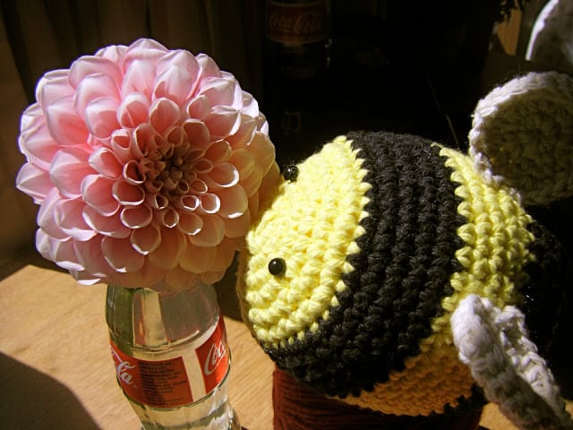

Hip Hip Hooray! It’s officially SPRING! Sadly, the furthest I’ve gone in the “nice” weather was to the coffee shop (where I’m currently sitting). That’s okay though. By the time you read this I’ll already be in Atlantic City celebrating the bride-to-be’s bachelorette party! Don’t be jealous. It’s early still, and you have your whole Sunday in front of you. Before you shut your laptop, take a gander at my Sunday Funday: Issue 6!
<h2>Makes Me Laugh: “Spring Harvest”</h2>
Yup. I’d link this if I had a clue where it came from, but I really don’t. All I know is it made me laugh really, really hard. Ohhhhhhhh so true.
<h2>What I’m Reading: “Stardust” by Neil Gaiman</h2>
I love this book. I love this movie. I love Neil Gaiman. I’m re-reading one of my faves right now, because why not? I have an hour and a half train ride to AC each way so I needed something to keep me busy. I didn’t feel like starting a brand new book yet, so I picked up
<a title="" stardust&#x26;#x26;#x26;#x26;#x26;#x22;="" by="" neil="" gaiman&#x26;#x26;#x26;#x26;#x26;#x22;="" href="http://amzn.to/1h3XUof" target="_blank" rel="noopener noreferrer"><strong>
“Stardust”
</strong></a>
in the middle of where I left off on my last round. Perfection.

<h2>Place I Love: Atlantic City!</h2>
I don’t care how Jersey it is. Actually, that’s part of what I love about it. My family and I went on an AC trip every year, sometimes twice a year, for a good 5 or 6 year run. It was our thing, our mini-vacation. Dad would wander off, and my sister, mom and I would sit on the slot machines for hours and hours (penny machines, of course) order a mimosa, and pop in a $10 bill. It would last forever. We’d hit up the buffet at Harrah’s and just have a nice long weekend of winning pretty much nothing and eating pretty much everything. I miss that.

<h2>Something Delicious: GIANT Macaron!</h2>
I know you’ve seen me post about them before, and chances are pretty good you’ll see them again. They’re my favorite, after all! But since this was the biggest macaron I’ve ever SEEN, I had to share it. Husband brought it home for me from his NYC work trip the other day. It got a little smushed on the commute, but was still good! It looks like a basketball for March Madness I imagine. It didn’t taste basketball-ish though, so don’t worry.

<h2>Project That Inspires: Bumble Bee</h2>
After adoring all the crazy cute creations over at
<a title="Featured Etsy Shop: The Wandering Deer" href="/featured-etsy-shop-the-wandering-deer/">The Wandering Deer</a>
, I decided to look up some new patterns for amigurumi! It’s been awhile since I’ve done any, so I thought some new patterns would inspire me. This is one I definitely want to try! It’s by
<a title="Curiouser and Curiouser: Bumble Bee Pattern" href="http://curiouscrochet.blogspot.com/2010/06/long-overdue-post-bee-pattern-and.html" target="_blank" rel="noopener noreferrer">Curiouser and Curiouser</a>
and it’s a big round bumble bee! It’s sooooooo cute! I hope mine comes out as well as hers did!

That’s it for today’s issue! Next week I’ll share the really fun nails that I did for the bachelorette party. Hope the rest of your day is beeeeeee-utiful! &#x3C;3

