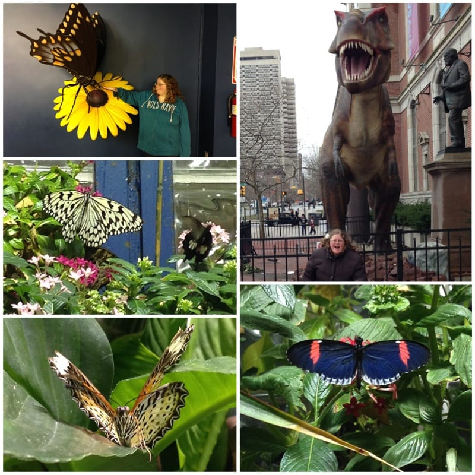
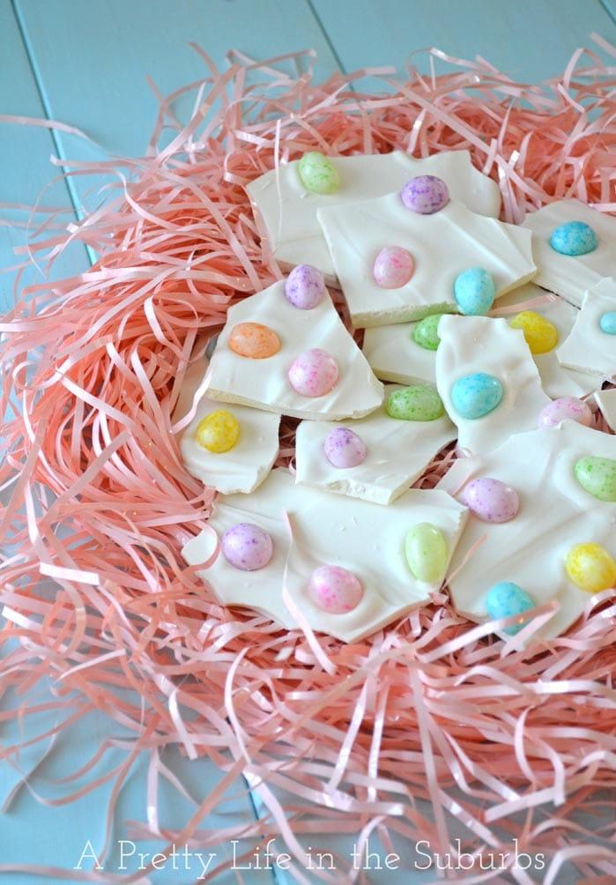

This past week was so busy, it was really just a blur. I was looking forward to this weekend for lots of relaxing and hopefully some walking in the sunshine. But of course, rain, rain, rain! I wish this entire weekend wasn’t so crummy! I’m going to use this downtime to craft, read and cook- so I guess it’s not that bad! You should do the same after you read my Sunday Funday: Issue 7!
<h2>Makes Me Laugh: Cat Versus Human</h2>
You’ll see me refer to
<a title="Cat Versus Human" href="http://www.catversushuman.com/" target="_blank" rel="noopener noreferrer">Cat Versus Human</a>
many times, as it’s one of my absolute favorite comics. It’s just so silly and perfect and funny, and almost always true! Here’s the one that made me giggle this week:
<h2>What I’m Reading: Veronica Mars</h2>
Hooray! The new book by Rob Thomas came out this week, and picks up right where the very recent movie left off! I’m so excited! I only JUST began reading it (really, I think I’m on page 14), but I know it’s going to be great. I’m so happy to be able to continue Veronica’s adventures! Go pick up
<a title="Veronica Mars Book by Rob Thomas" href="http://amzn.to/1dElHQq" target="_blank" rel="noopener noreferrer">Veronica Mars: An Original Mystery by Rob Thomas: The Thousand-Dollar Tan Line</a>
now!

<h2>Place I Love: Academy of Natural Sciences</h2>
Even though I’ve been here a million times before, I still enjoy the
<a title="Academy of Natural Sciences " href="http://www.ansp.org/" target="_blank" rel="noopener noreferrer">Academy of Natural Sciences</a>
. It’s just one of those Philly places that hosts fun science-y and history-y things that’s become a staple. Plus, they have a butterfly room! I brought my sister (being silly below!) here this week when she was visiting so that we could say “hi” to mom (who loved butterflies and lives on in each pretty little fluttering one! On this visit, we decided she was the one in the bottom left photo who kept flying in our faces and posing on leaves for photos. 🙂 )

<h2>Something Delicious: Garden Veggie Wheat Thins Toasted Chips</h2>
Wheat Thins Toasted Chips aren’t something new or fancy- just a snack I’ve been obsessed with forever that I happened to nibble again this week. They are sooooooo delicious and addicting. I could eat a whole bag in a day if my Husband let me!

<h2>Project That Inspires: Easter Egg Bark</h2>
This bark from
<a title="Easter Egg Bark on A Pretty Life" href="http://www.aprettylifeinthesuburbs.com/easter-egg-bark/" target="_blank" rel="noopener noreferrer">A Pretty Life</a>
is simply white chocolate and speckled jelly beans! It’s crazy cute and will be very easy to make! I’ll certainly be trying it out as this year’s fun recipe for Easter!

That’s all for today! Hope you all have a happy rainy Sunday, lovies!

