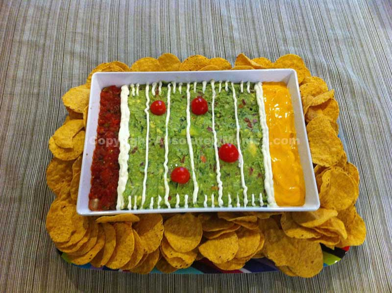
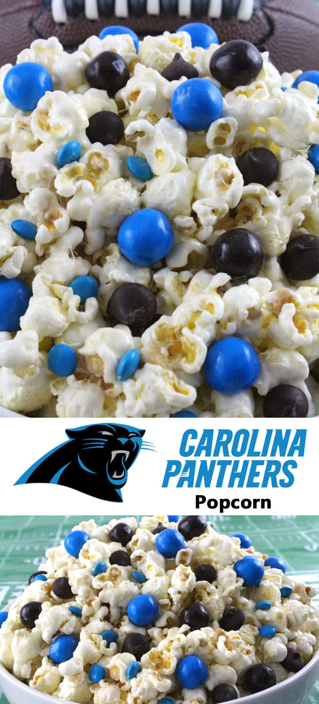

Whether you’re a Panthers or a Broncos fan (or neither!), chances are you’ll be hanging out with friends this Sunday for Super Bowl 50! Bring or serve these awesome Super Bowl Sunday snacks and you’ll be the one scoring a touchdown!

<a href="https://www.pinterest.com/search/pins/?rs=ac&#x26;len=2&#x26;q=super+bowl+sunday+snacks&#x26;term_meta%5B%5D=super%7Cautocomplete%7C2&#x26;term_meta%5B%5D=bowl%7Cautocomplete%7C2&#x26;term_meta%5B%5D=sunday%7Cautocomplete%7C2&#x26;term_meta%5B%5D=snacks%7Cautocomplete%7C2" target="_blank" rel="noopener noreferrer">Pinterest has a million ideas</a>

for football themed treats, but these 5 were my favorites. Check them out below!

photo from http://thefirstyearblog.com/peanut-butter-stuffed-chocolate-footballs/

Who doesn’t want Peanut Butter Stuffed Chocolate Footballs?! I know I do! The recipe from
<a href="http://thefirstyearblog.com/peanut-butter-stuffed-chocolate-footballs/" target="_blank" rel="noopener noreferrer">The First Year</a>
sounds delicious and easy!

photo from http://www.myrecipes.com/recipe/spicy-sweet-deviled-eggs

These Spicy-Sweet Deviled Eggs from
<a href="http://www.myrecipes.com/recipe/spicy-sweet-deviled-eggs" target="_blank" rel="noopener noreferrer">MyRecipes.com</a>
look like little footballs and are a yummy twist on an old favorite! I’ll definitely be trying these guys out!

photo from http://picturetherecipe.com/index.php/recipes/game-day-snacks-football-pizza-pockets/

<a href="http://picturetherecipe.com/index.php/recipes/game-day-snacks-football-pizza-pockets/" target="_blank" rel="noopener noreferrer">Picture The Recipe</a>

has some great football snack ideas, including these fun Pizza Pockets shaped like footballs! Love them!
<figure id="attachment_7645" aria-describedby="caption-attachment-7645" class="post__figure"><figcaption id="caption-attachment-7645">
photo from http://absolutelymonica.blogspot.ca/2011/02/super-bowl-sunday-guacamole-football.html
</figcaption></figure>
<a href="http://absolutelymonica.blogspot.ca/2011/02/super-bowl-sunday-guacamole-football.html" target="_blank" rel="noopener noreferrer">Absolutely Monica</a>

shared a great recipe for a Guacamole Football Field that would please everyone at your party. Also, it’s totally cute!
<figure id="attachment_7646" aria-describedby="caption-attachment-7646" class="post__figure"><figcaption id="caption-attachment-7646">
photo from http://www.twosisterscrafting.com/carolina-panthers-popcorn/
</figcaption></figure>
This popcorn recipe can be made with the colors for whichever team you prefer and will travel well if you’re heading out of town for your party! I’m so glad I found the recipe for it over at
<a href="http://www.twosisterscrafting.com/carolina-panthers-popcorn/" target="_blank" rel="noopener noreferrer">Two Sisters Crafting</a>
!

Whatever you decide to do for Super Bowl Sunday, I hope you have a great time! Who are you rooting for?

