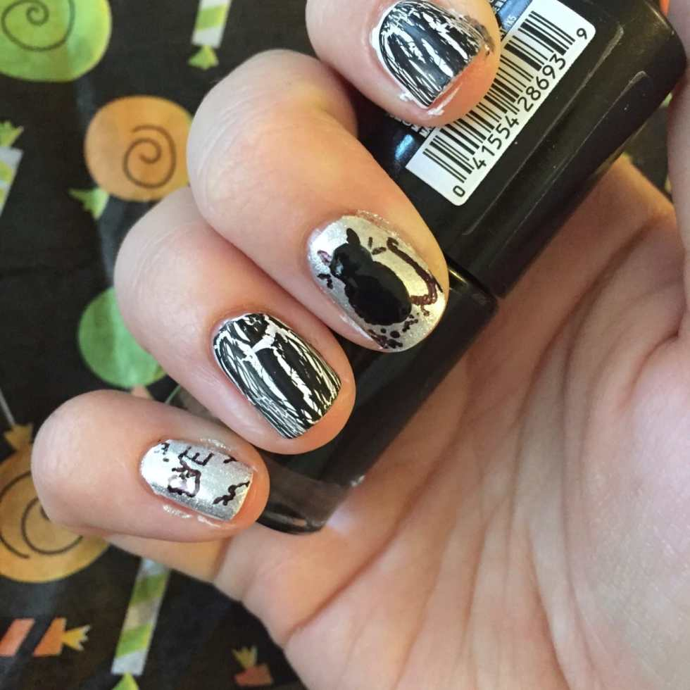
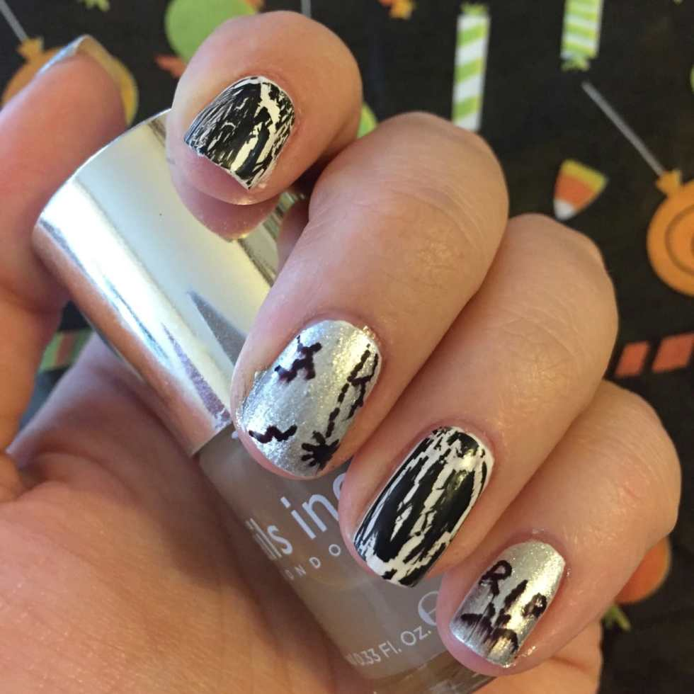
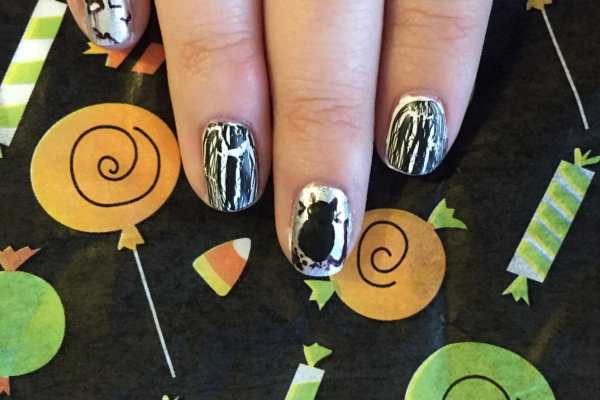
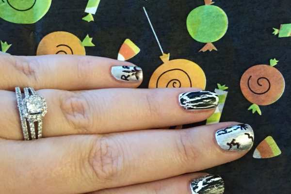
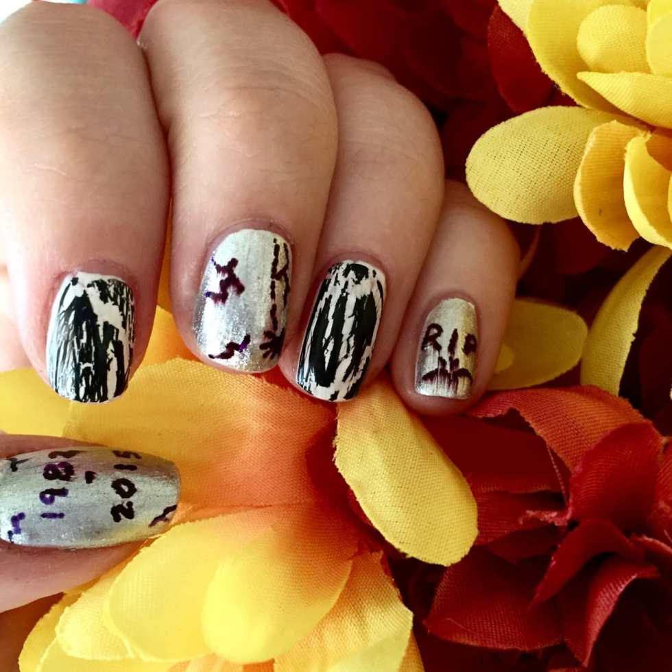

Halloween is in just two weeks! That means I have at least one more chance (maybe two!) to try out some
<a href="/boo-tiful-halloween-nails/">Halloween nail art</a>
designs to go with my costume. This week I’m rocking some tombstone nail art that was SUPER easy to do, since I used a Sharpie!

If I’d had gray nail polish, I would have used that for the graves, but silver would have to do this time! They still came out really cute, don’t you think!?
<h2>Materials:</h2><ul><li>
Clear base coat
</li><li>
White nail polish
</li><li>
Black nail polish
</li><li>
Silver or gray nail polish
</li><li><a href="http://amzn.to/1Ljbdmz" target="_blank" rel="noopener noreferrer">Black crackle nail polish</a></li><li>
Black extra fine tipped marker (
<a href="http://amzn.to/1RQzcfb" target="_blank" rel="noopener noreferrer">I used this Sharpie</a>
)
</li><li>
Matte top coat
</li></ul><h2>Instructions:</h2><ul><li>
Starting with clean, dry nails, paint a layer of clear base coat on each fingernail. Let dry.
</li></ul><ul><li>
Paint one layer of white polish on each nail and let dry.
<em>
If you are using a silver or gray polish on the translucent side, using white will make the silver/gray more opaque later. If you are using gray that is already quite opaque, you can skip painting the tombstone nails white and only paint the nails you will be using crackle polish on. If the latter is the case, do one coat of your gray right now so it can dry too! Got it?! Good!
</em>
Let dry completely.
</li></ul><ul><li>
Paint a second layer of white polish on each nail. Choose which nails you want to be your crackle nails right now, because you need to do the next step before the white on those dry!
</li></ul><ul><li>
Using your black crackle polish, paint directly on top of the wet white polish for the nails you want crackled. The crackle polish reacts only to wet polish underneath and won’t separate if the nail is already dry.
</li></ul>

<ul><li>
Once all your other nails are dry, you can paint one to two layers of the silver or gray on top of the white. Let dry
<em>
completely.
</em></li></ul>

<ul><li>
Use your marker to write sayings you may find on a gravestone! I went with the year I was born and this year (though I better not be dying this year!!), RIP, Rest in Pieces, BYE (I thought that was pretty funny) and then made some cracks, a spider, and a cat on my other nails!
</li></ul>

<ul><li>
For the cat, I used black nail polish for it’s head and body as it was easier to just dab that on and then draw on the ears, tail and whiskers with a marker afterwards. You can draw whatever you think would be haunting the cemetery! A bat? A ghost? A zombie hand coming out of the ground in front of the tombstone? Be creative!
</li></ul>

<ul><li>
When the nails are all totally dry, it’s time for the top coat! I went with matte again because the silver was already pretty sparkly and I was trying to make the gravestones as ‘creepy’ as possible. Sharpie markers (probably any markers) don’t like being dragged around by a wet nail polish brush and got a little streaky, but I didn’t mind as it kind of lent itself to the look. If you don’t want any smudges on yours, dab the matte top coat on rather than dragging the brush across the whole nail. Let dry completely.
</li></ul>

          
        

          
        

That’s it! Super easy tutorial with just a few steps, and the end result are nails perfect for October 31st! What Halloween nail art should I try for next week?

What would your tombstone nails say?

