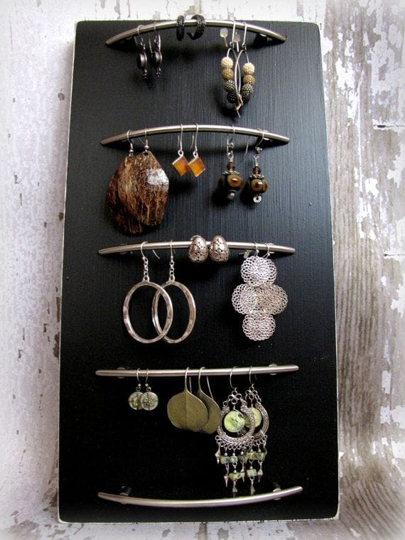
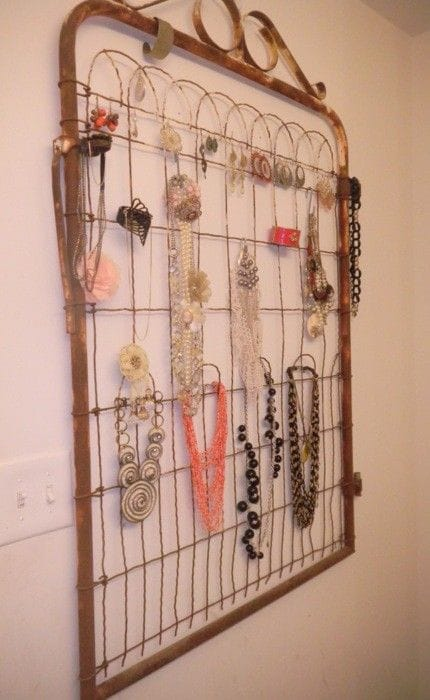
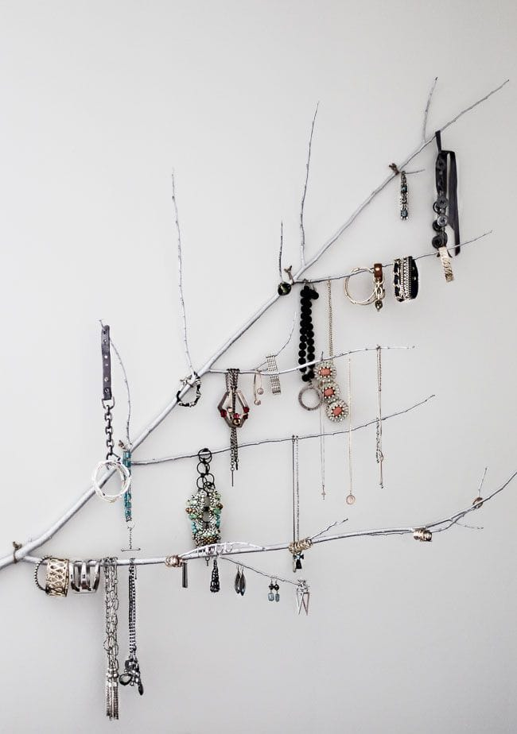
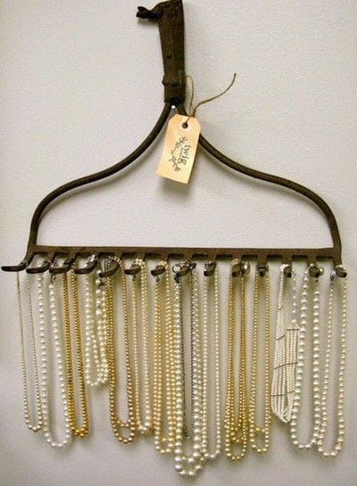

<em>As I mentioned</em>
<em><a href="/motivation-monday-be-brave/">Monday</a>
, this week is a rough one. I had one long post in drafts and was able to work up only a couple short ones for the week. Thankfully, a blogging buddy has offered to help out further! Today’s blog is a repost from our past guest blogger
<a href="http://magicjewellerybox.blogspot.ca/" target="_blank" rel="noopener noreferrer">Natalia Khon</a>
. She shared a really cool Top 10 with her readers last week that I thought you may enjoy as well!
<a href="http://magicjewellerybox.blogspot.ca/2015/09/top10-most-unusual-up-cycled-jewelry.html" target="_blank" rel="noopener noreferrer">Check out her original post here</a>
, and let me know below which your favorite upcycled jewelry organizer is! (Mine is the tree!)
</em>
You do not have to give the legs to your old grater to turn it into a jewellery organizer… but you are creative, right? So, why not? Why stop at this either? Maybe a couple of wings too? 🙂

Love this idea! Some assembly required, but it is worth it, I think!

Old shower hooks can be up-cycled too! I would not think of this, to be honest, but it works.

This one is my favorite!

Not sure what it is… possibly the back of a bed. Looks rusty too… Well, if you like up-cycling that much… I would suggest to paint it as jewelry needs to be kept on a clean organizer. Rust is not good for it either.

Another awesome idea!

Not any tree brunch would work for this. Looks like a piece of wall art, though!

Simple and lovely:

This is one creative organizer! (You can tell your guests that you’ve bought all those corks at a craft store!) 🙂

If your rake got rust on it… buy yourself a new one! This one you will need for a rustic home decor 🙂 (after you clean and paint it of course)

All pictures are from my (Pinterest) inspiration board.
<a href="https://www.pinterest.com/jewelleryfan/jewelry-organizers/" target="_blank" rel="noopener noreferrer">Visit to discover even more ideas.</a>
