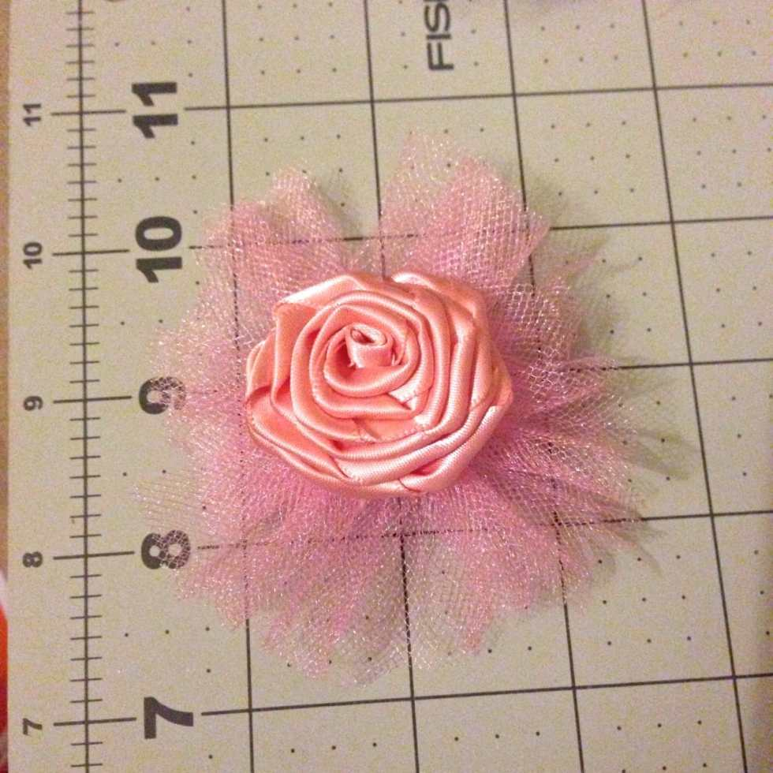
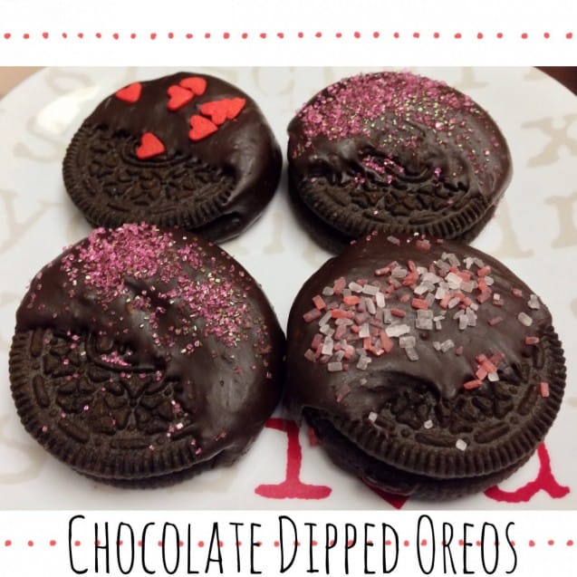
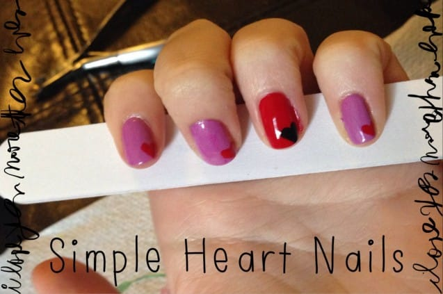
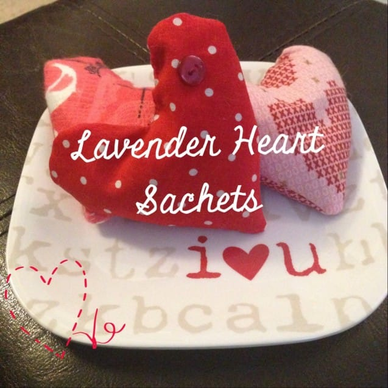
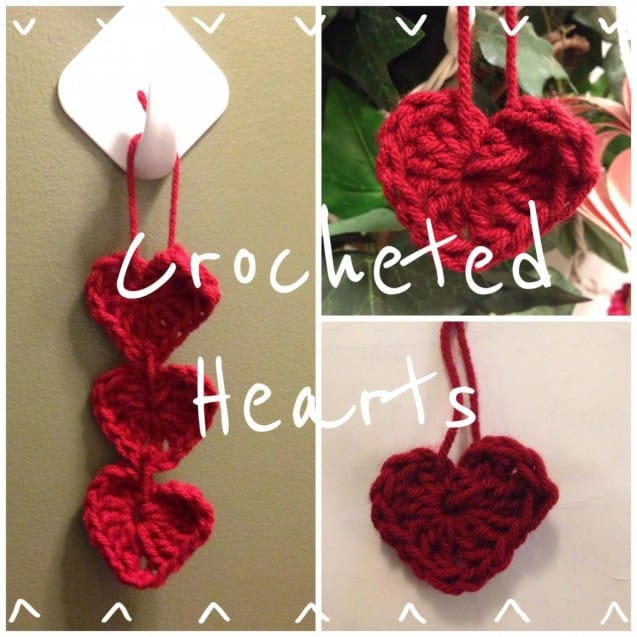

<em>Over the last year*</em>

, I’ve made many projects that had to do with Valentine’s Day or love, so it was pretty easy to find ten great ways to DIY your February 14th! It’s not too late to make something special for your Valentine… or yourself! Every day this week will be devoted to the holiday, beginning with today’s round up of past projects!
<blockquote>
<em>This past Saturday, February 7th, was a full year since Katie Crafts went live! Can you believe it?! It’s been so much fun and I look forward to the next year!</em>
</blockquote>
Whether you like to sew or crochet, are in to paper crafts or cooking, there is something for you in this round up! I hope you find something useful and enjoy!
<h2>Pixel Heart Pillow</h2>
I made this
<a title="Pixel Heart Pillow" href="/pixel-heart-pillow/"><strong>
pixel heart pillow
</strong></a>
last year for the Husband for V-Day. It sat above his work desk til we moved. It will get there again, as soon as we find what box it’s still hiding in!
<h2>DIY Valentine’s Wreath</h2>
You learned how to make this
<a title="DIY Valentine’s Wreath" href="/diy-valentines-wreath/"><strong>
wreath
</strong></a>
last week! It’s so adorable and would be the perfect decoration for your front door!
<h2>Nail Art: Valentine’s Glitter Design</h2>
This
<a title="Nail Art: Valentine’s Glitter Design" href="/valentines-glitter-design/"><strong>
nail art glitter design
</strong></a>
from a few years ago was so cute! Red polish topped with glitter polish and some white hearts outlined in black- easy and adorable.

<h2>5 Minute Tulle Pom Pom Flowers</h2>
I’m still obsessed with these
<a title="5 Minute Tulle Pom Pom Flowers" href="/5-minute-tulle-pom-pom-flowers/"><strong>
pom pom flowers
</strong></a>
! They take moments to make and you can use them in all kinds of decorations, gifts and wrappings for your Valentine. Don’t forget about the
<a title="DIY Shabby Chic Rosettes" href="/diy-shabby-chic-rosettes/"><strong>
shabby chic rosettes
</strong></a>
, too!

<h2>Chocolate Dipped Oreos</h2>
Mmmm. I should make these
<a title="Chocolate Dipped Oreos" href="/chocolate-dipped-oreos/"><strong>
chocolate dipped oreos
</strong></a>
all the time and not just for Valentine’s! They are so good! They will make a wonderful sweet treat that is just a little more special than a heart shaped box (though I’ll take those chocolates too, please!)

<h2>Heart Pillow with Pocket</h2>
Another cute
<a title="Heart Pillow with Pocket Tutorial" href="/heart-pillow-with-pocket-tutorial/"><strong>
heart pillow
</strong></a>
to sew, but this one is easier AND has a pocket! Slip a love letter inside for your Valentine to find, and make sure to add some conversation hearts too!

<h2>Valentine’s Cards</h2>
Use those tulle pom poms mentioned above, or cut out shapes from fabric and cardstock to make your own
<a title="Valentine’s Cards" href="/valentines-cards/"><strong>
Valentine’s cards
</strong></a>
for your loved ones. My Grams loved the one I sent her above from last year!
<h2></h2><h2>Nail Art: Simple Hearts</h2>
This
<a title="Nail Art: Simple Hearts" href="/nail-art-simple-hearts/"><strong>
simple hearts design
</strong></a>
is the easiest! Use different colors for your base coat and draw little hearts in the corner of each fingernail. So cute for V-Day!

<h2>Lavender Heart Sachets</h2>
I love these
<a title="Lavender Heart Sachets" href="/lavender-heart-sachets/"><strong>
heart sachets filled with lavender
</strong></a>
so much! Put one in your dresser to make your clothes smell good, leave them in a basket in the bathroom for a fresh scent, or put them anywhere you want for something cute! They would make such a great gift and are easy to make.

<h2>5 Minute Crocheted Hearts</h2>
I just made a bunch of these
<a title="5 Minute Crocheted Hearts" href="/5-minute-crocheted-hearts/"><strong>
crocheted hearts
</strong></a>
in red and pink, tied them to a long ribbon and hung them in my window for garland. They are quick and cute- the perfect pair!

Are you planning to DIY something for your Valentine?

